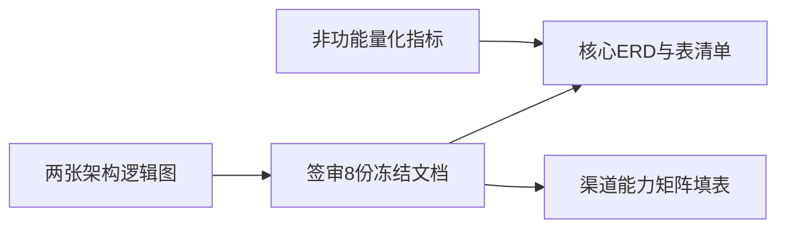

# ACmodus-01 项目设计深度审查与待完善项

## 现状判断

- **仓库实质**：[ACmodus-01](e:\项目文件\新建文件夹\ACmodus-01) 内几乎只有 Git 元数据 + [meeting/20260407](e:\项目文件\新建文件夹\ACmodus-01\meeting\20260407) 一份综合说明；**无后端/前端/数据库脚本**，因此「项目设计」= 该文档所承载的产品与架构设想。
- **文档优点**：已系统覆盖 7 类难点、三大中台职责、店铺中心与渠道同步、供应商独立端口、SPU/SKU/来源模型、库存三段式、结算冲正、客服聚合、AI/视频流水线、一期/二期边界、8 份冻结文档清单、规则冻结表等，**在需求广度上已高于常见 PRD**。

## 一、必须先处理的「一致性 / 可执行性」问题

1. **分销层级（已决策）**
  **产品冻结：仅一级分销**（无下级、无团队计酬）。执行文档修订时，需删除或改写文末「核心规则补漏清单」中与「**2 级**封顶」矛盾的表述，并在《分销规则 PRD》与签审材料中写明：仅绑定一级推广关系、禁止发展下级，以满足合规与结算模型定稿。
2. **从「一篇长文」到「可签审工件」**
  文档末尾已列出 8 份冻结文档（商业模式、一期范围、订单分摊、渠道能力矩阵、统一身份、高风险审批、主数据迁移、经营指标口径），但仓库中**尚未拆成独立、可版本评审的文件**。没有签审与变更记录，开发仍会认为需求未冻结。
3. **文档承诺的「架构图」仍为文字描述**
  「整体业务架构图」「跨渠道商品/订单流向图」在文中是建议项，**缺少实际 Mermaid/配图**。跨团队对齐时容易各解各的。

## 二、文档已点名、但仍需「落到字段/流程/口径表」的领域

以下在 [20260407](e:\项目文件\新建文件夹\ACmodus-01\meeting\20260407) 中已有章节方向，但多数停留在原则或示例表，**需补：状态机、异常分支、与外部系统的接口边界、财务科目映射**。

| 领域    | 文档中的位置线索        | 建议补强的设计深度                                           |
| ----- | --------------- | --------------------------------------------------- |
| 支付与资金 | §6「支付与结算还缺财务规则」 | 支付渠道、退款路径、分账/不分账、对账文件、差错账、手续费承担、跨境/多商户（若未来有）        |
| 用户与身份 | §10             | 账号合并规则、注销与保留期、游客购、多端 OpenID 映射表、与分销员/会员的同一主体模型      |
| 运营与数据 | §11、经营指标        | GMV/销量/库存等**统一定义表**（含外部渠道订单是否计入、退款是否冲减）             |
| 非功能   | §12             | **具体数字**：供应商数、SKU 规模、日单量与峰值、RPO/RTO、日志与备份周期，用于容量与选型 |
| 一级分销  | §13             | 独立《分销规则 PRD》：绑定/改绑、基数、与积分券叠加顺序、冲正、法务展示文案            |
| 积分    | §14             | 分账簿/过期、抵现上限、兑换品库存与履约主体、税务/可变对价口径                    |
| 商品模型  | §2、服装 SKU       | 各品类**属性模板实例**（不仅是原则）、渠道字段映射矩阵行级样例                   |
| 权限    | §9              | 资源清单（Resource 枚举级）、与审批流的绑定矩阵（谁审什么）                  |

## 三、文档涉及较浅或尚未展开的设计域（建议新增章节或独立附录）

- **发票与税务**：B2C 开票主体、电子发票流程、红冲与退款联动、供应商结算发票与平台角色。
- **搜索与推荐**：类目+多属性下的检索、排序权重、与渠道商品标题/标签的一致性（若站内也要增长）。
- **内容安全与 UGC**：评价、晒单、客服附件、AI 出图的统一审核分级与责任方。
- **隐私与合规**：个人信息字段分级、脱敏规则、导出审批、日志访问权限（除已有审计天数建议外）。
- **灾备与多环境**：§12 提到多环境，需补 **环境拓扑、数据克隆策略、密钥与配置管理**（与文末「三层沙箱」呼应）。
- **第三方依赖与降级**：各渠道 API 限流、熔断后的**业务表现**（是否停售、是否仅人工工单），而不只是技术重试。

## 四、工程侧「设计」空白（与业务文档互补）

当前无代码，但若视为完整项目，还缺：

- **模块边界与包结构**（模块化单体下的 Maven/Gradle 模块或 DDD 包划分）。
- **核心实体 ER 图** 与 **关键表清单**（文档提到多表名，未形成可追溯的 schema 基线）。
- **集成契约**：渠道 Webhook、支付回调、物流轨迹的 **幂等键、重试、死信** 规范（文中 Outbox 有方向，需落到接口级）。
- **测试与发布**：灰度策略、特性开关与「一期禁做清单」的门禁方式。

## 五、建议的下一步（不改变文档内容，仅规划动作）

1. 按「仅一级分销」**全文扫一遍** meeting/20260407 与后续拆出的冻结文档，去掉二级相关措辞。
2. 将 8 份冻结文档**拆出独立文件**并完成评审签字。
3. 补齐 **支付/发票/税务** 与 **经营指标口径表**（可各 1 份短文档）。
4. 输出 **ERD + 模块依赖图**，与现有「规则冻结」双向可追溯。

---

**说明**：您的问题中「学院完善」按语境理解为「**还有哪些需要完善**」。若实际指「学院派/学术化完善」或其他含义，可再说明以便收窄范围。