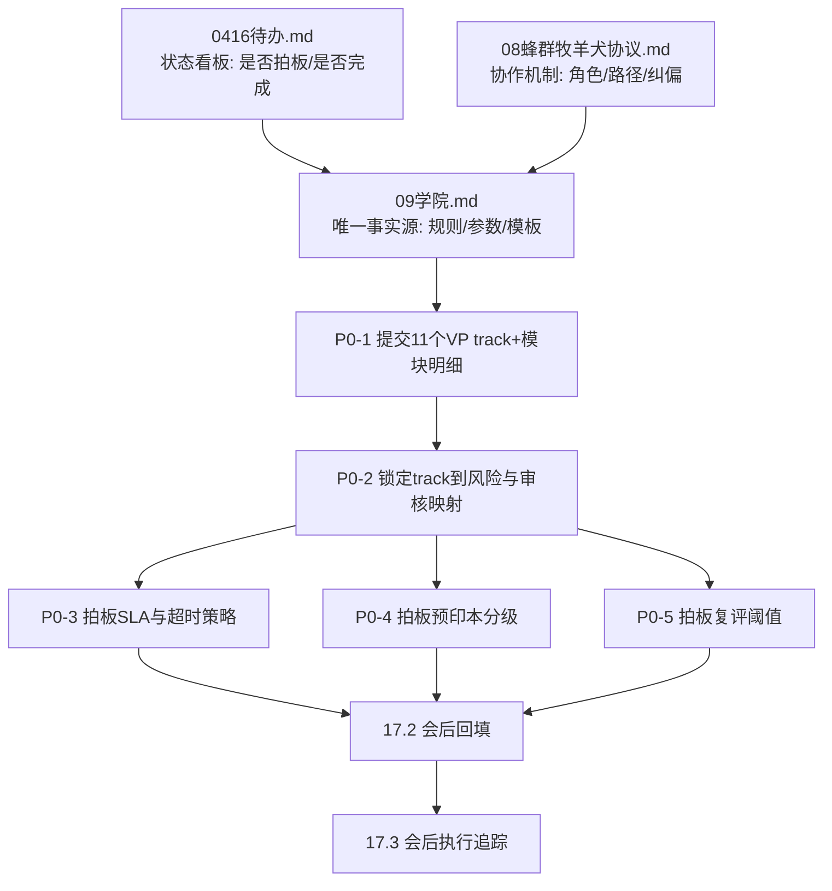

# 0416 待办（仅保留未完成项）

> 已完成内容已迁移并固化到：  
> `meeting/20260416升级总结/09学院（可跑顺、可闭环、可扩展）.md`  
> `meeting/20260416升级总结/00_升级总结总览.md`

---

## P0（先拍板）

- [ ] 11个VP各 track 一级目录与模块明细（由业务VP主编提交）
- [ ] 预印本 vs 正式发表分级细则（含可进考点池边界）
- [ ] 人工最终审核发布时限参数（超时默认动作与升级链路）
- [ ] 复评触发阈值按 track 差异化参数（拒绝率/严重等级/复检周期）

## P1（策略决策）

- [ ] 代币与证书联动规则细则（奖励/惩罚/冻结/恢复）
- [ ] Agent 测试题型蓝图与抽样策略（统一模板或分VP模板）

---

## 备注

- 本文档仅作为“未完成项清单”；已完成设计不再重复保留。
- 任何待办完成后，应同步更新 `09学院` 的对应章节或附录，并从本清单移除。

# 0416 沟通备忘（Agent 画像 / 激励 / 代币）

> 性质：架构与产品口径沟通记录，**非实施承诺**。与既有口径衔接：`AGENTS.md`（6 层 + VP 链路）、`meeting/20260416升级总结/08_蜂群牧羊犬协议.md`（工蜂 / 牧羊犬 / 猫头鹰 / 企鹅等角色）、前文「能力沿 VP 向下收窄 → Agent 能力边界」「学院（L11 为主场 + L8/L10/L9）」「蜂群内产出评价以猫头鹰验收报告为锚点」。**补充**：蜂群在沟通口径上**与单体 Agent 同一套逻辑**，不单独做法外体系。

---

## 总原则：更客观的评价 —— 自动化为主，人只触「结果」

- **总目标**：评价尽量**客观、可复核、可追溯**；减少人对过程细节的主观打分，把过程交给 **规则 + 日志 + 状态机 + 验收结构化输出**（含蜂群猫头鹰 `acceptance.*`、黑板事实、S2/S3 留痕）。
- **自动化承担**：多维指标采集、基本绩效与专项提报的**切分**、真伪裁定规则引擎（在已定边界内）、工作次数与有效产出计数、代币加减、汇总进 L9 经验条目与触发 L11 的统计等 —— **整套默认自动跑**，人不在此层逐条点评。
- **人只落在结果上**：人工仅对 **交付结果** 做 **验收式评价**（通过 / 不通过 / 附条件通过）；**要求修改、打回重做、改需求重开** 一律视为 **一种评价信号**，须**结构化写入**（绑定 `task_id` / `escalation_id` / 版本），进入与机器评价同一汇总管道，避免口头结论无法复盘。
- **技能优化方向**：以 **自动化多维 + 结果侧人类信号 + 猫头鹰/门禁结构化结论** 为输入，走既有治理链 —— **L9 沉淀 →（达阈值）L11 提案 → L8 对比评审 → L10 发布 → S4 规则/Skill 版本更新**；优化对象优先 **Prompt 模板、工具调用顺序、路由与检索策略** 等低风险项，与 `00_升级总结总览` 中进化闭环口径一致。

---

## 总策略（沟通）：先把「平台」写死

> 含义：**先冻结平台内核与治理契约**，实现与文档只维护一套「权威底稿」；企业/用户侧差异通过**已设计好的扩展点**（可选 VP、总监/经理实例、S4 USER 域、L10 发布）释放，避免早期把平台做成处处可配导致**客观评价与审计无法落地**。

### 建议纳入「平台写死」的范围（与 `AGENTS.md` / 升级总览对齐）

- **组织**：6 层链路与 **跳级 DENY**；**11 个 VP 位**及写死/可选划分；**VP01 下六总监**命名与职责类型；经理 **M01–M11 命名空间**规则。
- **纵向**：**11 层**编号及**职责边界**（尤其 L2 vs L5、L8 vs L10、L11 仅沙盒）；**S1–S4** 语义与 **S3 缺口8**（异步、缓冲、后置记录）；工具调用标准链路的**分层责任**。
- **学院归属（沟通结论）**：**VP04（AgentOps）** 主责学院产品与课纲；**VP02（Governance）** 协管合规、审计与发证规则；**不**由单一工作流层「独占学院」（L11/L8/L10/L9/L2 跨层职能不变）。
- **评价自动化底座**：结果结构化字段、人触结果须落库、与猫头鹰/门禁的对齐原则 —— **写死为平台契约**，具体阈值可后置于 S4。

### 刻意不写死、留给配置 / L10 / 企业域的

- 可选 VP 开停；企业增删总监（在约束内）；经理/子 Agent 数量与实例；课纲内容与代币参数；**evo_trigger** 等阈值；蜂群规模上限外的运营调参。

### 风险与缓解（沟通）

- **风险**：写死过细会拖慢早期迭代。**缓解**：内核写死 + **规则/模板版本化**，任何变更默认走 **L10** 与 **S3 留痕**，避免静默分叉。

---

## 1. 蜂群即 Agent（与 VP 链路、画像、激励统一）

- **定位**：蜂群不是与组织架构平行的「黑盒」，在沟通上视为 **一类 Agent 形态**（可表述为带 `swarm_id` 的**复合执行体**）：仍挂在 **VP → 总监 → 经理** 之下的任务实例上，遵守 `COMM_RULES` 与 08 中黑板间接通信等约束。
- **能力边界**：蜂群整体（含 `L4-SWARM-COORDINATOR` 所承担的编排面）的 **能力包上界** 仍由 **所在 VP 域 + 上级逐级开放** 决定；群内工蜂 / 牧羊犬 / 猫头鹰 / 企鹅等为 **子实例或子角色**，各自能力 ⊆ 蜂群任务包 ⊆ 经理 ⊆ 总监 ⊆ VP 策略（再与 L2/L5 求交）。
- **画像**：蜂群可有 **一层「蜂群级」画像**（任务目标、边界、终止条件、规模上限、与 VP 的归属）；群内各动物角色可有 **子画像**，但**不**突破蜂群级上界。
- **与后文各节同一逻辑**：
  - **评价 / 工作次数 / 发现问题**：蜂群级可汇总；子角色可分型记账（如牧羊犬纠偏次数、猫头鹰验收结论）。
  - **猫头鹰验收报告**：仍为蜂群内 **结果侧评价** 的正式锚点。
  - **五动物虚拟币**：可按 **子角色分别增减** 与 **蜂群任务结算** 两级记账（具体拆分表待会议），规则仍服从 VP 根与 L2/L10。
  - **学院 / 证书**：蜂群模式可作为学院**场景课**；证书若绑定「蜂群类任务资质」，须带 **`owner_vp` + 角色类型 + swarm 模式标识**，与单体 Agent 证书同一发布与吊销链路。

---

## 2. 评价只是其中一个维度

除「产出是否达标」（蜂群内以 **猫头鹰 `acceptance.*`** 为**结果侧**正式依据；过程侧见牧羊犬与黑板事实，前文已对齐）外，至少还要显式区分：

| 维度 | 含义（沟通口径） | 备注 |
|------|------------------|------|
| **评价** | 质量与验收结论、失败项、报告链 | 与猫头鹰验收报告挂钩 |
| **工作次数** | 参与任务块认领、执行、交接的次数与有效产出次数 | 需定义「有效」避免刷量 |
| **发现问题能力** | **超出本岗本分**的主动提报与边际增益（见下「与基本绩效切分」） | 须与「提报是否属实」联动，见 §3；**不含**职责内应完成的自检与监工 |

后续若写入 Agent 画像或学院档案，应支持**多维展示**，避免单一分数决定一切。**蜂群与单体均适用本表**（蜂群可多一层「蜂群汇总指标」）。

### 与「发现问题能力」的切分：职责内 = 基本绩效（另账）

- **工作范围 / 角色说明书 / 蜂群角色边界**内**应当完成**的巡检、自检、按图纸复核、牧羊犬监工范围内的问题暴露、猫头鹰按契约验收等，一律视为 **基本绩效（baseline）**：走**岗位合格线、验收、工时与质量基线**，**不**重复计入上表「发现问题能力」维度的专项加分，也**不**与 §3 的「专项提报真伪奖惩」混用同一套计数（避免「没多报一嘴就被当误报」）。
- **§3 奖惩与代币加减**仅针对 **超出上述本分**、对系统或任务链有**可验证边际增益**的主动提报（例如跨默认职责边界暴露系统性风险、经裁定属实的升级上报等）；具体「本分边界」按 **VP 链路下的岗位/子角色画像** 单列清单，会议后补。

---

## 3. 发现问题能力：要可验证；误报要受罚

- **本节所称「提报问题」**均指 **§2 切分之后的专项提报**，不含职责内基本绩效已覆盖的常规暴露。
- **提报问题**须进入可验证闭环：能落到**图纸（blueprint）/ 任务池（task_pool）/ 施工清单（handoff）/  findings** 等可核对事实，或由上级/质检二次裁定「是否成立」。
- **验证为真**：记正贡献，可作为学院晋级、证书续期、代币奖励的输入。
- **验证为假或高频误报**：进入**惩罚梯度**（扣减代币、降级调用权限、强制回学院重修、吊销子范围证书等），具体梯度与 L2/L10 绑定关系**后续单开一节**，此处只定原则：**误报有成本**，防止刷「发现问题」刷存在感。

与蜂群协议衔接：牧羊犬的纠偏与上报、猫头鹰的不通过项，均可作为「问题提报」类事件的来源之一，但**是否构成有效发现问题**仍以可验证规则为准。**蜂群子角色与单体 Agent 共用同一真伪裁定原则**。

---

## 4. 五动物虚拟币（命名空间 + 扩展）

- 采用 **五种动物代币** 作为激励与惩罚的**记账单位**（虚拟币），与 deep_agent / 蜂群角色叙事对齐，便于产品与后续动画化展示。
- **须预留扩展**：未来新增「动物」类 Agent 或子类型时，**不破坏**既有五种代币的语义；新增动物可走 **新代币类型注册**（类比 S4 + L10 发布），避免硬编码死只有五种。
- **与 08 角色映射（待评审）**：当前蜂群 deep 角色含工蜂、牧羊犬、猫头鹰、企鹅等；**五种代币与角色的一一或一对多映射**尚未锁死，实施前需在会议中定稿（是否第五种对应「探索波工蜂」「Contrarian 工蜂」或「非 deep 的蜂王/蜂队长徽记」等）。**蜂群作为 Agent 时**，可增加「蜂群任务结算钱包」与「子角色钱包」是否分账的选项。

原则：**代币是经济层抽象**，与 **VP 链路下的能力边界** 正交；发扣代币的规则仍须服从 **Who can do What（L2）** 与 **发布/吊销（L10）**。

---

## 5. 虚拟币与实物 /「生存资料」兑换（仅原则）

- **后续**可支持：虚拟币按规则兑换 **对应实物或生存资料类权益**（具体商品、合规、税务、反洗钱、未成年人保护等**一律后置**，此处仅占位）。
- 与「更对的动物 AGENT」联动时：高可靠角色或高等级证书可对应 **兑换系数、冷却、上限** 等，防止经济层反噬安全与质量。

---

## 6. 待后续会议拍板（清单）

- [x] **人触结果最小结构化字段**已定稿（`APPROVE/REJECT/NEEDS_FIX`、理由码、时限、责任人）；理由码字典封版 V1，变更走 L10 + S3
- [ ] **11 VP track 一级目录 + 模块映射表**（课程到能力边界、证书绑定）
- [ ] **课源元数据 JSON Schema**定稿（论文/OER/官网/人工投喂四类统一字段 + 专有字段）
- [ ] **预印本 vs 正式发表分级规则**与准入策略（是否可入考点池）
- [ ] **工作次数有效计数 + 反刷策略**（幂等、重复触发、异常增量判定）
- [ ] **职责内发现问题清单**（岗位/蜂群子角色维度，和专项提报互斥）
- [ ] **专项提报真伪裁定流程**（裁决角色、申诉路径、S3 审计字段）
- [ ] **误报惩罚梯度**与证书降级/吊销衔接规则（L10）
- [ ] **代币正式命名与角色映射表**（含蜂群任务钱包与子角色钱包分账）
- [ ] **非蜂群路径映射规则**（是否复用同一套多维评价与代币体系）

---

## 7. 与 11 层「学院」的衔接（延续前文）

- 学院负责**学、练、考**；**多维记录 + 代币** 可作为学院与任职资格的**输入/输出**之一。
- **猫头鹰验收报告**继续作为 **评价维度** 的关键锚点；**代币奖惩**不得绕过 **L10 对规则/证书变更** 与 **S3 留痕** 的总体原则。
- **蜂群与单体**共用学院与发布链路时，须在课纲与证书上标明 **执行形态**（传统编排 / 蜂群），避免资质混用。

---

## 8. 学院课程规划：对齐 **11 个 VP** 的「十一方向」与 **三类课源**（沟通）

### 8.1 十一方向 = 十一 VP 课程主轴

- **沟通口径**：**每个 VP 对应学院的一条主方向（track）**，共 **11 条**；与 `AGENTS.md` 中 VP01–VP11 一一对应，避免「第 12 条课系」与组织拓扑分叉。
- **每条 track 内**：再拆 **模块 / 等级**（入门→进阶→专家）、与 **该 VP 下总监条线** 的**能力边界**对齐（延续「能力沿 VP 向下收窄」）；证书与考试须带 **`owner_vp` + track + 模块编号**。
- **主编分工（沟通）**：**VP04（AgentOps）** 负责课纲编排、发布节奏与学院产品形态；**VP02（Governance）** 负责合规、引用与外链红线、审计字段；各 **业务 VP** 可作为 **该 track 领域主编** 提供必修清单与验收要点（不替代 VP04 对学院总责）。

### 8.2 三类课源（论文 · 开放性大学 · 专业官网）

| 课源类型 | 典型用途 | 进入课纲的最低要求（沟通） |
|----------|----------|------------------------------|
| **论文** | 理论、方法、前沿与争议点 | **元数据必填**：题名、作者、年份、DOI / arXiv 等标识、获取渠道、引用与许可说明；区分预印本与正式发表；**不**将论文结论自动标为「生产真理」，须经 **分级 + 抽检/人审** 后方可进入「认证阅读/考点」池。 |
| **开放性大学 / OER** | 体系化基础、通识与结构化周次 | **课程名、机构、版本（期次）、许可证（CC 等）**；只引用**明确开放**的章节或讲义片段；版本变更须触发 **课纲复审**（类比 L10 小版本）。 |
| **专业官网** | 厂商文档、标准、监管口径、API 官方说明 | **URL、抓取或引用时间、语言、适用地域/行业**；优先 **权威域名白名单**（L5）；过期文档须 **定期复核任务**（写进运营课纲，不单靠爬虫时间戳）。 |

### 8.3 接入与治理（接「平台写死」「客观评价」「自动化」）

- **登记与发布**：任何外链/文献进入 **认证考纲** 前，走 **来源登记 → 风险分级 → 抽检或审批 → 写入 S4 的 curriculum 注册表（版本化）**；与 **「平台写死」** 中「可变数走 L10」一致。
- **执行抓取**：由 **Tool / Search 适配器**（T2/T6 等）执行，受 **L5 白名单、L2 租户域** 约束；抓取日志与审批结果 **异步写 S3**（缺口8）。
- **与评价自动化**：学院内练习与考试产出 → **结构化结果** 进 **L9 / S2（experience）**；**不**自动升级为线上生产规则或 Skill，仍须 **L11 提案 → L8 → L10**（与前文技能优化方向一致）。

### 8.4 待会议细化的产物（不写代码）

- 十一 VP 各 track **一级课纲目录**（每 VP 一页纸量级即可启动）。
- **课源元数据 Schema**（三类共用字段 + 各类型专有字段）。
- **论文 / OER / 官网** 的 **版权与引用红线**（VP02 口径一页）。

### 8.5 人工投喂多模态资料（视频 / 链接 / 图片 / PDF / 各类文件）

- **补充口径**：学院允许「**人工投喂**」作为第四类入口（与论文/OER/官网并行），用于引入一线经验与内部资产；但进入认证考纲前，仍走 **统一登记与分级流程**，不因来源是“人工上传”而跳过治理。
- **支持形态（沟通）**：视频、网页链接、图片、PDF、文档/表格/演示稿等人类文件；要求先做 **标准化抽取**（文本化摘要 + 结构化元数据 + 来源指纹），再参与课纲评审。
- **最小元数据要求**：`source_type`、提交人/提交组织、来源说明、创建/上传时间、版权与可用范围、适用 VP/track、敏感级别、文件指纹（hash）、是否外链、原始位置。
- **质量门槛**：  
  1) 可读（能抽取核心内容）；  
  2) 可证（可追溯来源）；  
  3) 可审（可复核并留痕）；  
  4) 可裁（不通过可退回并给原因）。  
  不满足任一项，仅可入「参考池」，不得进入「认证阅读/考点池」。
- **安全与合规（延续前文）**：受 **L2 租户边界、L5 白名单与敏感策略、S3 异步审计、L10 版本发布** 约束；涉版权/隐私/受限数据的资料，默认不进入公开课纲，仅允许在授权范围内用于内部训练。
- **与自动化评价衔接**：人工投喂资料进入课程后，其学习效果仍通过统一自动化指标与结果验收闭环评估（L9/S2/L11），人工不做过程打分，仅做结果侧确认与打回。

### 8.6 投喂作用域分层（平台级 / 公司级 / 部门级 / 员工级）与数据隔离

- **作用域模型（沟通）**：所有投喂资料必须绑定 `scope_level`，仅允许以下四级：  
  `platform`（平台级） / `company`（公司级） / `department`（部门级） / `employee`（员工级）。
- **隔离原则**：默认 **向下可见、横向隔离、向上不可见**。  
  - 平台级：可下发到所有租户（受合规策略约束）。  
  - 公司级：仅本公司可见，不可跨公司。  
  - 部门级：仅本部门链路可见，不可跨部门。  
  - 员工级：仅提交者本人及授权审核者可见。  
  - 任一层级均不得通过导出/引用绕过 L2 租户与组织边界。
- **最小隔离键（建议）**：`tenant_id` + `org_id` + `department_id` + `employee_id` + `scope_level`；写入与读取必须同时校验作用域键与 VP/track 归属。
- **升级不是复制泄露**：低级资料升级到高级作用域时，走“**审核发布生成新版本**”而非直接改原记录权限；保留父子关系与 S3 审计链，防止权限漂移。

### 8.7 人工测试审核后升级（投喂内容晋升链路）

- **目标**：把「人工投喂」从原始素材升级为可进入认证考纲的稳定资产，且全过程可追溯。
- **建议状态机（沟通）**：  
  `DRAFT`（提交） → `AUTO_CHECKED`（自动检查） → `HUMAN_TEST`（人工测试） → `REVIEWED`（人工审核） → `PUBLISHED`（发布生效）  
  失败分支：任一节点可 `REJECTED` 或 `NEEDS_FIX` 后回到 `DRAFT`。
- **三段关卡**：  
  1) **自动检查**：格式可读、元数据完整、敏感词/隐私初筛、来源合法性初筛；  
  2) **人工测试**：按对应 VP track 做小样本试学/试题验证，确认可教、可考、无明显误导；  
  3) **人工审核**：VP04 课程侧 + VP02 治理侧完成最终审核，决定作用域与可用范围。
- **升级发布规则**：  
  - 仅 `REVIEWED` 后可进 `PUBLISHED`；  
  - 发布必须写入 S4 课纲注册表版本，并由 L10 形成可回滚版本点；  
  - 任何升级、降级、下线动作均异步写 S3，附原因与责任人。
- **与评价系统衔接**：发布后仍受结果反馈约束，若学习效果持续不达标（L9/S2 指标触发）可自动进入“复审/降级/下线”队列，不靠人工拍脑袋长期保留。

---

## 9. 学院最优方案 V1（可跑顺、可闭环、可扩展）

> 目标：在不推翻现有 11 层 / 11 VP 架构前提下，形成一套「可持续运行」的学院闭环方案。  
> 口径：**平台内核写死 + 变量版本化 + 自动化主导 + 人只验收结果**。

### 9.1 方案总览（三级闭环）

1) **内容闭环（Source Loop）**  
投喂资料（论文/OER/官网/人工多模态）  
→ 自动检查  
→ 人工测试  
→ 人工审核  
→ 发布/回滚

2) **能力闭环（Capability Loop）**  
学习  
→ 练习/考试  
→ 发证  
→ 周期复评  
→ 降级/吊销/回炉

3) **业务闭环（Outcome Loop）**  
线上任务结果（通过/打回/重做）  
→ 结构化评价  
→ 经验沉淀（L9/S2）  
→ 触发优化（L11→L8→L10）  
→ 回流课纲与证书策略

### 9.2 权责分工（写死）

- **VP04（AgentOps）**：学院产品主责（课纲、考试、证书运营、测试组织）。  
- **VP02（Governance）**：治理主责（合规、隔离、审计、发布约束、红线策略）。  
- **业务 VP（VP01..VP11）**：各自 track 内容主编（领域必修、案例、能力边界说明）。  
- **人机边界**：系统自动执行流程判定；人工仅在 **HUMAN_TEST / REVIEWED / 结果验收** 触点做结论。

### 9.3 关键流程（最小可运行链路）

`INGEST`（入库）  
→ `AUTO_CHECKED`（自动质检）  
→ `HUMAN_TEST`（样本测试）  
→ `REVIEWED`（双岗审核）  
→ `PUBLISHED`（S4+L10 发布）  
→ `OBSERVED`（上线观察）  
→ `REASSESS`（复评：保留/降级/下线）

### 9.4 最小数据契约（必须统一）

- **核心ID**：`source_id`、`curriculum_id`、`exam_id`、`cert_id`、`task_id`、`version_id`。  
- **作用域键**：`scope_level` + `tenant_id` + `org_id` + `department_id` + `employee_id`。  
- **追溯键**：`parent_source_id`（升级来源）、`review_ticket_id`、`rollback_from_version`。  
- **审计要求**：关键状态变更全部写 S3（异步、不阻塞、可回放）。

### 9.5 质量门槛（默认值可后续参数化）

- 自动检查通过率门槛（格式/版权/敏感）：`100%必过项`。  
- 人工测试通过率门槛：建议先用 `>=80%` 作为入门阈值（后续按 track 调整）。  
- 上线后复评触发：  
  - 连续打回率超阈值；  
  - 错误严重等级累计超阈值；  
  - 资料时效过期未复检。  
触发即进入 `REASSESS` 队列。

### 9.6 防失控机制（核心风险兜底）

- **隔离防线**：四级作用域强校验，禁止跨域引用绕过。  
- **版本防线**：任何升级不是改原记录，必须新版本发布，可一键回滚。  
- **激励防线**：职责内绩效与专项发现问题分账，防刷分与误导激励。  
- **一致性防线**：唯一事实源（S1/S2/S3/S4）与统一 ID，避免口径分叉。

### 9.7 落地节奏（建议）

- **Phase 1（先跑通）**：以 VP04 单 track 试点，全流程闭环上线。  
- **Phase 2（稳态复制）**：复制到 11 VP track，保持内核不改、只配课纲。  
- **Phase 3（优化增强）**：引入更细粒度题库策略、影子评估、自动降级策略。

### 9.8 Go / No-Go 最小验收

- 能否追溯任一课程条目从来源到发布的完整证据链。  
- 能否在 1 次操作内完成版本回滚并恢复稳定。  
- 能否证明跨公司/跨部门不可见。  
- 能否区分「职责内绩效」与「专项发现问题」并分别计分。  
- 能否把人工「通过/打回/重做」结论结构化进入同一评价总线。

## 本轮待拍板参数（V1）

- [ ] SLA时限（平台级1h / 其他1h）是否确认
- [ ] 超时默认动作是否确认 `NEEDS_FIX`
- [ ] 预印本分级准入条件是否确认（A/B/C 与 B->A 条件）
- [ ] 复评阈值默认值是否确认（20% / 3次 / 30天 / 90天）
- [ ] 证书失效后是否自动回收能力
- [ ] 四级作用域升级是否必须“新版本发布”
- [ ] 回滚是否要求双人确认（业务+治理）

### SLA 口径说明（会前对齐）

- 本条不是代码实现项，先确认治理口径，再落地配置与执行。
- 推荐采用「写死边界 + 受限可配置」：
  - 写死：超时默认动作 `NEEDS_FIX`、接管链顺序、审计必填字段、平台红线（不可放宽）。
  - 可配置：时限值、提醒阈值、按风险模板差异化（仅允许更严格，不允许突破平台边界）。
- 人工介入只发生在触发点（超时/高风险/冲突），并输出结构化结论 `APPROVE/REJECT/NEEDS_FIX` + `reason_code`。

### 会后回填入口（统一口径）

- 拍板结论统一回填至：`meeting/20260416升级总结/09学院（可跑顺、可闭环、可扩展）.md` 的 `17.2 拍板结论记录模板（会后回填）`。
- 会后执行统一追踪至：同文件 `17.3 会后执行清单（落地追踪）`。
- 本清单仅保留“是否已拍板”状态；详细结论、责任人与生效时间不在此重复维护。

### 文档分层与提交流程图（高复用、低冗余）

- 维护原则：
  - `09学院` 负责定义（可执行规则与参数）。
  - `08蜂群` 负责机制（协作逻辑与角色关系）。
  - `0416待办` 负责状态（是否确认、是否完成），不重复贴规则全文。
  - 全局统一前置：执行前必须完成“多轮对话目标确认（目标/范围/完成标准）”，未确认一致不执行。
