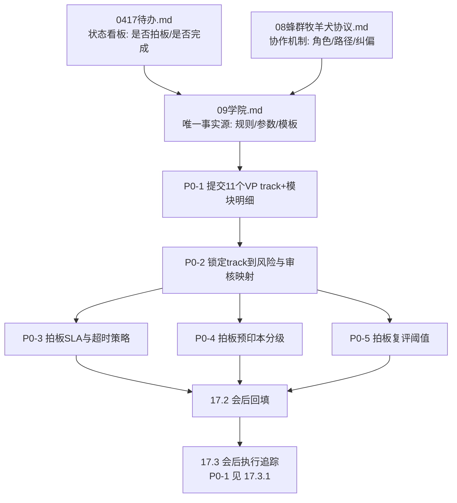

# 0417 待办（仅保留未完成项）

> **文件名沿革**：由原 `0416待办.md` 更名为本文件；仓库内其它文档已同步指向 `0417待办.md`。

> 已完成内容已迁移并固化到：  
> `meeting/20260418升级总结/09学院（可跑顺、可闭环、可扩展）.md`  
> `meeting/20260418升级总结/00_升级总结总览.md`

---

## 下次打开先看：会话沉淀与未完成（沟通已写入文档）

> **目的**：把会话里已对齐、但 **勾选仍为 `[ ]`** 或 **须人执行** 的事项集中在一处；**下次打开本文件先看本节**，再对照 **P0 / §6 / 本轮待拍板**。详细规则 **不重复**，一律指向 `09学院`。

### 权威与分工（一行）

| 角色 | 文档 |
|------|------|
| 规则 / 参数 / 模板 / Playbook **唯一事实源** | `meeting/20260418升级总结/09学院（可跑顺、可闭环、可扩展）.md` |
| 全局总览入口 | `meeting/20260418升级总结/00_升级总结总览.md` |
| **本 `0417待办.md`** | **未完成状态看板** + 沟通备忘；不写长规则正文 |

### 已在 `09学院` 固化（≠ 业务或会议已结案）

- **`§14.4`**：对外引用章节速查（防误引「8.x = 课源」等）。  
- **`§14.5` / `§14.5.6`**：平台四类配置、租户可覆盖白名单、逻辑键↔S4 映射、冲突/缺交流程。  
- **`§14.6`～`§14.6.5`**：治理短会、主编征集、`v0` Phase0、**一页会议检查清单**。  
- **`§14.6.4`**：前端 + **任意对话** 入口、**同一状态机**；**「训练」消歧**；**任何对话须先满足 `§2.2` 两轮目标沟通 + 配图**（与 **`17.7.1`** 一致）。  
- **`附录 I`** + 单独附件 **`附录I_VP_track主编交稿模板.md`**（邮件可只附后者）。  
- **`§17.2` 表扩展**、**第十七章**状态说明、**`17.7.5` 标题**与清单语义对齐。

### 仍须人工执行（打开文档后对着打勾）

| 事项 | 怎么做 | 做完后改哪里 |
|------|--------|----------------|
| 治理短会 + 回填 | 按 **`09学院` §14.6.5** 逐项执行 | **`09学院` §17.2** + **第十七章** `- [x]`；再回到本文 **「本轮待拍板」** 与 **P0** 打 `[x]` |
| 主编征集 | **`09学院` §14.6.2**：附录 I、截止日、**唯一提交入口**、VP04 收口人 | 收齐材料后 **§6**、**P0-1** 打 `[x]` |
| Phase 0 `v0` | **`09学院` §14.6.3`**：载体 + `policy_version` + 四块配置 | **`§17.2` 备注** 或纪要中贴 **v0 链接** |
| 产品实现 | 前端 + 任意对话 → 同一 **`DRAFT`** 链（**`§14.6.4`**） | **工程排期**；不在本文当「文档已完成」 |

### 仍须知晓的事实（避免误会）

- **本仓库无** `track.catalog` / 配置自动校验的 **实现代码**；「平台做配置」当前允许 **Git / Wiki / 只读表** 作 **`v0` 载体**（见 **`§14.6.3`**）。

### 与下方 `[ ]` 清单的关系

- **正文里已有基线**（如 **`15.2`/`15.3`/`15.4`/`15.5`**）**不等于**「会已开完」。会后若 **采纳基线**，在 **`§17.2`「最终口径」** 写 **「采纳基线；无差分」+ 生效日**，再回本文把对应 **`[ ]` → `[x]`**，避免看板永远不打勾。

---

## P0（先拍板）

> 执行规则：P0 同一时间只保留 1 条进行中；其余保持待排队，当前不并行。

- [ ] 【进行中】收齐并校验 11个VP各 track 一级目录与模块明细（由业务VP主编提交）【迁移：09学院-附录I + 17.2 + 17.3.1】
- [ ] 【排队】预印本 vs 正式发表分级细则（含可进考点池边界）【迁移：09学院-15.2 + 17.2】
- [ ] 【排队】人工最终审核发布时限参数（超时默认动作与升级链路）【迁移：09学院-17.7.5 + 17.2 + 17.3】
- [ ] 【排队】复评触发阈值按 track 差异化参数（拒绝率/严重等级/复检周期）【迁移：09学院-15.4/15.5 + 17.2 + 17.3】

### 当前进行中执行卡（P0-1）

> **口径唯一事实源**：`meeting/20260418升级总结/09学院（可跑顺、可闭环、可扩展）.md` **`§14.6.2.2`**（`有效数=11`、统计/复核冻结、分支执行）。本文以下为 **操作面**；若表述冲突，以 **`09学院`** 为准。

- [ ] 任务：`收齐并校验 11 个 VP 交稿（4项）`
  - 执行：`按附录I模板收齐 track一级目录、模块明细、能力边界、证书绑定，并统一到唯一提交入口`
  - 检查（全部通过才可删除本条）：
    - [ ] `结果检查`：`有效数=11/11`（定义见 **`09学院 §14.6.2.2`**）；且 **VP04（统计）+ VP02（复核）** 已对 `有效数` 与 `缺口VP` **书面确认无异议并冻结**
    - [ ] `文件检查`：`结论已回填 09学院 §17.2；P0-1 留痕（scope+统计+双签）已填实 §17.3.1；必要项已同步附录I`
    - [ ] `状态检查`：`本文 P0-1 已更新状态，并记录收口人/截止时间/版本`
  - 完成判定：`3项检查均为 [x]`
  - 完成后动作：`删除该进行中条目 -> 将“预印本 vs 正式发表分级细则”升为【进行中】 -> 继续下一条沟通`

#### P0-1 当前状态（滚动更新）

- 当前结论：`未完成（检查项未全部通过）`
- **仓库校验（Agent，2026-04-16）**：在 `flow--harness-02` 内 **未发现** 可作为事实源的 **11 VP 附录 I 实交件**（无统一收件目录/表导出；且 **Agent 默认无「唯一提交入口」读权**，见 **`09学院 §14.6.2.2` 之「2.5）授权与可见范围」**）。因此 **核对表不得标 Y**，仅能保留 **`N` = 未在本仓库证实** 或备注 **`待唯一入口核实`**；**真实 `有效数` 须由 VP04 在已授权范围内** 对「唯一提交入口」人工统计后覆盖，并经 VP02 双签冻结。
- 当前缺口：
  - `提交缺口`：`待确认是否已达 11/11`
  - `回填缺口`：`待确认 09学院 §17.2 与 §17.3.1 是否已写入结论与留痕`
  - `状态缺口`：`待补收口人/截止时间/版本等完成记录`
- 下一动作（按顺序执行）：
  - [ ] `data_access_scope`：按 **`09学院 §14.6.2.2` 2.5）** 在 **`09学院 §17.3.1`** 填实（无授权范围则 **不做**「有效数」终局统计）
  - [ ] `统计有效数`：按 **`09学院 §14.6.2.2`** 汇总 `有效数` 与 `缺口VP`（`提交数` 仅作过程播报，不作为完成条件）
  - [ ] `双签冻结`：VP04 产出统计、VP02 复核书面确认（无异议即冻结为会前事实）
  - [ ] `字段抽检`：逐条抽检 4 项字段是否齐全（可抽检后再全检）
  - [ ] `回填结论`：将拍板结论写入 `09学院 §17.2`，将 P0-1 执行留痕写入 `09学院 §17.3.1`
  - [ ] `更新本卡`：把三类检查项改为 `[x]` 或记录未通过原因

#### P0-1 执行前置确认卡（填完即可执行）

- [ ] `唯一提交入口` 已填写：`<URL>`
- [ ] `截止时间` 已填写（含时区）：`<YYYY-MM-DD HH:mm TZ>`
- [ ] `data_access_scope` 与 **P0-1 统计窗口** 已写入 **`09学院 §17.3.1`**（与 **`09学院 §14.6.2.2` 2.5）** 一致；**禁止**在本文件另存一份不同正文）
- [ ] `当前现状` 已填写：`提交数=<n>/11；有效数=<m>/11；缺口VP=<VP列表>`（数字须与 **`09学院 §17.3.1`** 一致）
- [ ] `双签冻结` 已完成：VP04 统计 + VP02 复核，对 `有效数` 与 `缺口VP` **书面确认无异议**

#### P0-1 与 `09学院 §17.3.1` 的关系（避免双份维护）

> **`data_access_scope` + 统计结果** 的**唯一正文**在 **`meeting/20260418升级总结/09学院（可跑顺、可闭环、可扩展）.md` → `§17.3.1`**。此处只勾选「已写入」；占位符、`<n>/<m>`、双签日期等 **一律在 `09学院` 内修改**。
> **填值顺序**：按 `§17.3.1` 的 **「P0-1 推荐字段顺序（最优）」** 逐项填写（窗口 -> 有效判定 -> VP04输出 -> VP02确认 -> 冻结结论 -> 证据链接），避免漏项与顺序混乱。

- P0-1 填值快检（与 `§17.3.1` 一一对应）：
  - [ ] 已填 `统计窗口`：`start~end (TZ)`
  - [ ] 已填 `有效判定`：`有效=已提交Y且4项齐全Y且格式通过Y`
  - [ ] 已填 `VP04 统计输出渠道`（工单/邮件/群链接之一）
  - [ ] 已填 `VP02 复核确认原文`
  - [ ] 已填 `冻结结论`：`提交数/有效数/缺口VP`
  - [ ] 已填 `证据留痕链接`

#### VP04 一次性填报模板（复制即填）

> 用途：由 VP04 一次性给出 `§17.3.1` 所需核心字段；VP02 仅补复核确认原文与确认时间。

```text
【P0-1 一次性填报（VP04）】
- 统计窗口：<YYYY-MM-DD HH:mm> ~ <YYYY-MM-DD HH:mm> (<TZ>)
- 有效判定：有效=已提交Y且4项齐全Y且格式通过Y
- 唯一入口：<URL/邮箱/工单类型+项目/共享盘路径>
- VP04 统计输出渠道：<工单ID/邮件主题/群消息链接>
- 冻结结论：提交数=<n>/11；有效数=<m>/11；缺口VP=<VP列表>
- 证据留痕：<链接1>；<链接2>
- 备注：如 m<11，已触发缺口补交通知，截止 <YYYY-MM-DD HH:mm TZ>
```

```text
【P0-1 复核补充（VP02）】
- 复核确认原文：已复核，同意冻结P0-1统计结果。
- 复核确认时间：<YYYY-MM-DD HH:mm TZ>
- 复核渠道：<工单评论/邮件回执/群确认链接>
```

#### 可直接发送（催填 §17.3.1）

```text
@VP04 @VP02 请按 P0-1 收口规则补齐 09学院 §17.3.1（先填实值再谈完成）。

请 VP04 直接回复并回填以下字段：
1) 统计窗口（start~end, TZ）
2) 唯一入口（URL/邮箱/工单/共享盘）
3) VP04 统计输出渠道（链接或ID）
4) 冻结结论（提交数/有效数/缺口VP）
5) 证据留痕链接

请 VP02 在 VP04 填后补：
6) 复核确认原文（“已复核，同意冻结P0-1统计结果”）
7) 复核确认时间与渠道

规则提醒：有效=已提交Y且4项齐全Y且格式通过Y；未达有效数=11前，不得写 §17.2“已收齐完成”结论。
```

#### 回填后 30 秒验收清单（你来勾）

- [ ] `§17.3.1` 已有实值（不再是 `<...>` 占位）
- [ ] 已看到 `统计窗口 + 唯一入口 + VP04输出渠道`
- [ ] 已看到 `冻结结论（提交数/有效数/缺口VP）`
- [ ] 已看到 `VP02 复核确认原文 + 时间 + 渠道`
- [ ] 已看到至少 1 条可点击的 `证据留痕链接`
- [ ] `0417待办` 的 `当前现状（n/m/缺口）` 与 `§17.3.1` 一致

- 验收结论：
  - [ ] `m < 11`：执行分支A（催补交，保持P0-1）
  - [ ] `m = 11`：执行分支B（回填 §17.2 完成结论，删除P0-1，切P0-2）

#### 与 `09学院 §17.3.1` 同步判定卡（最终版）

> 用途：将 `§17.3.1` 的 A/B/C 判定映射为本看板可勾选动作，避免口径来回切换。

- 判定A（字段齐全）：
  - [ ] `§17.3.1` 推荐字段 1~6 均为实值
  - [ ] 无 `<...>` 占位符残留

- 判定B（双签齐全）：
  - [ ] 已有 VP04 统计输出（含时间+渠道）
  - [ ] 已有 VP02 复核确认（含原文+时间+渠道）

- 判定C（数字一致）：
  - [ ] `提交数/有效数/缺口VP` 与 `0417待办` 当前现状一致

- 判定D（证据可追溯）：
  - [ ] 至少 1 条可点击或可检索证据链（工单/邮件/群链接）
  - [ ] 证据链可对应本次冻结结论（`提交数/有效数/缺口VP`）

- 同步结论（硬门禁公式）：
  - [ ] 真执行 = A AND B AND C AND D
  - [ ] A/B/C/D 全满足 -> 进入分支判定（`m<11` 或 `m=11`)
  - [ ] 任一不满足 -> 维持 P0-1 进行中，禁止写 `§17.2` 完成结论

- 执行分支判定（**前提**：上项「双签冻结」已为 `[x]`，以冻结后的 `m` 为准）：
  - `m < 11` -> `立即发送催补交通知` + `记录补交截止时间` + `保持P0-1进行中`
  - `m = 11` -> `执行回填模板到 09学院 §17.2；并确认 09学院 §17.3.1 中 scope + 统计窗口 + 双签已填实` + `勾选P0-1检查项为[x]` + `删除P0-1并切换P0-2`

#### P0-1 分支执行动作清单（填值后直接执行）

- 分支A（`m < 11`）：
  - [ ] 发送催补交通知（使用本文通知模板，替换截止时间）
  - [ ] 在核对表备注列写明缺口VP与缺失字段
  - [ ] 记录补交截止时间：`<YYYY-MM-DD HH:mm TZ>`
  - [ ] 更新当前状态：`未完成，待补交`

- 分支B（`m = 11`）：
  - [ ] 将 `P0-1 回填模板` 粘贴到 `09学院 §17.2` 并填入实值；确认 `09学院 §17.3.1` 已含 scope + 统计窗口 + 双签
  - [ ] 将本卡三项检查改为 `[x]`
  - [ ] 删除 `【进行中】P0-1` 条目（或标记完成后移除）
  - [ ] 将 `【排队】P0-2` 升级为 `【进行中】`
  - [ ] 在本文记录切换时间：`<YYYY-MM-DD HH:mm TZ>`

#### P0-1 每日状态播报模板（群内1句话）

- 进行中（`m < 11`）：

```text
【P0-1进度】当前提交<n>/11、有效<m>/11，缺口<VP列表>；已发补交通知，补交截止<YYYY-MM-DD HH:mm TZ>，P0-1保持进行中。
```

- 已完成（`m = 11`）：

```text
【P0-1完成】11/11有效提交已达成，结论已回填09学院§17.2，留痕已填实§17.3.1，现切换P0-2（预印本vs正式发表分级细则）为进行中。
```

#### P0-1 核对表（11个VP）

> 用法：每收一份就更新一行；“4项齐全”与“格式通过”都为 `Y` 才计入完成数。  
> **完成判定**：仅当 **`有效数 = 11`** 且满足 **`09学院 §14.6.2.2`** 之统计/复核冻结后，方可进入回填与删除本条。

| VP | 已提交 | 4项齐全 | 格式通过(附录I) | 备注 |
|----|--------|---------|-----------------|------|
| VP01 | N | N | N | 仓库未检出实交；待唯一入口核实 |
| VP02 | N | N | N | 仓库未检出实交；待唯一入口核实 |
| VP03 | N | N | N | 仓库未检出实交；待唯一入口核实 |
| VP04 | N | N | N | 仓库未检出实交；待唯一入口核实 |
| VP05 | N | N | N | 仓库未检出实交；待唯一入口核实 |
| VP06 | N | N | N | 仓库未检出实交；待唯一入口核实 |
| VP07 | N | N | N | 仓库未检出实交；待唯一入口核实 |
| VP08 | N | N | N | 仓库未检出实交；待唯一入口核实 |
| VP09 | N | N | N | 仓库未检出实交；待唯一入口核实 |
| VP10 | N | N | N | 仓库未检出实交；待唯一入口核实 |
| VP11 | N | N | N | 仓库未检出实交；待唯一入口核实 |

> **说明**：上表 **`N` 在此上下文中 = 「本 Git 仓库内未见可核验附录 I 交付」**，**不等于**业务侧已书面确认「该 VP 未交」。收件后由 **VP04** 据 **`09学院 §14.6.2.2`** 更新为 `Y/N` 真值，再经 **VP02** 双签冻结。

- 汇总口径：
  - `提交数`：`已提交=Y` 的 VP 数量
  - `有效数`：`已提交=Y 且 4项齐全=Y 且 格式通过=Y` 的 VP 数量
  - `P0-1 通过阈值`：`有效数 = 11`

#### P0-1 回填模板（达标后直接粘贴）

> 触发条件：仅当 `有效数=11` 时使用。若未达标，先在本卡记录缺口，不回填“已完成”结论。

- 回填到 `09学院 §17.2`（拍板结论）：

```text
【P0-1 结论】11个VP交稿输入已收齐并通过附录I格式校验。
- 生效日期：<YYYY-MM-DD>
- 版本号：<policy_version>
- 收口人：VP04
- 复核人：VP02
- 结果：11/11 VP 有效提交（track一级目录、模块明细、能力边界、证书绑定）；
        字段完整且命名规范通过，作为后续P0拍板统一输入。
- 备注：如后续发现单条差错，按补交流程修订并留痕，不影响本次收口结论。
```

- 执行留痕 **`data_access_scope` + 统计窗口 + 双签**：**唯一正文**在 **`09学院 §17.3.1`**（须事先或同步填实）。达标后 **无需** 在别处再贴一份不同正文；若纪要仅需一行摘要，可选用：

```text
【P0-1执行完成摘要】有效数=11/11；授权与统计全文见 09学院 §17.3.1；收口 VP04 / 复核 VP02。
```

- 本文同步更新（完成闭环）：
  - [ ] 将 `当前进行中执行卡（P0-1）` 三项检查改为 `[x]`
  - [ ] 删除 `【进行中】P0-1` 条目（或标记完成后移除）
  - [ ] 将下一条 `【排队】` 升级为 `【进行中】`

#### 下一条预置执行卡（P0-2，待P0-1完成后启用）

- [ ] 任务：`预印本 vs 正式发表分级细则（含可进考点池边界）`
  - 执行：`基于09学院既有基线整理A/B/C分级口径，补齐“可学/可考/可入考点池”边界与B→A升级条件`
  - 检查（全部通过才可删除本条）：
    - [ ] `结果检查`：`A/B/C边界清晰，含可进考点池条件与反例说明`
    - [ ] `文件检查`：`差分回填 09学院 15.2（若有）并在 §17.2 写最终口径`
    - [ ] `状态检查`：`本文P0-2状态已更新，记录生效日期/版本/责任人`
  - 完成判定：`3项检查均为 [x]`
  - 完成后动作：`删除该进行中条目 -> 将“人工最终审核发布时限参数”升为【进行中】 -> 继续下一条沟通`

##### P0-2 快速产出模板（讨论/回填两用）

```text
【P0-2 口径草案】预印本 vs 正式发表分级细则
- A级（正式发表）：可学，可考，可入考点池
- B级（预印本）：可学，不可直接入考点池；满足<条件集>后可申请B→A
- C级（其他材料）：可参考，不入考核与证书依据
- B→A最小条件：来源可追溯 + 版本稳定 + 复核通过 + 发布留痕
- 生效日期：<YYYY-MM-DD>
- 版本号：<policy_version>
- 责任人：<owner_vp>
```

##### P0-2 执行前置确认卡（启用后先填）

- [ ] `讨论输入` 已齐备：`A/B/C边界争议点 + 反例样本 + 现行基线差分点`
- [ ] `会议参数` 已填写：`会议时间=<YYYY-MM-DD HH:mm TZ>；决策人=<roles>`
- [ ] `当前现状` 已填写：`已定项=<n>；待拍板项=<m>；主要分歧=<要点>`

- 执行分支判定：
  - `m > 0` -> `保持P0-2进行中` + `按分歧项逐条拍板并记录反例`
  - `m = 0` -> `执行回填到09学院 15.2/§17.2` + `完成并切换P0-3`

##### P0-2 分支执行动作清单（填值后直接执行）

- 分支A（`m > 0`）：
  - [ ] 输出分歧清单：`条目/争议点/候选口径/风险`
  - [ ] 逐条拍板：明确 `A/B/C` 归类与 `可学/可考/考点池` 边界
  - [ ] 固化 `B→A` 条件：最小证据、复核角色、生效方式
  - [ ] 更新当前状态：`未完成，待拍板`

- 分支B（`m = 0`）：
  - [ ] 将最终口径写入 `09学院 15.2`（仅差分）与 `§17.2`
  - [ ] 将本卡三项检查改为 `[x]`
  - [ ] 删除 `【进行中】P0-2` 条目（或标记完成后移除）
  - [ ] 将 `【排队】P0-3（人工最终审核发布时限参数）` 升级为 `【进行中】`
  - [ ] 在本文记录切换时间：`<YYYY-MM-DD HH:mm TZ>`

##### P0-2 每日状态播报模板（群内1句话）

- 进行中（`m > 0`）：

```text
【P0-2进度】分级细则已定<n>项、待拍板<m>项，当前分歧<要点>；已安排决策会<YYYY-MM-DD HH:mm TZ>，P0-2保持进行中。
```

- 已完成（`m = 0`）：

```text
【P0-2完成】预印本vs正式发表分级细则已拍板并回填09学院15.2/§17.2，现切换P0-3（人工最终审核发布时限参数）为进行中。
```

## P1（策略决策）

- [ ] 代币与证书联动规则细则（奖励/惩罚/冻结/恢复）【迁移：09学院-第十七章相关节 + 17.2】
- [ ] Agent 测试题型蓝图与抽样策略（统一模板或分VP模板）【迁移：09学院-第十七章相关节/附录 + 17.2 + 17.3】

---

## 单条待办（结构化模板：可执行 / 可检查 / 完成即删除）

> 用法：每次只推进一条。先执行，再按检查项验收；全部通过才算完成并删除；未通过则保留并补救。
> 新增规则：任何“新增待办”必须使用本节结构化模板；不接受仅一行标题式新增。
> 队列规则：新增待办默认写为 `【排队】`，只有当前 `【进行中】` 完成并删除后，才可升为 `【进行中】`。

- [ ] 任务：`<任务名称>`
  - 执行：`<可重复执行动作（可脚本/可操作步骤）>`
  - 检查：
    - `结果检查`：`<预期输出/结论是否达成>`
    - `文件检查`：`<是否已回填到指定文档/章节>`
    - `状态检查`：`<是否已同步状态、责任人、时间>`
  - 完成判定：`以上检查项全部通过 = 已完成`
  - 完成后动作：`先迁移沉淀到权威文档 -> 删除本条 -> 继续下一条沟通（目标/验收标准/负责人）`

### 单条待办（示例：可直接复用）

- [ ] 任务：`收齐并校验 11 个 VP 交稿（4项）`
  - 执行：`按附录I模板收齐 track一级目录、模块明细、能力边界、证书绑定，并统一到唯一提交入口`
  - 检查：
    - `结果检查`：`11/11 VP 全部提交且字段齐全`
    - `文件检查`：`结论回填 09学院 §17.2；P0-1 留痕见 §17.3.1；必要项同步附录I`
    - `状态检查`：`本文对应P0项状态已更新，记录收口人/截止时间/版本`
  - 完成判定：`三项检查均通过`
  - 完成后动作：`删除本条，进入下一条待办沟通（P0剩余事项中优先级最高一条）`

## 立即执行（第一步）：先收齐 11 个 VP 交稿

> 目标：先把后续拍板所需输入收齐，避免会议空转。  
> 原则：本节只定义执行动作，不新增规则正文；规则仍以 `09学院` 为唯一事实源。

### A. 本轮提交范围（只交这 4 项）

- `track 一级目录`
- `模块明细`
- `能力边界`
- `证书绑定`

### B. 交稿前 8 项对齐清单（会前必对）

- [ ] **交付物边界一致**：仅交上面 4 项，不展开长规则。  
- [ ] **模板一致**：统一使用 `09学院` 附录 I（字段与顺序不改）。  
- [ ] **命名一致**：`track_id / module_id / cert_id` 命名规范统一（大小写、连接符、版本位）。  
- [ ] **归属一致**：每条记录必须写 `owner_vp`。  
- [ ] **作用域一致**：每条记录必须写 `scope_level`（`platform/company/department/employee`）。  
- [ ] **SLA 字段齐全**：需审核模块必须给出 `时限 + 超时默认动作 + 升级链路`。  
- [ ] **提交机制一致**：唯一提交入口、截止时间、逾期处理写清。  
- [ ] **回填路径一致**：拍板回填 `09学院 17.2`；执行回填 `09学院 17.3`；本文仅改状态。

### C. 统一提交参数（发通知前先填）

- 唯一提交入口：`<填写链接>`
- 截止时间：`<YYYY-MM-DD HH:mm 时区>`
- 收口人：`VP04`
- 复核人：`VP02`
- 逾期处理：`未按时提交视为未参会材料，进入会后补交流程并记录`

### D. 每个 VP 最小提交行（示例）

```text
owner_vp: VP07
track_id: vp07-risk-control
track_name: 风险控制与审计
module_id: vp07-m03
module_name: 复评触发与处置
capability_boundary: 仅限VP07风险域；不可跨租户读取
cert_binding: cert-vp07-risk-L2
scope_level: company
sla_limit: 1h
timeout_default_action: NEEDS_FIX
escalation_chain: manager -> director -> VP07 -> VP02
preprint_policy_suggestion: B可学不可考，A可入考点池
pending_decision: 复评阈值20%/3次/30天是否全域默认
```

### E. 可直接发送的催交通知（模板）

> 各 VP 主编请注意：本轮仅收 `track 一级目录 + 模块明细 + 能力边界 + 证书绑定`，请严格按 `09学院` 附录 I 提交，其他格式不收。  
> 唯一提交入口：`<填写链接>`；截止：`<YYYY-MM-DD HH:mm 时区>`。  
> 收口人 VP04，复核 VP02。逾期未交将记为未完成本轮输入，进入会后补交流程并留痕。  
> 本轮目标是为 P0 拍板提供统一输入，不在群内展开规则争论。

### F. 完成后迁移映射表（执行用）

> 用法：某条待办完成后，先按下表把“结论+责任人+生效时间/版本”写入目标文档，再从本文移除对应待办。

| 本文待办项 | 完成后沉淀到哪里 | 最低沉淀内容（缺一不可） |
|------|------|------|
| 11个VP各 track 一级目录与模块明细 | `09学院` `附录I` + `§17.2` + `§17.3.1` | 目录/模块事实、收口结论、owner、截止；**scope+统计+双签** 入 `§17.3.1` |
| 预印本 vs 正式发表分级细则 | `09学院` `15.2`（若有差分）+ `§17.2` | A/B/C 与考点池边界、B→A 条件、生效时间 |
| 人工最终审核发布时限参数 | `09学院` `17.7.5`（若有差分）+ `§17.2` | SLA 时限、超时默认动作、接管链、责任人 |
| 复评触发阈值按 track 差异化 | `09学院` `15.4/15.5`（若有差分）+ `§17.2` + `§17.3` | 阈值参数、track 风险档、执行计划 |
| 代币与证书联动规则 | `09学院` 第十七章相关小节 + `§17.2` | 奖惩/冻结/恢复条件、证书状态联动、版本号 |
| Agent 测试题型蓝图与抽样策略 | `09学院` 第十七章相关小节 + `附录`（如需模板）+ `§17.2` | 题型蓝图、抽样口径、适用范围、owner |
| 四级作用域升级“新版本发布”规则 | `09学院` `17.7.2` + `§17.2` | 升级约束、是否双人确认、生效时间 |
| 回滚是否要求双人确认 | `09学院` `17.7.1/17.7.2` + `§17.2` + `§17.3` | 双签角色、触发条件、回滚执行SOP |

---

## 备注

- 本文档仅作为“未完成项清单”；已完成设计不再重复保留。
- **完成即迁移**：凡本清单事项完成，必须先写入 `meeting/20260418升级总结/` 对应权威文档（优先 `09学院（可跑顺、可闭环、可扩展）.md`，必要时同步 `00_升级总结总览.md` 或相关附录），再从本文删除或改为 `[x]` 后移除条目。
- **禁止双份维护**：`0417待办` 不长期保存已完成正文；已完成内容只保留在 `20260418升级总结` 体系内。
- 任何待办完成后，应同步更新 `09学院` 的对应章节或附录，并从本清单移除。
- **索引勘误**：权威升级总结目录为 `meeting/20260418升级总结/`（若他处仍写 `20260416` 请以此为准）。
- **全域默认（人机分流 + 必审超时 + 对客三态）**：见同目录 `09学院（可跑顺、可闭环、可扩展）.md` 之 **`17.7.5`、`17.7.8`、`17.7.1`**，及 `00_升级总结总览.md`「全局前置沟通规则」增补条；无 **L10 豁免**不得另立口径。
- **写章节号前**：必须先打开 `09学院` **`§14.4` 对外引用速查表**，禁止凭记忆写「8.x / 17.7.x」——本文 **八** 章为评价体系，课源在 **五** 章与 **附录C**（与 `0417` 下文「§8 沟通备忘」编号不是同一套）。
- **下次打开先看**：本文 **`## 下次打开先看：会话沉淀与未完成`**；**会议照表**：`09学院` **`§14.6.5`**。

# 0417 沟通备忘（Agent 画像 / 激励 / 代币）

> 性质：架构与产品口径沟通记录，**非实施承诺**。与既有口径衔接：`AGENTS.md`（6 层 + VP 链路）、`meeting/20260418升级总结/08_蜂群牧羊犬协议.md`（工蜂 / 牧羊犬 / 猫头鹰 / 企鹅等角色）、前文「能力沿 VP 向下收窄 → Agent 能力边界」「学院（L11 为主场 + L8/L10/L9）」「蜂群内产出评价以猫头鹰验收报告为锚点」。**补充**：蜂群在沟通口径上**与单体 Agent 同一套逻辑**，不单独做法外体系。

---

## 总原则：更客观的评价 —— 自动化为主，人只触「结果」

- **总目标**：评价尽量**客观、可复核、可追溯**；减少人对过程细节的主观打分，把过程交给 **规则 + 日志 + 状态机 + 验收结构化输出**（含蜂群猫头鹰 `acceptance.*`、黑板事实、S2/S3 留痕）。
- **自动化承担**：多维指标采集、基本绩效与专项提报的**切分**、真伪裁定规则引擎（在已定边界内）、工作次数与有效产出计数、代币加减、汇总进 L9 经验条目与触发 L11 的统计等 —— **整套默认自动跑**，人不在此层逐条点评。
- **人只落在结果上**：人工仅对 **交付结果** 做 **验收式评价**（通过 / 不通过 / 附条件通过）；**要求修改、打回重做、改需求重开** 一律视为 **一种评价信号**，须**结构化写入**（绑定 `task_id` / `escalation_id` / 版本），进入与机器评价同一汇总管道，避免口头结论无法复盘。
- **技能优化方向**：以 **自动化多维 + 结果侧人类信号 + 猫头鹰/门禁结构化结论** 为输入，走既有治理链 —— **L9 沉淀 →（达阈值）L11 提案 → L8 对比评审 → L10 发布 → S4 规则/Skill 版本更新**；优化对象优先 **Prompt 模板、工具调用顺序、路由与检索策略** 等低风险项，与 `00_升级总结总览` 中进化闭环口径一致。

---

## 总策略（沟通）：先把「平台」写死

> 含义：**先冻结平台内核与治理契约**，实现与文档只维护一套「权威底稿」；企业/用户侧差异通过**已设计好的扩展点**（可选 VP、总监/经理实例、S4 USER 域、L10 发布）释放，避免早期把平台做成处处可配导致**客观评价与审计无法落地**。

### 建议纳入「平台写死」的范围（与 `AGENTS.md` / 升级总览对齐）

- **组织**：6 层链路与 **跳级 DENY**；**11 个 VP 位**及写死/可选划分；**VP01 下六总监**命名与职责类型；经理 **M01–M11 命名空间**规则。
- **纵向**：**11 层**编号及**职责边界**（尤其 L2 vs L5、L8 vs L10、L11 仅沙盒）；**S1–S4** 语义与 **S3 缺口8**（异步、缓冲、后置记录）；工具调用标准链路的**分层责任**。
- **学院归属（沟通结论）**：**VP04（AgentOps）** 主责学院产品与课纲；**VP02（Governance）** 协管合规、审计与发证规则；**不**由单一工作流层「独占学院」（L11/L8/L10/L9/L2 跨层职能不变）。
- **评价自动化底座**：结果结构化字段、人触结果须落库、与猫头鹰/门禁的对齐原则 —— **写死为平台契约**，具体阈值可后置于 S4。

### 刻意不写死、留给配置 / L10 / 企业域的

- 可选 VP 开停；企业增删总监（在约束内）；经理/子 Agent 数量与实例；课纲内容与代币参数；**evo_trigger** 等阈值；蜂群规模上限外的运营调参。

### 风险与缓解（沟通）

- **风险**：写死过细会拖慢早期迭代。**缓解**：内核写死 + **规则/模板版本化**，任何变更默认走 **L10** 与 **S3 留痕**，避免静默分叉。

---

## 1. 蜂群即 Agent（与 VP 链路、画像、激励统一）

- **定位**：蜂群不是与组织架构平行的「黑盒」，在沟通上视为 **一类 Agent 形态**（可表述为带 `swarm_id` 的**复合执行体**）：仍挂在 **VP → 总监 → 经理** 之下的任务实例上，遵守 `COMM_RULES` 与 08 中黑板间接通信等约束。
- **能力边界**：蜂群整体（含 `L4-SWARM-COORDINATOR` 所承担的编排面）的 **能力包上界** 仍由 **所在 VP 域 + 上级逐级开放** 决定；群内工蜂 / 牧羊犬 / 猫头鹰 / 企鹅等为 **子实例或子角色**，各自能力 ⊆ 蜂群任务包 ⊆ 经理 ⊆ 总监 ⊆ VP 策略（再与 L2/L5 求交）。
- **画像**：蜂群可有 **一层「蜂群级」画像**（任务目标、边界、终止条件、规模上限、与 VP 的归属）；群内各动物角色可有 **子画像**，但**不**突破蜂群级上界。
- **与后文各节同一逻辑**：
  - **评价 / 工作次数 / 发现问题**：蜂群级可汇总；子角色可分型记账（如牧羊犬纠偏次数、猫头鹰验收结论）。
  - **猫头鹰验收报告**：仍为蜂群内 **结果侧评价** 的正式锚点。
  - **五动物虚拟币**：可按 **子角色分别增减** 与 **蜂群任务结算** 两级记账（具体拆分表待会议），规则仍服从 VP 根与 L2/L10。
  - **学院 / 证书**：蜂群模式可作为学院**场景课**；证书若绑定「蜂群类任务资质」，须带 **`owner_vp` + 角色类型 + swarm 模式标识**，与单体 Agent 证书同一发布与吊销链路。

---

## 2. 评价只是其中一个维度

除「产出是否达标」（蜂群内以 **猫头鹰 `acceptance.*`** 为**结果侧**正式依据；过程侧见牧羊犬与黑板事实，前文已对齐）外，至少还要显式区分：

| 维度 | 含义（沟通口径） | 备注 |
|------|------------------|------|
| **评价** | 质量与验收结论、失败项、报告链 | 与猫头鹰验收报告挂钩 |
| **工作次数** | 参与任务块认领、执行、交接的次数与有效产出次数 | 需定义「有效」避免刷量 |
| **发现问题能力** | **超出本岗本分**的主动提报与边际增益（见下「与基本绩效切分」） | 须与「提报是否属实」联动，见 §3；**不含**职责内应完成的自检与监工 |

后续若写入 Agent 画像或学院档案，应支持**多维展示**，避免单一分数决定一切。**蜂群与单体均适用本表**（蜂群可多一层「蜂群汇总指标」）。

### 与「发现问题能力」的切分：职责内 = 基本绩效（另账）

- **工作范围 / 角色说明书 / 蜂群角色边界**内**应当完成**的巡检、自检、按图纸复核、牧羊犬监工范围内的问题暴露、猫头鹰按契约验收等，一律视为 **基本绩效（baseline）**：走**岗位合格线、验收、工时与质量基线**，**不**重复计入上表「发现问题能力」维度的专项加分，也**不**与 §3 的「专项提报真伪奖惩」混用同一套计数（避免「没多报一嘴就被当误报」）。
- **§3 奖惩与代币加减**仅针对 **超出上述本分**、对系统或任务链有**可验证边际增益**的主动提报（例如跨默认职责边界暴露系统性风险、经裁定属实的升级上报等）；具体「本分边界」按 **VP 链路下的岗位/子角色画像** 单列清单，会议后补。

---

## 3. 发现问题能力：要可验证；误报要受罚

- **本节所称「提报问题」**均指 **§2 切分之后的专项提报**，不含职责内基本绩效已覆盖的常规暴露。
- **提报问题**须进入可验证闭环：能落到**图纸（blueprint）/ 任务池（task_pool）/ 施工清单（handoff）/  findings** 等可核对事实，或由上级/质检二次裁定「是否成立」。
- **验证为真**：记正贡献，可作为学院晋级、证书续期、代币奖励的输入。
- **验证为假或高频误报**：进入**惩罚梯度**（扣减代币、降级调用权限、强制回学院重修、吊销子范围证书等），具体梯度与 L2/L10 绑定关系**后续单开一节**，此处只定原则：**误报有成本**，防止刷「发现问题」刷存在感。

与蜂群协议衔接：牧羊犬的纠偏与上报、猫头鹰的不通过项，均可作为「问题提报」类事件的来源之一，但**是否构成有效发现问题**仍以可验证规则为准。**蜂群子角色与单体 Agent 共用同一真伪裁定原则**。

---

## 4. 五动物虚拟币（命名空间 + 扩展）

- 采用 **五种动物代币** 作为激励与惩罚的**记账单位**（虚拟币），与 deep_agent / 蜂群角色叙事对齐，便于产品与后续动画化展示。
- **须预留扩展**：未来新增「动物」类 Agent 或子类型时，**不破坏**既有五种代币的语义；新增动物可走 **新代币类型注册**（类比 S4 + L10 发布），避免硬编码死只有五种。
- **与 08 角色映射（待评审）**：当前蜂群 deep 角色含工蜂、牧羊犬、猫头鹰、企鹅等；**五种代币与角色的一一或一对多映射**尚未锁死，实施前需在会议中定稿（是否第五种对应「探索波工蜂」「Contrarian 工蜂」或「非 deep 的蜂王/蜂队长徽记」等）。**蜂群作为 Agent 时**，可增加「蜂群任务结算钱包」与「子角色钱包」是否分账的选项。

原则：**代币是经济层抽象**，与 **VP 链路下的能力边界** 正交；发扣代币的规则仍须服从 **Who can do What（L2）** 与 **发布/吊销（L10）**。

---

## 5. 虚拟币与实物 /「生存资料」兑换（仅原则）

- **后续**可支持：虚拟币按规则兑换 **对应实物或生存资料类权益**（具体商品、合规、税务、反洗钱、未成年人保护等**一律后置**，此处仅占位）。
- 与「更对的动物 AGENT」联动时：高可靠角色或高等级证书可对应 **兑换系数、冷却、上限** 等，防止经济层反噬安全与质量。

---

## 6. 待后续会议拍板（清单）

- [ ] **11 VP track 一级目录 + 模块映射表**（课程到能力边界、证书绑定）（交稿格式：**`09学院` 附录I**；口径：**四（4.1/4.2）**、**附录B**、**15.1**；勿误引 17.7.2/17.7.4，待收齐11 VP提交）【迁移：09学院-附录I + 17.2 + 17.3】
- [ ] **课源元数据 JSON Schema**定稿（论文/OER/官网/人工投喂四类统一字段 + 专有字段）（口径已归档：`09学院` **五（5.1–5.3）**、**附录C**；勿误引「8.2/8.5/8.6」——`09学院` **八**章为评价体系而非课源，待定稿字段与版本号）【迁移：09学院-附录C + 17.2】
- [ ] **预印本 vs 正式发表分级规则**与准入策略（是否可入考点池）（口径已归档：`09学院` **15.2**（基线）+ 第十七章拍板与 `17.2` 回填；**勿与** `17.7.5` SLA 条混淆，待回填阈值与生效时间）【迁移：09学院-15.2 + 17.2 + 17.3】
- [ ] **工作次数有效计数 + 反刷策略**（幂等、重复触发、异常增量判定）（口径已归档：`09学院` 17.6 风险治理，待回填计算口径与告警阈值）【迁移：09学院-17.6 + 17.2 + 17.3】
- [ ] **职责内发现问题清单**（岗位/蜂群子角色维度，和专项提报互斥）（口径已归档：本文件第2节沟通口径 + `09学院` **八·8.2**（职责内/专项切分）+ **17.6**（风险处置挂钩位），待形成岗位清单）【迁移：09学院-8.2 + 17.6 + 17.2】
- [ ] **专项提报真伪裁定流程**（裁决角色、申诉路径、S3 审计字段）（口径已归档：`09学院` 17.6/17.7.1，待回填裁定链与时限）【迁移：09学院-17.6/17.7.1 + 17.2 + 17.3】
- [ ] **误报惩罚梯度**与证书降级/吊销衔接规则（L10）（口径已归档：`09学院` 17.6/17.7.3，待回填梯度参数与触发阈值）【迁移：09学院-17.6/17.7.3 + 17.2 + 17.3】
- [ ] **代币正式命名与角色映射表**（含蜂群任务钱包与子角色钱包分账）（口径已归档：本文件第4节沟通口径，待命名表与映射表定稿）【迁移：09学院-相关附录 + 17.2】
- [ ] **非蜂群路径映射规则**（是否复用同一套多维评价与代币体系）（口径已归档：`09学院` **附录H** + 本文件§7；**17.7.3** 为成长链/发证边界可一并阅读，待确认复用范围）【迁移：09学院-附录H + 17.2】

---

## 7. 与 11 层「学院」的衔接（延续前文）

- 学院负责**学、练、考**；**多维记录 + 代币** 可作为学院与任职资格的**输入/输出**之一。
- **猫头鹰验收报告**继续作为 **评价维度** 的关键锚点；**代币奖惩**不得绕过 **L10 对规则/证书变更** 与 **S3 留痕** 的总体原则。
- **蜂群与单体**共用学院与发布链路时，须在课纲与证书上标明 **执行形态**（传统编排 / 蜂群），避免资质混用。

---

## 8. 学院课程规划：对齐 **11 个 VP** 的「十一方向」与 **三类课源**（沟通）

### 8.1 十一方向 = 十一 VP 课程主轴

- **沟通口径**：**每个 VP 对应学院的一条主方向（track）**，共 **11 条**；与 `AGENTS.md` 中 VP01–VP11 一一对应，避免「第 12 条课系」与组织拓扑分叉。
- **每条 track 内**：再拆 **模块 / 等级**（入门→进阶→专家）、与 **该 VP 下总监条线** 的**能力边界**对齐（延续「能力沿 VP 向下收窄」）；证书与考试须带 **`owner_vp` + track + 模块编号**。
- **主编分工（沟通）**：**VP04（AgentOps）** 负责课纲编排、发布节奏与学院产品形态；**VP02（Governance）** 负责合规、引用与外链红线、审计字段；各 **业务 VP** 可作为 **该 track 领域主编** 提供必修清单与验收要点（不替代 VP04 对学院总责）。

### 8.2 三类课源（论文 · 开放性大学 · 专业官网）

| 课源类型 | 典型用途 | 进入课纲的最低要求（沟通） |
|----------|----------|------------------------------|
| **论文** | 理论、方法、前沿与争议点 | **元数据必填**：题名、作者、年份、DOI / arXiv 等标识、获取渠道、引用与许可说明；区分预印本与正式发表；**不**将论文结论自动标为「生产真理」，须经 **分级 + 抽检/人审** 后方可进入「认证阅读/考点」池。 |
| **开放性大学 / OER** | 体系化基础、通识与结构化周次 | **课程名、机构、版本（期次）、许可证（CC 等）**；只引用**明确开放**的章节或讲义片段；版本变更须触发 **课纲复审**（类比 L10 小版本）。 |
| **专业官网** | 厂商文档、标准、监管口径、API 官方说明 | **URL、抓取或引用时间、语言、适用地域/行业**；优先 **权威域名白名单**（L5）；过期文档须 **定期复核任务**（写进运营课纲，不单靠爬虫时间戳）。 |

### 8.3 接入与治理（接「平台写死」「客观评价」「自动化」）

- **登记与发布**：任何外链/文献进入 **认证考纲** 前，走 **来源登记 → 风险分级 → 抽检或审批 → 写入 S4 的 curriculum 注册表（版本化）**；与 **「平台写死」** 中「可变数走 L10」一致。
- **执行抓取**：由 **Tool / Search 适配器**（T2/T6 等）执行，受 **L5 白名单、L2 租户域** 约束；抓取日志与审批结果 **异步写 S3**（缺口8）。
- **与评价自动化**：学院内练习与考试产出 → **结构化结果** 进 **L9 / S2（experience）**；**不**自动升级为线上生产规则或 Skill，仍须 **L11 提案 → L8 → L10**（与前文技能优化方向一致）。

### 8.4 待会议细化的产物（不写代码）

- 十一 VP 各 track **一级课纲目录**（每 VP 一页纸量级即可启动）。
- **课源元数据 Schema**（三类共用字段 + 各类型专有字段）。
- **论文 / OER / 官网** 的 **版权与引用红线**（VP02 口径一页）。

### 8.5 人工投喂多模态资料（视频 / 链接 / 图片 / PDF / 各类文件）

- **补充口径**：学院允许「**人工投喂**」作为第四类入口（与论文/OER/官网并行），用于引入一线经验与内部资产；但进入认证考纲前，仍走 **统一登记与分级流程**，不因来源是“人工上传”而跳过治理。
- **支持形态（沟通）**：视频、网页链接、图片、PDF、文档/表格/演示稿等人类文件；要求先做 **标准化抽取**（文本化摘要 + 结构化元数据 + 来源指纹），再参与课纲评审。
- **最小元数据要求**：`source_type`、提交人/提交组织、来源说明、创建/上传时间、版权与可用范围、适用 VP/track、敏感级别、文件指纹（hash）、是否外链、原始位置。
- **质量门槛**：  
  1) 可读（能抽取核心内容）；  
  2) 可证（可追溯来源）；  
  3) 可审（可复核并留痕）；  
  4) 可裁（不通过可退回并给原因）。  
  不满足任一项，仅可入「参考池」，不得进入「认证阅读/考点池」。
- **安全与合规（延续前文）**：受 **L2 租户边界、L5 白名单与敏感策略、S3 异步审计、L10 版本发布** 约束；涉版权/隐私/受限数据的资料，默认不进入公开课纲，仅允许在授权范围内用于内部训练。
- **与自动化评价衔接**：人工投喂资料进入课程后，其学习效果仍通过统一自动化指标与结果验收闭环评估（L9/S2/L11），人工不做过程打分，仅做结果侧确认与打回。

### 8.6 投喂作用域分层（平台级 / 公司级 / 部门级 / 员工级）与数据隔离

- **作用域模型（沟通）**：所有投喂资料必须绑定 `scope_level`，仅允许以下四级：  
  `platform`（平台级） / `company`（公司级） / `department`（部门级） / `employee`（员工级）。
- **隔离原则**：默认 **向下可见、横向隔离、向上不可见**。  
  - 平台级：可下发到所有租户（受合规策略约束）。  
  - 公司级：仅本公司可见，不可跨公司。  
  - 部门级：仅本部门链路可见，不可跨部门。  
  - 员工级：仅提交者本人及授权审核者可见。  
  - 任一层级均不得通过导出/引用绕过 L2 租户与组织边界。
- **最小隔离键（建议）**：`tenant_id` + `org_id` + `department_id` + `employee_id` + `scope_level`；写入与读取必须同时校验作用域键与 VP/track 归属。
- **升级不是复制泄露**：低级资料升级到高级作用域时，走“**审核发布生成新版本**”而非直接改原记录权限；保留父子关系与 S3 审计链，防止权限漂移。

### 8.7 人工测试审核后升级（投喂内容晋升链路）

- **目标**：把「人工投喂」从原始素材升级为可进入认证考纲的稳定资产，且全过程可追溯。
- **建议状态机（沟通）**：  
  `DRAFT`（提交） → `AUTO_CHECKED`（自动检查） → `HUMAN_TEST`（人工测试） → `REVIEWED`（人工审核） → `PUBLISHED`（发布生效）  
  失败分支：任一节点可 `REJECTED` 或 `NEEDS_FIX` 后回到 `DRAFT`。
- **三段关卡**：  
  1) **自动检查**：格式可读、元数据完整、敏感词/隐私初筛、来源合法性初筛；  
  2) **人工测试**：按对应 VP track 做小样本试学/试题验证，确认可教、可考、无明显误导；  
  3) **人工审核**：VP04 课程侧 + VP02 治理侧完成最终审核，决定作用域与可用范围。
- **升级发布规则**：  
  - 仅 `REVIEWED` 后可进 `PUBLISHED`；  
  - 发布必须写入 S4 课纲注册表版本，并由 L10 形成可回滚版本点；  
  - 任何升级、降级、下线动作均异步写 S3，附原因与责任人。
- **与评价系统衔接**：发布后仍受结果反馈约束，若学习效果持续不达标（L9/S2 指标触发）可自动进入“复审/降级/下线”队列，不靠人工拍脑袋长期保留。

---

## 9. 学院最优方案 V1（可跑顺、可闭环、可扩展）

> 目标：在不推翻现有 11 层 / 11 VP 架构前提下，形成一套「可持续运行」的学院闭环方案。  
> 口径：**平台内核写死 + 变量版本化 + 自动化主导 + 人只验收结果**。

### 9.1 方案总览（三级闭环）

1) **内容闭环（Source Loop）**  
投喂资料（论文/OER/官网/人工多模态）  
→ 自动检查  
→ 人工测试  
→ 人工审核  
→ 发布/回滚

2) **能力闭环（Capability Loop）**  
学习  
→ 练习/考试  
→ 发证  
→ 周期复评  
→ 降级/吊销/回炉

3) **业务闭环（Outcome Loop）**  
线上任务结果（通过/打回/重做）  
→ 结构化评价  
→ 经验沉淀（L9/S2）  
→ 触发优化（L11→L8→L10）  
→ 回流课纲与证书策略

### 9.2 权责分工（写死）

- **VP04（AgentOps）**：学院产品主责（课纲、考试、证书运营、测试组织）。  
- **VP02（Governance）**：治理主责（合规、隔离、审计、发布约束、红线策略）。  
- **业务 VP（VP01..VP11）**：各自 track 内容主编（领域必修、案例、能力边界说明）。  
- **人机边界**：系统自动执行流程判定；人工仅在 **HUMAN_TEST / REVIEWED / 结果验收** 触点做结论。

### 9.3 关键流程（最小可运行链路）

`INGEST`（入库）  
→ `AUTO_CHECKED`（自动质检）  
→ `HUMAN_TEST`（样本测试）  
→ `REVIEWED`（双岗审核）  
→ `PUBLISHED`（S4+L10 发布）  
→ `OBSERVED`（上线观察）  
→ `REASSESS`（复评：保留/降级/下线）

### 9.4 最小数据契约（必须统一）

- **核心ID**：`source_id`、`curriculum_id`、`exam_id`、`cert_id`、`task_id`、`version_id`。  
- **作用域键**：`scope_level` + `tenant_id` + `org_id` + `department_id` + `employee_id`。  
- **追溯键**：`parent_source_id`（升级来源）、`review_ticket_id`、`rollback_from_version`。  
- **审计要求**：关键状态变更全部写 S3（异步、不阻塞、可回放）。

### 9.5 质量门槛（默认值可后续参数化）

- 自动检查通过率门槛（格式/版权/敏感）：`100%必过项`。  
- 人工测试通过率门槛：建议先用 `>=80%` 作为入门阈值（后续按 track 调整）。  
- 上线后复评触发：  
  - 连续打回率超阈值；  
  - 错误严重等级累计超阈值；  
  - 资料时效过期未复检。  
触发即进入 `REASSESS` 队列。

### 9.6 防失控机制（核心风险兜底）

- **隔离防线**：四级作用域强校验，禁止跨域引用绕过。  
- **版本防线**：任何升级不是改原记录，必须新版本发布，可一键回滚。  
- **激励防线**：职责内绩效与专项发现问题分账，防刷分与误导激励。  
- **一致性防线**：唯一事实源（S1/S2/S3/S4）与统一 ID，避免口径分叉。

### 9.7 落地节奏（建议）

- **Phase 1（先跑通）**：以 VP04 单 track 试点，全流程闭环上线。  
- **Phase 2（稳态复制）**：复制到 11 VP track，保持内核不改、只配课纲。  
- **Phase 3（优化增强）**：引入更细粒度题库策略、影子评估、自动降级策略。

### 9.8 Go / No-Go 最小验收

- 能否追溯任一课程条目从来源到发布的完整证据链。  
- 能否在 1 次操作内完成版本回滚并恢复稳定。  
- 能否证明跨公司/跨部门不可见。  
- 能否区分「职责内绩效」与「专项发现问题」并分别计分。  
- 能否把人工「通过/打回/重做」结论结构化进入同一评价总线。

## 本轮待拍板参数（V1）

- [ ] SLA时限（平台级1h / 其他1h）是否确认（口径已归档：`09学院` 17.7.5，待 `17.2` 回填责任人/生效时间）【迁移：09学院-17.7.5 + 17.2 + 17.3】
- [ ] 超时默认动作是否确认 `NEEDS_FIX`（口径已归档：`09学院` 17.7.5，待 `17.2` 回填责任人/生效时间）【迁移：09学院-17.7.5 + 17.2 + 17.3】
- [ ] 预印本分级准入条件是否确认（A/B/C 与 B->A 条件）（口径已归档：`09学院` **15.2** + 第十七章/`17.2`；勿与 `17.7.5` SLA 混淆，待 `17.2` 回填阈值）【迁移：09学院-15.2 + 17.2 + 17.3】
- [ ] 复评阈值默认值是否确认（20% / 3次 / 30天 / 90天）（口径已归档：`09学院` 17.7.6，待 `17.2` 回填最终阈值）【迁移：09学院-17.7.6 + 17.2 + 17.3】
- [ ] 证书失效后是否自动回收能力【迁移：09学院-17.7.3 + 17.2 + 17.3】
- [ ] 四级作用域升级是否必须“新版本发布”（口径已归档：`09学院` 17.7.2，待 `17.2` 回填生效时间）【迁移：09学院-17.7.2 + 17.2】
- [ ] 回滚是否要求双人确认（业务+治理）（口径已归档：`09学院` 17.7.1/17.7.2，待 `17.2` 回填责任人）【迁移：09学院-17.7.1/17.7.2 + 17.2 + 17.3】

### SLA 口径说明（会前对齐）

- 本条不是代码实现项，先确认治理口径，再落地配置与执行。
- 推荐采用「写死边界 + 受限可配置」：
  - 写死：超时默认动作 `NEEDS_FIX`、接管链顺序、审计必填字段、平台红线（不可放宽）。
  - 可配置：时限值、提醒阈值、按风险模板差异化（仅允许更严格，不允许突破平台边界）。
- 人工介入只发生在触发点（超时/高风险/冲突），并输出结构化结论 `APPROVE/REJECT/NEEDS_FIX` + `reason_code`。

### 会后回填入口（统一口径）

- 拍板结论统一回填至：`meeting/20260418升级总结/09学院（可跑顺、可闭环、可扩展）.md` 的 `17.2 拍板结论记录模板（会后回填）`。
- 会后执行统一追踪至：同文件 **`17.3` 会后执行清单**；其中 **P0-1** 的 **`data_access_scope`、统计窗口、双签** 落在 **`17.3.1`**。
- 本清单仅保留“是否已拍板”状态；详细结论、责任人与生效时间不在此重复维护。

### 文档分层与提交流程图（高复用、低冗余）



- 维护原则：
  - `09学院` 负责定义（可执行规则与参数）。
  - `08蜂群` 负责机制（协作逻辑与角色关系）。
  - `0417待办` 负责状态（是否确认、是否完成），不重复贴规则全文。
  - 全局统一前置：执行前必须完成「多轮对话目标确认（目标/范围/完成标准）+ 配图」；**口径与任意对话入口**见 `09学院` **`§2.2`、`§14.6.4`、`17.7.1`**；未确认一致不执行。
  - 全局治理模型：采用“规则写死、参数可配、边界写死”；参数可调但仅允许边界内收紧，所有变更须版本化与审计留痕。
