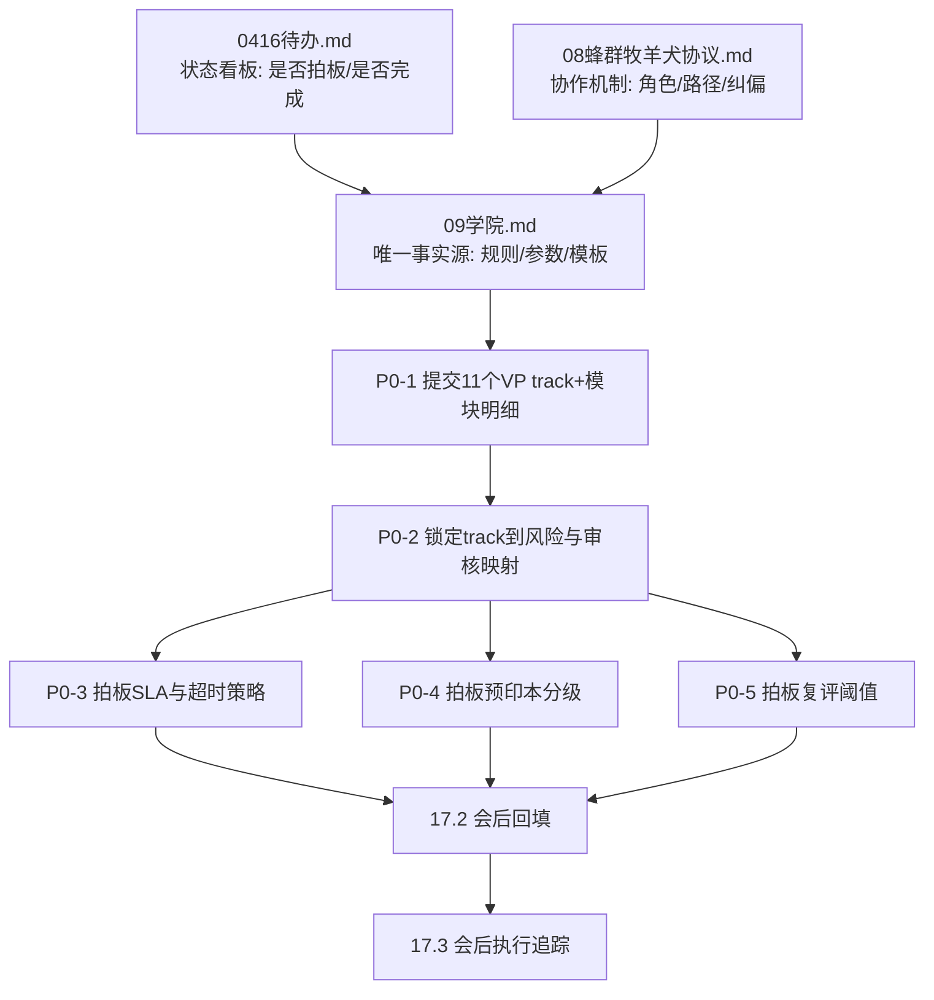
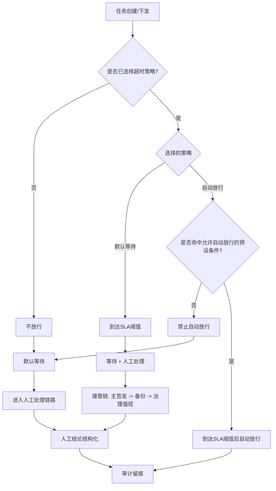

# 09 学院（可跑顺、可闭环、可扩展）

**补充日期**：2026-04-16  
**性质**：学院方案正式化文档（承接沟通稿，形成可执行口径）  
**状态**：方案版（待实施）  
**上位依赖**：`00_升级总结总览.md`（11层、S1-S4、L10/L11）、`AGENTS.md`（6层与11VP）、`08_蜂群牧羊犬协议.md`（蜂群角色与验收锚点）

---

## 一、目标与边界

### 1.1 目标

在不推翻现有 **11层工作流 + 11个VP + 6层组织** 的前提下，建立学院体系，使其满足：

1. **可跑顺**：流程可持续运行，不卡在人工链路。
2. **可闭环**：内容、能力、业务效果三环可回流优化。
3. **可扩展**：支持11个VP方向扩展与多租户隔离扩展。

### 1.2 口径

学院采用以下固定口径：

- **平台内核写死**：组织拓扑、治理约束、审计链路、发布链路不随业务波动。
- **变量版本化**：课纲、题库、阈值、资料范围、证书参数通过版本迭代。
- **自动化主导**：过程由规则和系统执行，人工不参与过程打分。
- **人只验收结果**：人工仅在结果触点做通过/打回/重做结论。

### 1.3 非目标（本期不做）

- 不在本期实现前端页面细节。
- 不在本期落地全部11个VP并发上线。
- 不在本期开放自由跨租户数据共享。

---

## 二、学院归属与责任分工

### 2.1 组织归属

- **VP04（AgentOps）**：学院主责（课纲、测试、证书运营、课程发布组织）。
- **VP02（Governance）**：治理主责（合规、隔离、审计、发布红线、引用红线）。
- **业务VP（VP01..VP11）**：各自track内容主编（领域知识、案例、能力边界）。

### 2.2 人机边界（写死）

- **Agent线（主执行线）**：在任务进入对应VP角色链路后自动启动，自主完成课程规划、课源汇总、草案生成、自动检查、自动测试、候选包生成、复评触发。
- **人工线（最小介入线）**：仅负责两项动作：  
  1) 源头资料负责（资料提交、来源归属确认）；  
  2) 最终审核发布（`REVIEWED`→`PUBLISHED` 的人工闸门）。
- **全局前置规则（写死）**：任何任务下发前，最少完成 `2` 轮目标沟通（目标、范围、完成标准三项对齐），并提供配图理解后再执行。
- **上线策略（当前）**：先按流程与文档规范执行；系统侧“上线强制门禁”暂不启用。
- **治理模型（统一）**：采用“规则写死、参数可配、边界写死”：
  - 写死规则：流程门禁、接管链路、审计要求、发布与回滚约束。
  - 可配置参数：SLA、复评阈值、紧急策略、试点范围等运营参数。
  - 边界写死：仅允许边界内收紧，不允许突破平台红线；配置变更必须版本化发布并写审计。
- 人工不参与中间过程打分与逐条编排；人工结论必须结构化落库，不接受口头结论。
- 时间口径（写死）：人工线中「已投喂时间」即流程开始时间，作为调度、统计、SLA与审计起算点。

### 2.3 Agent线调度控制（四级人工开关 + 定时周期）

- Agent线默认可自动运行，但运行许可由人工在四级作用域配置：`platform` / `company` / `department` / `employee`。
- 每级人工可配置三类控制：  
  1) `enabled`（开启/关闭）  
  2) `window`（定时窗口）  
  3) `cycle`（执行周期）
- 配置口径（写死）：**平台配置与企业配置均不写死**，统一走版本化配置；但配置必须受平台规则边界约束，不得突破安全与治理红线。
- 冲突优先级（写死）：**员工 > 部门 > 公司 > 平台**；同级冲突时**关闭优先于开启**。
- 平台级保留全局熔断权（紧急关闭），用于风险事件时一键暂停Agent线执行。
- 同一 `scope + track + period` 在同一周期内只允许一个有效执行实例（幂等锁），防止重复触发或漏触发。

---

## 三、学院与11层的映射关系

| 层级 | 学院职责 |
|------|---------|
| L2 权限管理层 | 平台/公司/部门/员工作用域校验；访问授权 |
| L5 安全策略层 | 来源白名单、敏感信息策略、外链策略 |
| L8 质量门禁层 | 测试与评审门禁（是否可发布/升级） |
| L9 反馈闭环层 | 结果沉淀、效果统计、触发优化条件 |
| L10 版本发布层 | 课纲/题库/证书版本发布、灰度、回滚 |
| L11 进化实验层 | 训练策略实验、影子评估、提案生成 |

> 说明：学院不是单独新层，而是跨 L2/L5/L8/L9/L10/L11 的复合职能。

---

## 四、11个VP方向课程体系

### 4.1 方向定义

- 课程主轴采用 **11 VP = 11 track** 的一一映射，不新增第12条平台主轴。
- 每个track包含：`基础` / `进阶` / `专家` 三档。
- 每个track内模块与对应VP下总监能力边界对齐。

### 4.2 证书绑定

每个证书必须绑定以下字段：

- `owner_vp`
- `track_id`
- `module_id`
- `scope_level`
- `version_id`
- `effective_from` / `expires_at`

---

## 五、四类课源与资料投喂

### 5.1 课源类型

1. **论文**：方法论、前沿研究、理论依据。  
2. **开放性大学/OER**：体系化课程内容。  
3. **专业官网**：厂商文档、标准规范、监管口径。  
4. **人工投喂多模态**：视频、链接、图片、PDF、文档/表格/演示稿等。

### 5.2 人工投喂最小元数据（必须）

- `source_id`
- `source_type`
- `submitter_id` / `submitter_org`
- `source_desc`
- `created_at` / `uploaded_at`
- `license_scope`
- `owner_vp` / `track_id`
- `scope_level`
- `sensitivity_level`
- `content_hash`
- `origin_uri`（可空）

### 5.3 投喂质量门槛

资料需同时满足：

1. 可读（可抽取核心内容）
2. 可证（来源可追溯）
3. 可审（可复核、可留痕）
4. 可裁（可拒绝并给出原因）

不满足任一项，仅能进入参考池，不可进入认证阅读/考点池。

---

## 六、数据隔离与作用域分层（写死）

### 6.1 四级作用域

- `platform`
- `company`
- `department`
- `employee`

### 6.2 隔离原则

- 默认 **向下可见、横向隔离、向上不可见**。
- 不允许通过导出/引用绕过 L2 租户和组织边界。
- 读写都要校验作用域键与VP/track归属。

### 6.3 最小隔离键

`tenant_id + org_id + department_id + employee_id + scope_level`

### 6.4 升级规则

低级作用域升级到高级作用域必须走“新版本发布”，不得直接修改原记录权限；需保留父子版本关系与S3审计链。

---

## 七、学院核心流程（最小可运行）

## 7.1 状态机

`DRAFT`  
→ `AUTO_CHECKED`  
→ `AGENT_TESTED`  
→ `REVIEWED`  
→ `PUBLISHED`  
→ `OBSERVED`  
→ `REASSESS`

失败分支：任意节点可 `REJECTED` 或 `NEEDS_FIX`，回流 `DRAFT`。

### 7.2 三段关卡

1. 自动检查：格式、元数据、敏感词、来源合法性初筛  
2. Agent测试：小样本试学/试题验证（可教、可考、无明显误导）  
3. 人工最终审核发布：VP04（课程）+ VP02（治理）双岗通过后，执行发布裁决

### 7.3 发布规则

- 仅 `REVIEWED` 可进入 `PUBLISHED`
- 发布必须写入 S4 curriculum 注册表版本
- 通过 L10 形成可回滚版本点
- 升级、降级、下线全部异步写 S3

### 7.4 工业级边界读取安全基线（写死）

- 学院**只允许读取 S4 发布区的已生效版本**，禁止读取草稿区版本。
- 学院版本触发源仅为 **L10 发布事件** 与已生效版本指针，不接受草稿变更触发。
- 边界版本采用不可变发布：发布后只允许发新版本，不允许覆盖写旧版本。
- 学院读取失败或版本异常时采用 **Fail-Closed**：保持当前稳定版本继续运行并告警，禁止回退读取草稿区。
- 任意发布/回滚动作必须保留审计链（提交、审批、发布、回滚）并异步写 S3。

---

## 八、评价体系（客观为主）

### 8.1 三维评价

1. 结果评价：通过/打回/重做（以结果锚点）
2. 工作次数：有效认领/执行/交接计数
3. 发现问题能力：仅统计“超出职责边界”的有效提报

### 8.2 基本绩效与专项能力切分

- 职责内应完成的巡检/监工/验收属于基本绩效，不计入专项发现问题奖励。
- 专项提报必须可验证；误报有惩罚。

### 8.3 蜂群口径

- 蜂群视作一类Agent，沿VP链路定义能力边界。
- 蜂群内结果侧评价以猫头鹰验收报告为锚点。

---

## 九、最小数据契约与审计要求

### 9.1 核心ID

- `source_id`
- `curriculum_id`
- `exam_id`
- `cert_id`
- `task_id`
- `version_id`

### 9.2 追溯字段

- `parent_source_id`
- `review_ticket_id`
- `rollback_from_version`

### 9.3 审计要求

- 关键状态变更必须写 S3（异步、不阻塞、可回放）。
- S3不可用时走本地缓冲与重试链路（遵循缺口8约定）。

---

## 十、质量阈值与复评机制

### 10.1 默认阈值（可后续参数化）

- 自动检查必过项：100%
- Agent测试通过率：初始建议 >=80%

### 10.2 复评触发条件（任一满足）

- 连续打回率超阈值
- 严重错误累计超阈值
- 资料过期未复检

触发后进入 `REASSESS`：保留/降级/下线三选一。

---

## 十一、风险防线

1. 隔离防线：四级作用域强校验，禁止跨域绕过  
2. 版本防线：只发新版本，不改历史记录  
3. 激励防线：基本绩效与专项能力分账，防刷分  
4. 一致性防线：S1/S2/S3/S4 单一事实源 + 统一ID

---

## 十二、实施路径（建议）

### Phase 1：VP04 单track试点

- 跑通资料投喂→测试审核→发布→复评的完整闭环
- 验证四级隔离和回滚链路

### Phase 2：复制到11个VP

- 内核不改，仅配置track与课纲
- 建立跨VP一致的证书模板

### Phase 3：增强优化

- 引入影子评估
- 引入自动降级策略
- 引入更细粒度题库与难度控制

---

## 十三、Go / No-Go 验收（最小）

1. 任一课程条目可追溯从来源到发布的完整证据链  
2. 1次操作内可完成版本回滚并恢复稳定  
3. 可证明跨公司/跨部门不可见  
4. 可区分职责内绩效与专项发现问题并分别计分  
5. 人工通过/打回/重做可结构化进入统一评价总线

---

## 十四、待补充清单（本文件后续迭代）

### 14.1 已覆盖（本版已落文档）

- 动作级权限矩阵（见附录A）
- 课程→证书→能力边界映射模板（见附录B）
- 四类课源最小Schema（文档版，见附录C）
- 阈值参数首版默认（见附录D）
- 最终审核理由码字典（见附录E）
- 回滚SOP最小步骤（见附录F）
- 反作弊最小规则（见附录G）
- 非蜂群路径等价映射（见附录H）

### 14.2 待参数拍板（会议决策后定稿）

- 11个VP各track一级目录与模块明细（按业务VP主编提交）
- 预印本与正式发表分级细则（含可进考点池边界）
- 人工最终审核发布的时限参数（超时默认动作与升级链路）
- 复评触发阈值按track差异化参数（拒绝率/严重等级/复检周期）

### 14.3 待会议决策（策略级）

- 代币与证书联动规则细则（奖励、惩罚、冻结、恢复）
- 人工测试题型蓝图与抽样策略（是否按VP统一模板或分VP模板）

---

## 附录A：动作级权限矩阵（学院流程）

> 目的：把“谁能做什么”从原则落到动作级，避免执行口径漂移。  
> 说明：本矩阵遵循本文“Agent线主执行 + 人工线轻介入（资料负责与最终审核发布）”口径。

| 动作 | Agent线（自动） | 人工-资料负责人 | 人工-最终审核发布 | 约束 |
|------|------------------|------------------|--------------------|------|
| 提交资料（`DRAFT`） | ✅ 可自动接收并登记 | ✅ 可手动提交与补充来源说明 | ❌ | 必须写 `source_id` 与最小元数据 |
| 资料编辑（发布前） | ✅ 可按规则补全元数据与抽取内容 | ✅ 可补充来源与版权说明 | ❌ | 仅限发布前版本；修改需写审计 |
| 自动检查（`AUTO_CHECKED`） | ✅ | ❌ | ❌ | 失败可回流 `DRAFT` |
| Agent测试（`AGENT_TESTED`） | ✅ | ❌ | ❌ | 按 track 测试模板执行并写结果 |
| 生成审核候选（`REVIEWED`候选） | ✅ | ❌ | ❌ | 候选包必须包含测试摘要与风险标签 |
| 最终审核结论（`APPROVE/REJECT/NEEDS_FIX`） | ❌ | ❌ | ✅ | 必填 `reason_code`；无理由码视为无效 |
| 发布（`REVIEWED -> PUBLISHED`） | ❌ | ❌ | ✅ | 仅人工最终审核发布可执行 |
| 打回修正（`NEEDS_FIX -> DRAFT`） | ❌ | ❌ | ✅ | 必填修正项清单与截止时间 |
| 下线/降级（`PUBLISHED -> REASSESS`） | ✅ 可触发建议 | ❌ | ✅ 最终确认 | 自动触发仅为建议，人工最终确认 |
| 版本回滚 | ❌ | ❌ | ✅ | 需绑定 `rollback_from_version` 与原因 |

### A.1 作用域与越权约束

- 四级作用域（平台/公司/部门/员工）下，人工动作必须在本作用域权限内执行。
- 不允许跨租户、跨公司、跨部门越权发布。
- 就近优先：员工 > 部门 > 公司 > 平台；同级冲突时关闭优先。

### A.2 审计字段（动作最小集）

每次人工动作至少落以下字段：

- `actor_id`
- `actor_role`
- `action`
- `reason_code`
- `ticket_id`
- `scope_level`
- `timestamp`

> 若缺 `reason_code` 或 `ticket_id`，动作可被系统拒绝落库或标记为无效动作。

---

## 附录B：课程 -> 证书 -> 能力边界映射模板（执行版）

> 目的：把“学了什么、拿到什么证、解锁什么能力边界”一次性对齐，避免口径漂移。  
> 使用方式：每个 VP 的每个模块至少填一行。

| owner_vp | track_id | module_id | 课程通过条件 | 授予证书 | 解锁能力边界（最小） | 作用域上限 | 失效条件 |
|----------|----------|-----------|--------------|----------|----------------------|------------|----------|
| VPxx | T-xx | M-xx | AGENT_TESTED >= 阈值 且 REVIEWED=APPROVE | CERT-xx | `capability_ids[]`（仅本VP） | `employee/department/company/platform` 之一 | 复评失败/过期/人工吊销 |

### B.1 映射硬约束

- 任何证书必须绑定 `owner_vp + track_id + module_id + version_id`。
- 证书只解锁本 VP 允许范围内能力，不得跨 VP 直接解锁。
- 解锁能力必须受 L2/L5 约束，不因证书绕过安全与权限。

---

## 附录C：四类课源最小 JSON Schema（文档版）

> 说明：为文档规范，非代码定义。所有来源共享通用字段，再补专有字段。

### C.1 通用字段（四类都必须）

- `source_id`
- `source_type`（`paper` / `oer` / `official_site` / `human_feed`）
- `title`
- `owner_vp`
- `track_id`
- `scope_level`
- `license_scope`
- `content_hash`
- `created_at`
- `submitted_by`

### C.2 专有字段

- `paper`：`authors`、`year`、`doi_or_arxiv`、`publication_status`
- `oer`：`institution`、`course_name`、`term_version`、`license_type`
- `official_site`：`origin_url`、`retrieved_at`、`region_scope`
- `human_feed`：`file_type`、`origin_desc`、`sensitivity_level`

---

## 附录D：阈值参数表（首版默认）

| 参数名 | 默认值 | 适用范围 | 说明 |
|--------|--------|----------|------|
| `agent_test.pass_rate` | 0.80 | 全局默认 | 各 track 可覆盖 |
| `reassess.reject_rate_threshold` | 0.20 | 观察窗口 | 连续打回触发复评 |
| `reassess.severity_threshold` | 3 | 观察窗口 | 严重错误累计触发 |
| `source.recheck_days` | 30 | 官方站点/投喂 | 超期需复检 |
| `cert.review_cycle_days` | 90 | 证书复评 | 到期触发复评 |

> 参数归档于 S4，变更走 L10；未经发布不生效。

---

## 附录E：最终审核理由码字典（首版）

### E.1 `APPROVE`

- `A01`：内容完整且可教可考  
- `A02`：来源与许可合规  
- `A03`：作用域与风险级别匹配

### E.2 `REJECT`

- `R01`：来源不可追溯  
- `R02`：版权/许可不合规  
- `R03`：测试结果不达阈值  
- `R04`：跨作用域越权风险  
- `R05`：高敏信息处理不合规

### E.3 `NEEDS_FIX`

- `N01`：元数据不完整  
- `N02`：题库样本不足  
- `N03`：描述歧义需重写  
- `N04`：证书映射字段缺失

---

## 附录F：回滚 SOP（最小步骤）

1. 触发：`REASSESS` 判定需回滚或人工最终审核发布发起回滚。  
2. 选择：指定 `rollback_from_version` 与目标版本。  
3. 审核：人工最终审核发布确认（保留 `reason_code` + `ticket_id`）。  
4. 执行：写 S4 新版本指针并冻结问题版本。  
5. 验证：检查可见性隔离、证书映射、关键链路可用。  
6. 留痕：全流程异步写 S3。  

---

## 附录G：反作弊最小规则（首版）

- **次数防刷**：同一 `scope + track + period` 重复触发只记一次有效执行。
- **提报防刷**：同一问题指纹在窗口期内重复提报仅首条计分。
- **成绩防刷**：题库重复命中率超阈值时降权并触发复测。
- **越权防刷**：跨作用域提报与调用默认拒绝并记审计事件。

---

## 附录H：非蜂群路径映射规则（等价口径）

- 非蜂群任务沿同一学院评价模型执行：结果评价、工作次数、专项提报三维一致。
- 蜂群“猫头鹰验收锚点”在非蜂群路径由对应质检输出（L7/L8）等价替代。
- 证书、作用域、发布、回滚规则与蜂群路径保持同一套门禁，不另起体系。

---

## 十五、学院参数基线 V1（工业稳态优先）

> 用途：作为“先上线可跑、稳态可控”的默认参数基线。  
> 规则：本节参数为默认值；后续差异化调整必须走 L10 发布并写 S3 审计。

### 15.1 课程结构基线（按 VP -> 总监 -> 经理 -> 执行角色）

- 每个 VP track 必须同时包含两类模块：  
  1) `common`（通用能力）  
  2) `role_specific`（工种技能）
- 每个 VP track 最少课程数：`6`（建议：通用2 + 工种4）。
- 每个课程条目必须标注：`owner_vp`、`director_line`、`manager_line`、`target_role`、`capability_type`。

### 15.2 预印本准入基线（paper 分级）

- `A`（正式发表）：可进入课程池与考点池。
- `B`（预印本）：可进入课程池，不可直接进入考点池。
- `C`（来源不稳）：仅参考池。
- `B -> A` 升级最低条件：`>=1` 次人工复核 + `>=1` 个交叉来源验证。
- `B` 档有效期默认：`90天`，到期必须复审。

### 15.3 人工最终审核 SLA 基线

- 平台级（`scope=platform`）首次响应：`1小时`。
- 非平台级（company/department/employee）首次响应：`1小时`。
- 超时默认动作：`NEEDS_FIX`（保守策略，不自动发布）。
- 超时接管链：主签发官 -> 备份签发官 -> 治理值班签发官。

### 15.3.1 SLA 治理策略（V1）

- 原则：采用「写死边界 + 受限可配置」，避免口径漂移与执行失控。
- 写死项（不可配置）：
  - 超时默认动作固定为 `NEEDS_FIX`。
  - 超时接管链顺序固定：主签发官 -> 备份签发官 -> 治理值班签发官。
  - 审计字段必填（结论、理由码、责任人、时间戳）且需异步写入 S3。
  - 平台红线不可突破（Fail-Closed）。
- 可配置项（受平台边界约束）：
  - `scope/track` 的时限值与提醒阈值。
  - 风险模板差异化参数（高风险更严格，普通/低风险在边界内调整）。
  - 仅允许“收紧”或边界内微调，不允许放宽至超出平台红线。
- 人工介入策略：
  - 人工只在触发点介入（超时、高风险、冲突或连续打回），不介入过程细节。
  - 人工结论必须结构化为 `APPROVE/REJECT/NEEDS_FIX` 并附 `reason_code`，统一进入评价与审计链路。
  - 未在预设策略中明确配置“自动放行”的场景，一律不得自动放行，必须进入人工处理链路。
  - 任务创建/下发时必须主动选择“超时策略”（自动放行/默认等待）；该字段为必填，未选择视为“默认等待 + 人工处理”。

### 15.4 复评阈值基线（默认）

- 连续打回率触发线：`>=20%`（30天窗口）。
- 严重错误累计触发线：`>=3`（30天窗口）。
- 资料复检周期：  
  - 官方站点：`30天`  
  - 论文/OER：`90天`

### 15.5 风险分层系数（V1.1 预留）

- 高风险 track：阈值系数 `0.8`（更严格）。
- 普通 track：阈值系数 `1.0`。
- 低风险 track：阈值系数 `1.2`（适度放宽）。

---

## 十六、工业级安全基线（学院边界读取与发布）

> 本节为不可谈判条款，优先级高于运营便捷性。
> 双区模型已写死：草稿区用于编辑，发布区用于运行；学院仅消费发布区。
> 平台相关安全配置写死：安全基线、发布门禁、审计必填项、越权拒绝策略不得由企业侧覆盖。

1. 学院只读 `S4` 发布区已生效版本，禁止读取草稿区。  
2. 学院触发源仅为 `L10` 发布事件 + 已生效版本指针。  
3. 发布版本不可变（immutable），禁止覆盖写旧版本。  
4. 指针切换必须原子化（要么旧版，要么新版）。  
5. 读取失败或版本异常采取 `Fail-Closed`：保持旧版运行并告警，禁止草稿兜底。  
6. 任意发布/回滚动作必须保留完整审计链并异步写 S3。  
7. 审批执行职责分离（提交、审核、签发不得同人兼任关键组合）。  
8. 平台相关变更采用双层加固：  
   - 第一层：自动规则校验（权限、作用域、字段完整性、风险策略一致性）；  
   - 第二层：人工审核验证（业务侧 + 治理侧），两层均通过方可生效。  
9. 平台级发布与回滚实行多人审核验证（最少双人）；任何单人审批结果不允许直接生效。  
10. 企业级配置可调但受平台写死边界约束，若与平台红线冲突则按平台红线拒绝执行（Fail-Closed）。
11. 全局执行前置：任务下发需满足“最少2轮目标沟通 + 配图理解”；当前阶段按流程规范执行，系统侧门禁暂不启用。

---

## 十七、会议拍板清单（V1 必答）

- [x] 双区模型已写死：草稿区可改、发布区只读给学院。  
- [ ] 是否确认最终签发人唯一角色与超时接管链。  
- [x] `APPROVE/REJECT/NEEDS_FIX` 理由码字典已封版 V1（附录E）；新增/修改需走 L10 发布并写 S3 审计。  
- [ ] 是否确认人工最终审核 SLA（统一 `1h`）与超时默认动作 `NEEDS_FIX`。  
- [ ] 是否确认预印本分级准入与 `B->A` 升级条件。  
- [ ] 是否确认复评阈值默认值（20%/3次/30天/90天）。  
- [ ] 是否确认证书失效后能力自动回收策略。  
- [ ] 是否确认作用域升级必须“新版本发布”而非改原权限。  

### 17.1 SLA 拍板口径（宣读版）

- 本次确认采用「写死边界 + 受限可配置」。
- 写死项：
  - 超时默认动作固定为 `NEEDS_FIX`，不自动发布。
  - 超时接管链固定为：主签发官 -> 备份签发官 -> 治理值班签发官。
  - 审计字段必须完整留痕并异步写入 S3。
  - 平台红线不可突破，冲突时按 `Fail-Closed` 执行。
- 可配置项：
  - `scope/track` 的时限值、提醒阈值、风险模板参数可在平台边界内调整。
  - 仅允许“收紧”或边界内微调，不允许放宽至超出平台红线。
- 人工介入边界：
  - 人工只在触发点介入（超时/高风险/冲突/连续打回），不介入过程细节。
  - 人工结论统一结构化为 `APPROVE/REJECT/NEEDS_FIX`，并附 `reason_code` 进入同一审计与评价链路。
  - 未预设“自动放行”的场景默认“等待 + 人工处理”，不得自动放行。
  - 下发任务时必须显式选择超时策略；没有选择则不放行，按“等待 + 人工处理”执行。

### 17.2 拍板结论记录模板（会后回填）

| 议题 | 结论状态 | 最终口径 | 责任人 | 生效时间 | 备注 |
|---|---|---|---|---|---|
| 人工最终审核 SLA（统一1h） | 待确认/已确认/驳回 | 平台级 `1h`；非平台级 `1h`（可按模板收紧） |  |  |  |
| 超时默认动作 `NEEDS_FIX` | 待确认/已确认/驳回 | 固定 `NEEDS_FIX`，不自动发布 |  |  |  |
| 超时接管链 | 待确认/已确认/驳回 | 主签发官 -> 备份签发官 -> 治理值班签发官 |  |  |  |
| 可配置范围与边界 | 待确认/已确认/驳回 | 仅边界内调整，不得突破平台红线 |  |  |  |
| 人工介入边界 | 待确认/已确认/驳回 | 仅触发点介入，结论结构化留痕 |  |  |  |

### 17.3 会后执行清单（落地追踪）

- `D+1`：由治理侧发布最终口径公告，标注生效时间与适用范围（platform/company/department/employee）。
- `D+1`：由平台侧固化策略模板（高/中/低风险），并标注可调参数与不可调参数。
- `D+3`：完成提醒阈值与接管链值班表校准，确保触发后可执行。
- `D+3`：更新审计检查项，确保 `APPROVE/REJECT/NEEDS_FIX` 与 `reason_code` 必填且可追溯。
- `D+7`：输出首周运行复盘（超时率、打回率、接管次数、误判样例），作为下一轮参数微调输入。

### 17.4 文档分层与提交流程图（镜像）

- 维护约束：本章为规则与参数唯一事实源；`0416待办` 仅维护状态，`08蜂群` 仅维护机制叙事，不重复粘贴规则全文。

### 17.5 超时策略决策图（写死）

> 本图为固定执行口径：任务下发时必须显式选择超时策略；未选择或不满足自动放行预设条件时，一律不放行并进入人工处理链路。

### 17.6 风险-触发-处置表（治理附录）

| 风险 | 触发条件（示例） | 处置动作（默认） |
|---|---|---|
| 紧急状态滥用 | 紧急标记占比连续超阈值（如 `>30%`） | 自动降级为普通、治理抽检、超限团队限额 |
| 1h SLA 被人工队列压垮 | 连续两周超时率超阈值 | 启用备份签发池、分时值班、高峰期临时扩容 |
| 灰度内容外溢到全量 | 非 `PUBLISHED` 版本被生产引用 | 立即熔断引用、回滚至上稳定版、触发审计追踪 |
| 评估数据污染 | 样本分布异常或标签冲突率上升 | 隔离脏数据批次、重算评估、暂停自动升级 |
| 指标博弈（刷通过率） | 通过率上升但返工率同步上升 | 提高盲测权重、增强反作弊特征、人工抽审 |
| 跨VP口径不一致 | 同类场景在不同VP判定差异过大 | 启用统一达标字典、召开跨VP校准会、冻结本地特例 |
| 回滚不彻底（链路断裂） | 课程/考试/证书版本不一致 | 一键全链回滚、禁止部分回滚、补齐版本审计 |
| 权限漂移（越权可见） | 作用域升级后出现跨租户读取 | `Fail-Closed`、撤销异常授权、全量权限重算 |
| 告警疲劳 | 告警处理率持续下降 | 分级告警（P1/P2/P3）、合并噪声、保留高风险强提醒 |
| 成本失控（自动迭代） | 单 track 成本超预算阈值 | 自动停机、转人工复核、下调轮次或采样策略 |

- 执行说明：
  - 本表作为默认治理动作模板，具体阈值由 `17.2` 回填并在 `17.3` 跟踪生效。
  - 任一处置动作均需保留结构化审计记录（触发时间、触发条件、处置责任人、回滚点）。

### 17.7 全局智能体技能治理（统一口径）

#### 17.7.1 总原则（写死）

- 治理模型统一采用“规则写死、参数可配、边界写死”。
- 执行前最少完成 `2` 轮目标沟通（目标/范围/完成标准）并提供配图理解。
- 关键动作必须版本化发布并写入审计链（L10/S3）。
- 冲突按 `Fail-Closed` 执行。

#### 17.7.2 作用域隔离与权限边界（写死）

- 四级作用域：`platform` / `company` / `department` / `employee`。
- 上级查看下级默认只读，不得直接修改下级内容。
- 跨公司默认不可见；仅公司可授权跨公司可见，平台无权代公司授权。
- 作用域升级必须“新版本发布”，禁止改原记录权限。
- 平台红线不可被企业/部门/用户覆盖。

#### 17.7.3 成长链路与发证边界（写死）

- 统一成长链路：学习 -> 经验（N种） -> 考试获证 -> 绩效 -> 比赛 -> 分享。
- 发证唯一入口为考试获证层。
- 经验/绩效/比赛/分享均不得直接发证。
- 比赛与分享按“每次比赛规则”执行加权；可影响绩效或考试准入权重，但不得替代考试获证。

#### 17.7.4 技能上迁规则（写死）

- 仅允许逐级上迁：`employee -> department -> company -> platform`，禁止跳级。
- 每次上迁必须满足：成熟证明 + 审批链 + 新版本发布 + 审计留痕。
- 上迁默认周期（V1）：
  - 用户 -> 部门：`2周` 或 `20轮`
  - 部门 -> 公司：`4周` 或 `50轮`
  - 公司 -> 平台：`8周` 或 `100轮`

#### 17.7.5 SLA 与审核闸门（已确认）

- SLA 统一 `1h`，起算点为“进入待审核态”。
- 超时默认动作固定 `NEEDS_FIX`。
- 接管链固定：主签发官 -> 备份签发官 -> 治理值班签发官。
- 超时策略字段必填（自动放行/默认等待）；未预设自动放行或未选择策略时，一律不放行并进入人工处理。

#### 17.7.6 数据采集、脱敏与授权（写死）

- 平台以外一律不允许采集。
- 平台内数据必须先脱敏后使用，未脱敏不得进入训练或分析链路。
- 脱敏抽检与处置默认值（V1）：
  - 抽检比例：高 `20%` / 中 `10%` / 低 `5%`
  - 处置时限：高 `4h` / 中 `24h` / 低 `48h`
  - 单次不合格率 `>=5%` 提级抽检；连续两次不合格暂停入训并人工复核；严重失败立即熔断；连续两周不合格率 `<1%` 恢复默认比例。
- 公司授权，平台受益（在授权边界内）。
- 撤销授权后不得新增使用该主体后续数据；历史已入训资产按既定历史规则处理并保留完整审计记录。

#### 17.7.7 第三方模型白名单与收费（平台手动配置）

- 第三方模型白名单与收费细则由平台手动配置并版本化发布。
- 默认白名单为关闭状态，不在白名单模型一律不可调用。
- 企业仅可启用/禁用并确认费用，不可修改白名单与单价。
- 欠费自动停用第三方模型能力。
- 起始计费三档（V1）：
  - 低档：`P_in=0.8` / `P_out=1.2`
  - 中档（默认）：`P_in=1.0` / `P_out=1.5`
  - 高档：`P_in=1.3` / `P_out=2.0`

