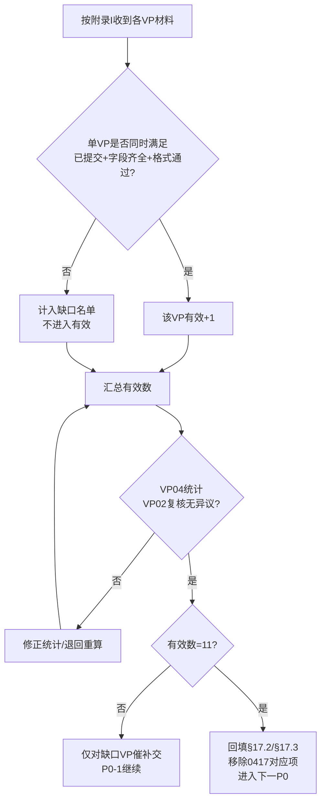
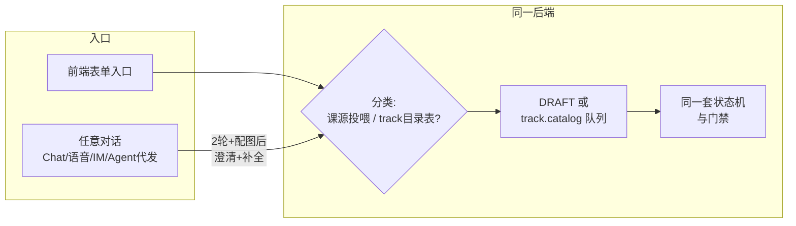
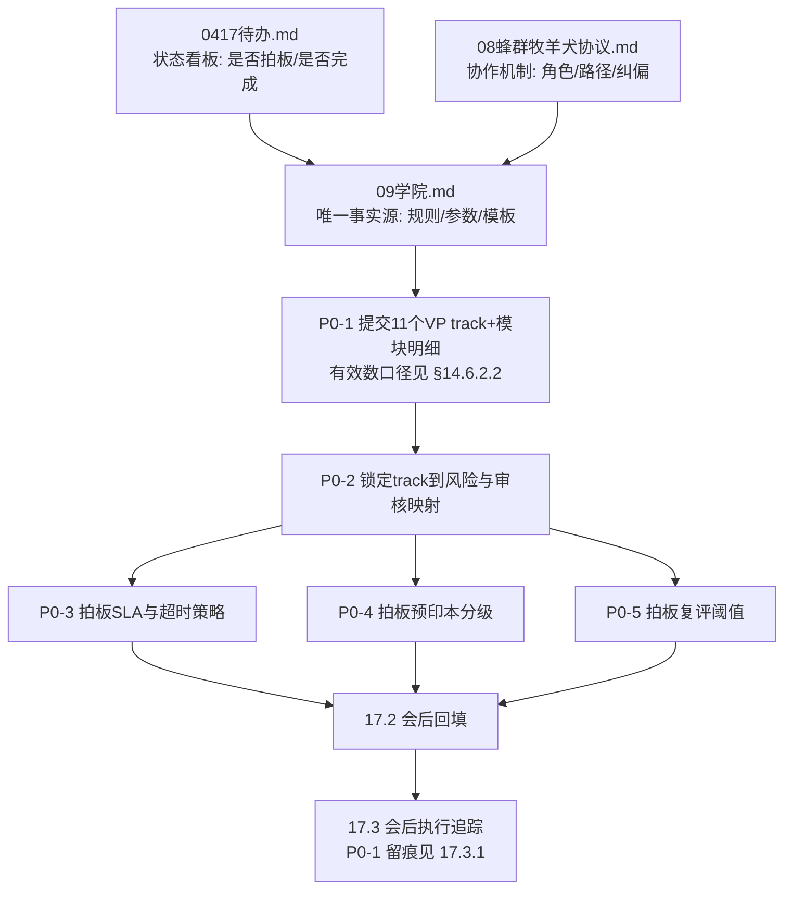
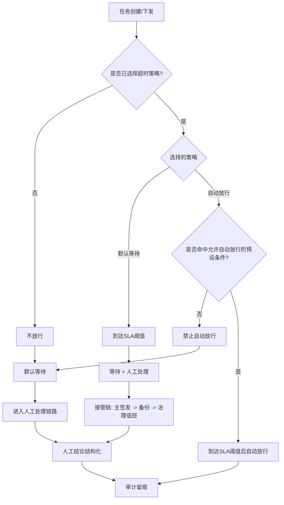

# 09 学院（可跑顺、可闭环、可扩展）

**补充日期**：2026-04-16  
**性质**：学院方案正式化文档（承接沟通稿，形成可执行口径）  
**状态**：方案版（待实施）  
**上位依赖**：`00_升级总结总览.md`（11层、S1-S4、L10/L11）、`AGENTS.md`（6层与11VP）、`08_蜂群牧羊犬协议.md`（蜂群角色与验收锚点）  
**对外写章节号**：凡向 `0417待办`、PR、其它文档引用本文件条款时，**必须先查 `§14.4` 速查表**，禁止凭记忆写「8.x / 17.7.x」以免与评价体系/作用域章节错位。

---

## 一、目标与边界

### 1.1 目标

在不推翻现有 **11层工作流 + 11个VP + 6层组织** 的前提下，建立学院体系，使其满足：

1. **可跑顺**：流程可持续运行，不卡在人工链路。
2. **可闭环**：内容、能力、业务效果三环可回流优化。
3. **可扩展**：支持11个VP方向扩展与多租户隔离扩展。

### 1.2 口径

学院采用以下固定口径：

- **平台内核写死**：组织拓扑、治理约束、审计链路、发布链路不随业务波动。
- **变量版本化**：课纲、题库、阈值、资料范围、证书参数通过版本迭代。
- **真实业务值配置化**：凡可由配置承载的真实业务值，一律配置化管理，能配置就不写死。
- **接口不做占位**：所有接口定义必须可直接落地；设计可以做全局通用与扩展增强，但不保留仅供后补的占位接口。
- **自动化主导**：过程由规则和系统执行，人工不参与过程打分。
- **人只验收结果**：人工仅在结果触点做通过/打回/重做结论。

### 1.3 非目标（本期不做）

- 不在本期实现前端页面细节。
- 不在本期落地全部11个VP并发上线。
- 不在本期开放自由跨租户数据共享。

---

## 二、学院归属与责任分工

### 2.1 组织归属

- **VP04（AgentOps）**：学院主责（课纲、测试、证书运营、课程发布组织）。
- **VP02（Governance）**：治理主责（合规、隔离、审计、发布红线、引用红线）。
- **业务VP（VP01..VP11）**：各自track内容主编（领域知识、案例、能力边界）。

### 2.2 人机边界（写死）

- **Agent线（主执行线）**：在任务进入对应VP角色链路后自动启动，自主完成课程规划、课源汇总、草案生成、自动检查、自动测试、候选包生成、复评触发。
- **人工线（最小介入线）**：仅负责两项动作：  
  1) 源头资料负责（资料提交、来源归属确认）；  
  2) 最终审核发布（`REVIEWED`→`PUBLISHED` 的人工闸门）。
- **全局前置规则（写死）**：**任何对话或任务下发前**（含用户与系统 Chat、语音/IM、客服会话、**Agent 代用户发起** 等任一自然语言入口），最少完成 `2` 轮目标沟通（目标、范围、完成标准三项对齐），并提供配图理解后再执行；**不因入口形态豁免**。
- **上线策略（当前）**：先按流程与文档规范执行；系统侧“上线强制门禁”暂不启用。
- **治理模型（统一）**：采用“规则写死、参数可配、边界写死”：
  - 写死规则：流程门禁、接管链路、审计要求、发布与回滚约束。
  - 可配置参数：SLA、复评阈值、紧急策略、试点范围等运营参数。
  - 边界写死：仅允许边界内收紧，不允许突破平台红线；配置变更必须版本化发布并写审计。
- 人工不参与中间过程打分与逐条编排；人工结论必须结构化落库，不接受口头结论。
- 时间口径（写死）：人工线中「已投喂时间」即流程开始时间，作为调度、统计、SLA与审计起算点。

### 2.3 Agent线调度控制（四级人工开关 + 定时周期）

- Agent线默认可自动运行，但运行许可由人工在四级作用域配置：`platform` / `company` / `department` / `employee`。
- 每级人工可配置三类控制：  
  1) `enabled`（开启/关闭）  
  2) `window`（定时窗口）  
  3) `cycle`（执行周期）
- 配置口径（写死）：**平台配置与企业配置均不写死**，统一走版本化配置；但配置必须受平台规则边界约束，不得突破安全与治理红线。
- 冲突优先级（写死）：**员工 > 部门 > 公司 > 平台**；同级冲突时**关闭优先于开启**。
- 平台级保留全局熔断权（紧急关闭），用于风险事件时一键暂停Agent线执行。
- 同一 `scope + track + period` 在同一周期内只允许一个有效执行实例（幂等锁），防止重复触发或漏触发。

---

## 三、学院与11层的映射关系

| 层级 | 学院职责 |
|------|---------|
| L2 权限管理层 | 平台/公司/部门/员工作用域校验；访问授权 |
| L5 安全策略层 | 来源白名单、敏感信息策略、外链策略 |
| L8 质量门禁层 | 测试与评审门禁（是否可发布/升级） |
| L9 反馈闭环层 | 结果沉淀、效果统计、触发优化条件 |
| L10 版本发布层 | 课纲/题库/证书版本发布、灰度、回滚 |
| L11 进化实验层 | 训练策略实验、影子评估、提案生成 |

> 说明：学院不是单独新层，而是跨 L2/L5/L8/L9/L10/L11 的复合职能。

---

## 四、11个VP方向课程体系

### 4.1 方向定义

- 课程主轴采用 **11 VP = 11 track** 的一一映射，不新增第12条平台主轴。
- 每个track包含：`基础` / `进阶` / `专家` 三档。
- 每个track内模块与对应VP下总监能力边界对齐。

### 4.2 证书绑定

每个证书必须绑定以下字段：

- `owner_vp`
- `track_id`
- `module_id`
- `scope_level`
- `version_id`
- `effective_from` / `expires_at`

---

## 五、四类课源与资料投喂

### 5.1 课源类型

1. **论文**：方法论、前沿研究、理论依据。  
2. **开放性大学/OER**：体系化课程内容。  
3. **专业官网**：厂商文档、标准规范、监管口径。  
4. **人工投喂多模态**：视频、链接、图片、PDF、文档/表格/演示稿等。

### 5.2 人工投喂最小元数据（必须）

- `source_id`
- `source_type`
- `submitter_id` / `submitter_org`
- `source_desc`
- `created_at` / `uploaded_at`
- `license_scope`
- `owner_vp` / `track_id`
- `scope_level`
- `sensitivity_level`
- `content_hash`
- `origin_uri`（可空）

### 5.3 投喂质量门槛

资料需同时满足：

1. 可读（可抽取核心内容）
2. 可证（来源可追溯）
3. 可审（可复核、可留痕）
4. 可裁（可拒绝并给出原因）

不满足任一项，仅能进入参考池，不可进入认证阅读/考点池。

---

## 六、数据隔离与作用域分层（写死）

### 6.1 四级作用域

- `platform`
- `company`
- `department`
- `employee`

### 6.2 隔离原则

- 默认 **向下可见、横向隔离、向上不可见**。
- 不允许通过导出/引用绕过 L2 租户和组织边界。
- 读写都要校验作用域键与VP/track归属。

### 6.3 最小隔离键

`tenant_id + org_id + department_id + employee_id + scope_level`

### 6.4 升级规则

低级作用域升级到高级作用域必须走“新版本发布”，不得直接修改原记录权限；需保留父子版本关系与S3审计链。

---

## 七、学院核心流程（最小可运行）

## 7.1 状态机

`DRAFT`  
→ `AUTO_CHECKED`  
→ `AGENT_TESTED`  
→ `REVIEWED`  
→ `PUBLISHED`  
→ `OBSERVED`  
→ `REASSESS`

失败分支：任意节点可 `REJECTED` 或 `NEEDS_FIX`，回流 `DRAFT`。

### 7.2 三段关卡

1. 自动检查：格式、元数据、敏感词、来源合法性初筛  
2. Agent测试：小样本试学/试题验证（可教、可考、无明显误导）  
3. 人工最终审核发布：VP04（课程）+ VP02（治理）双岗通过后，执行发布裁决

### 7.3 发布规则

- 仅 `REVIEWED` 可进入 `PUBLISHED`
- 发布必须写入 S4 curriculum 注册表版本
- 通过 L10 形成可回滚版本点
- 升级、降级、下线全部异步写 S3

### 7.4 工业级边界读取安全基线（写死）

- 学院**只允许读取 S4 发布区的已生效版本**，禁止读取草稿区版本。
- 学院版本触发源仅为 **L10 发布事件** 与已生效版本指针，不接受草稿变更触发。
- 边界版本采用不可变发布：发布后只允许发新版本，不允许覆盖写旧版本。
- 学院读取失败或版本异常时采用 **Fail-Closed**：保持当前稳定版本继续运行并告警，禁止回退读取草稿区。
- 任意发布/回滚动作必须保留审计链（提交、审批、发布、回滚）并异步写 S3。

---

## 八、评价体系（客观为主）

### 8.1 三维评价

1. 结果评价：通过/打回/重做（以结果锚点）
2. 工作次数：有效认领/执行/交接计数
3. 发现问题能力：仅统计“超出职责边界”的有效提报

### 8.2 基本绩效与专项能力切分

- 职责内应完成的巡检/监工/验收属于基本绩效，不计入专项发现问题奖励。
- 专项提报必须可验证；误报有惩罚。

### 8.3 蜂群口径

- 蜂群视作一类Agent，沿VP链路定义能力边界。
- 蜂群内结果侧评价以猫头鹰验收报告为锚点。

---

## 九、最小数据契约与审计要求

### 9.1 核心ID

- `source_id`
- `curriculum_id`
- `exam_id`
- `cert_id`
- `task_id`
- `version_id`

### 9.2 追溯字段

- `parent_source_id`
- `review_ticket_id`
- `rollback_from_version`

### 9.3 审计要求

- 关键状态变更必须写 S3（异步、不阻塞、可回放）。
- S3不可用时走本地缓冲与重试链路（遵循缺口8约定）。

---

## 十、质量阈值与复评机制

### 10.1 默认阈值（可后续参数化）

- 自动检查必过项：100%
- Agent测试通过率：初始建议 >=80%

### 10.2 复评触发条件（任一满足）

- 连续打回率超阈值
- 严重错误累计超阈值
- 资料过期未复检

触发后进入 `REASSESS`：保留/降级/下线三选一。

---

## 十一、风险防线

1. 隔离防线：四级作用域强校验，禁止跨域绕过  
2. 版本防线：只发新版本，不改历史记录  
3. 激励防线：基本绩效与专项能力分账，防刷分  
4. 一致性防线：S1/S2/S3/S4 单一事实源 + 统一ID

---

## 十二、实施路径（建议）

### Phase 1：VP04 单track试点

- 跑通资料投喂→测试审核→发布→复评的完整闭环
- 验证四级隔离和回滚链路

### Phase 2：复制到11个VP

- 内核不改，仅配置track与课纲
- 建立跨VP一致的证书模板

### Phase 3：增强优化

- 引入影子评估
- 引入自动降级策略
- 引入更细粒度题库与难度控制

---

## 十三、Go / No-Go 验收（最小）

1. 任一课程条目可追溯从来源到发布的完整证据链  
2. 1次操作内可完成版本回滚并恢复稳定  
3. 可证明跨公司/跨部门不可见  
4. 可区分职责内绩效与专项发现问题并分别计分  
5. 人工通过/打回/重做可结构化进入统一评价总线

---

## 十四、待补充清单（本文件后续迭代）

### 14.1 已覆盖（本版已落文档）

- 动作级权限矩阵（见附录A）
- 课程→证书→能力边界映射模板（见附录B）
- 四类课源最小Schema（文档版，见附录C）
- 阈值参数首版默认（见附录D）
- 最终审核理由码字典（见附录E）
- 回滚SOP最小步骤（见附录F）
- 反作弊最小规则（见附录G）
- 非蜂群路径等价映射（见附录H）
- VP track 主编交稿模板（见附录I）
- 平台配置项规划 P0（见 **§14.5**、**§14.5.6**：track / 预印本 / SLA / 复评；租户白名单与键映射）
- 本周执行 Playbook（见 **§14.6**：短会、主编征集、Phase0 v0）
- 产品入口（前端 / Chat）与同一状态机（见 **§14.6.4**）
- 会议与落地一页检查清单（见 **§14.6.5**）

### 14.2 待参数拍板（会议决策后定稿）

- 11个VP各track一级目录与模块明细（按业务VP主编提交）
- 预印本与正式发表分级细则（含可进考点池边界）
- 人工最终审核发布的时限参数（超时默认动作与升级链路）
- 复评触发阈值按track差异化参数（拒绝率/严重等级/复检周期）

### 14.3 待会议决策（策略级）

- 代币与证书联动规则细则（奖励、惩罚、冻结、恢复）
- 人工测试题型蓝图与抽样策略（是否按VP统一模板或分VP模板）

### 14.4 对外引用章节号速查（锁定，避免误引）

> 用途：**任何**跨文档引用本文件时，只使用下表左列锚点。右列为高频误引，写入即视为口径错误。

| 主题 | 正确锚点（本文） | 常见误引（禁止） |
|------|------------------|------------------|
| 11 VP track / 课程主轴 / 证书绑定字段 | **四**（4.1/4.2）、**附录B**、**15.1** | `17.7.2` / `17.7.4`（实为作用域、技能上迁） |
| 课源类型与元数据 / JSON Schema | **五**（5.1–5.3）、**附录C** | 「`8.2`/`8.5`/`8.6`」——本文 **八** 章为**评价体系**，非课源；勿与 `0417待办` 内「§8 沟通备忘」小节编号混用 |
| 预印本 A/B/C、B→A、复审周期 | **15.2**、第十七章 **`17.2`** 回填 | `17.7.5`（该节仅为 **SLA 与审核闸门**） |
| 人工审核 SLA / 超时策略 / 决策图 | **15.3**、**15.3.1**、**17.1–17.5**、**17.7.5** | — |
| 全域人机分流、必审超时、对客三态 | **17.7.1**、**17.7.8**；总览入口见 `00_升级总结总览.md` 全局前置条 | — |
| 职责内绩效 vs 专项发现问题 | **八·8.2** | 单写 `17.7.3` 代替岗责切分（该节主为成长链/发证） |
| 非蜂群路径等价映射 | **附录H** | 仅写 `17.7.3` 而省略附录 H |
| 风险触发处置、运营阈值模板 | **17.6** | — |
| 脱敏抽检与数据授权 | **17.7.6** | — |
| P0 平台配置落地（目录/预印本/SLA/复评） | **§14.5**（含 **§14.5.6** 租户白名单与映射） | 误当成纯业务需求而不走 L10/S4 |
| 11 track 主编交稿格式 | **附录I** | 自拟表头导致无法入库 |
| 本周落地动作顺序 | **§14.6** | 仅开会不登记 v0、或征集无单一入口 |
| Chat 与前端是否双入口 | **§14.6.4** | Chat 另起一条不经门禁的「快捷发布链」 |
| 「训练」歧义 + 2 轮沟通 + 配图（**任何对话**） | **§14.6.4**、**§2.2**、**§十六·11**、`17.7.1` | 未消歧或未 2 轮+配图即自动入库或入模 |
| 会议照表执行 | **§14.6.5** | 会开了但 `§17.2` 空、v0 未登记 |

### 14.5 平台配置项规划（P0：track 目录 / 预印本 / SLA / 复评）

> **定位**：本节描述 **平台侧「只做配置、不写业务分叉」** 的落地规划——把 **`§14.2` 待拍板项** 收敛为 **可注册、可版本化、可按租户/按 track 下发** 的配置面；**写死边界**仍以 **`15.3.1`、`17.7.x`** 与 **`§17.2` 会议结论** 为上限，**配置不得突破红线**（Fail-Closed）。

#### 14.5.1 配置总原则

1. **单一事实源**：课纲结构、阈值、SLA 数字、track 风险标签等，以 **S4 发布区注册表**（概念名：`curriculum_registry` / `academy_policy` 等）为存储；**生效指针**仅随 **L10** 发布事件切换（与 §十六、§七一致）。  
2. **平台 vs 企业**：平台维护 **全局默认 + 可选 VP 主编内容包**；企业在允许范围内 **仅可收紧**（与 `15.3.1` 一致），不可放宽出平台红线。  
3. **变更路径**：任何默认值变更 → **`§17.2` 记结论** → **L10 版本** → **异步 S3 审计**（缺口8）；禁止热改生产指针无版本。  
4. **与「11 track 主编交稿」分工**：业务 VP 产出 **内容与目录事实**；平台负责 **校验 Schema、入库、绑定 `owner_vp`/`track_id`、生成版本号、挂指针**。

#### 14.5.2 配置域拆分（四大块）

| 配置域 | 业务含义 | 主编/Owner | 平台职责（配置） |
|--------|----------|------------|------------------|
| **A. Track 目录与模块** | 11 主轴 + 模块树 + common/role_specific | 各业务 VP 主编 + VP04 收口 | Schema 校验、ID 分配、`director_line` 枚举校验、与 **附录B** 映射表字段对齐、发布为只读快照 |
| **B. 预印本分级** | A/B/C、考点池准入、B→A、B 档有效期 | 治理 VP02 + 教研共识 | 将 **`15.2`**（及 `§17.2` 差分）注册为 **策略版本**；考点池/课程池/参考池 **路由规则** 配置化（布尔+条件表达式，禁随意代码分支） |
| **C. 人工审核 SLA** | 时限、提醒、接管链 roster id、超时策略字段 | 治理 + 运营 | 将 **`15.3`/`17.7.5`** 注册为 **默认策略模板**；按 `scope_level` / `risk_template` **可选收紧**；**写死项**（`NEEDS_FIX`、接管链顺序）**不出现在可编辑 JSON** 或置为只读常量 |
| **D. 复评按 track** | 打回率/严重错误/复检周期 × 风险系数 | VP04 + 各 VP 标风险档 | 存储 **`15.4` 全局默认** + **`15.5` 每 track 系数**；生成 **派生阈值**（平台计算，避免各端各算一遍）；未标 track 前 **系数默认 1.0** |

#### 14.5.3 建议配置键（逻辑名，实施时映射到实际 Schema）

- **`track.catalog`**：`track_id`、`level`（基础/进阶/专家）、`modules[]`（`module_id`、`kind`=common|role_specific、`title`、`director_line`）。  
- **`paper.tier_policy`**：`tiers`（A/B/C 定义）、`exam_pool_allowed`（按 tier）、`b_to_a_rules`、`b_ttl_days`。  
- **`review.sla_policy`**：`first_response_minutes`（默认 60）、`reminder_minutes[]`、`on_timeout`（固定 NEEDS_FIX）、`escalation_chain_role_ids[]`、`timeout_strategy_required`（布尔）。  
- **`reassess.track_policy`**：`window_days`（默认 30）、`reject_rate_default`（0.2）、`severity_count_default`（3）、`recheck_official_days`（30）、`recheck_paper_oer_days`（90）、`track_risk_tier`（high|normal|low → 乘 `15.5` 系数）。

#### 14.5.4 分阶段落地（平台执行顺序）

| 阶段 | 目标 | 平台动作 |
|------|------|----------|
| **Phase 0** | 可运行默认 | 导入 **`15.2`/`15.3`/`15.4`/`15.5`** 为 **v0 默认策略**；全 track **risk_tier=normal** |
| **Phase 1** | VP04 试点 | 写入 **`track.catalog`（单 track）**；试点 track 可标 **high 或 low** 之一验证 **派生复评阈值**；其余 track 仍 1.0 |
| **Phase 2** | 11 track 齐 | 批量导入 11 份主编表；**逐 track** 填 `track_risk_tier`；复评派生表全量生成 |
| **Phase 3** | 企业差异化 | 开通租户级 **收紧覆盖**（仅覆盖允许键）；审计记录覆盖来源 |

#### 14.5.5 验收（平台配置完成后）

- 任意环境可通过 **版本号** 说明当前生效的 **预印本/SLA/复评/track 目录** 四套配置。  
- **Fail-Closed**：配置校验失败 → 保持 **上一稳定版本指针**，禁止回退草稿。  
- 与 **Go/No-Go**（§十三）：至少能演示 **单 track 全链路** 使用的配置来自 **哪一版 L10**。

#### 14.5.6 租户可覆盖键白名单、配置键映射、冲突与缺交

**（1）租户可收紧覆盖（白名单）**

> 企业/租户仅允许覆盖下列键；**未列入者一律不可由租户写入**。覆盖值须通过 **平台校验**（仅收紧、不突破红线），并写入 **S3 审计**。

| 配置域 | 允许租户覆盖的键（逻辑名） | 收紧含义（平台校验） |
|--------|---------------------------|----------------------|
| **C. SLA** | `review.sla_policy.first_response_minutes` | 不得大于平台当前生效值（同 `scope_class` 下：分钟数 **只能减小**） |
| **C. SLA** | `review.sla_policy.reminder_minutes`（或 `reminder_offsets[]`） | 仅允许 **更早** 提醒，不得取消提醒 |
| **D. 复评** | `reassess.track_policy.tenant_tighten_factor`（可选，建议 0.8–1.0） | 在 **平台已派生阈值之上** 再收紧；**不得**大于 1.0（放宽） |
| **D. 复评** | `reassess.track_policy.recheck_official_days` / `recheck_paper_oer_days` | 仅允许 **不长于** 平台默认（`15.4`：30 / 90） |

**（2）平台只读 / 禁止租户直接覆盖（锁定）**

| 配置域 | 锁定键或内容 | 理由 |
|--------|----------------|------|
| **A** | `track.catalog` 主体（`owner_vp`/`track_id`/模块树） | 由 **主编交付 + VP04 收口 + L10** 发布；租户改课纲须走 **新版本** 与授权，不得热改指针 |
| **B** | `paper.tier_policy` 全文 | **预印本分级**属平台治理基线（`15.2` + `§17.2`）；考点池路由不得因租户放宽 |
| **C** | `on_timeout`、`escalation_chain` **顺序**、`timeout_strategy_required` 语义 | 与 **`17.7.5` / `17.7.8`** 写死一致 |
| **C** | 接管链「角色类型」枚举 | 租户仅可在 **L10 备案** 下更换 **具体人/账号绑定**，**不得**改顺序与角色缺省 |

**（3）`§14.5.3` 逻辑键 → S4 概念分区 → 与附录/十五章关系**

| `§14.5.3` 逻辑键 | S4 发布区概念分区（实施命名可调整） | 与本文其它锚点 |
|------------------|--------------------------------------|----------------|
| `track.catalog` | `curriculum_registry.tracks`（或等价集合） | 与 **四、4.1/4.2**、**附录B** 中 `track_id`/`module_id` 对齐；**不**写入附录 C |
| `paper.tier_policy` | `academy_policy.paper_tiers` | 落实 **`15.2`**；课源侧 `paper.publication_status` 与 **附录 C·C.2** 枚举对齐 |
| `review.sla_policy` | `academy_policy.review_sla` | 落实 **`15.3` / `15.3.1` / `17.7.5`** |
| `reassess.track_policy` | `academy_policy.reassess` | 落实 **`15.4` / `15.5`**；派生结果可由平台定时物化 |

**（4）主编材料冲突与超期缺交（流程）**

- **`module_id` / `track_id` 冲突**（跨 VP 重名、非法字符）：由 **VP04（学院产品收口）** 裁定是否改名或分配平台 `module_id`；**24h** 内给出唯一标识建议。  
- **超期未交目录**：该 `track_id` 在注册表中标记 **`CATALOG_PENDING`**（概念状态）；**`track_risk_tier` 默认 `normal`**，**派生复评阈值** 使用 **Phase 0 全局默认**（`15.4`×1.0），直至主编补交并经 L10 发布。  
- **部分已交**：已交 track 正常进入 **Phase 2** 子集；未交 track 保持 `CATALOG_PENDING`，**不阻塞** 已交子集的试点与发布。

**（5）复评触发后的「事件出口」（平台配置衔接运营）**

- 配置层仅产生 **`REASSESS` 建议事件**（含 `track_id`、触发原因码、窗口统计快照 ID）；**工单/告警路由**（通知对象、渠道）由 **运营在监控子系统** 绑定同一 `reason_code`，不在学院策略 JSON 内硬编码私人联系方式。

### 14.6 本周可执行 Playbook（治理短会 / 主编征集 / Phase 0 v0）

> 本节把「立刻可做」拆成 **可照做的步骤、产出物、RACI**；与 **`§17.1–17.3`**、**附录 I**、**`§14.5.4` Phase 0** 对齐。

#### 14.6.1 治理短会（建议 60–90 分钟）

**与会下限（缺一不可则改期）**：VP02（治理）代表、VP04（学院产品）代表、**平台配置 Owner**（能登记 v0）、**治理值班/签发链**代表（至少熟悉接管链与 roster）。

| 时段 | 议程 | 产出物 | 主持人 |
|------|------|--------|--------|
| 0–10min | 声明范围：仅 **学院 P0 基线采纳/差分 + `§17.2` 回填**；不讨论课纲正文细节 | 纪要首段「范围」 | VP04 |
| 10–35min | **宣读 `§17.1`**；逐项对 **`15.2` / `15.3` / `15.4` / `15.5`** 表态 | 每项仅允许：**`采纳基线`** / **`附条件采纳`** / **`驳回`** | VP02 与 VP04 共持 |
| 35–70min | **当场打开 `§17.2` 表**：填 **结论状态、最终口径、责任人、生效时间**；与 **第十七章** `- [ ]` **一一对应** | 填满行或明确 **`驳回`** 的替代路径 | 书记员（可 VP04 兼任） |
| 70–85min | **勾选**：凡 `§17.2` 为 **`已确认`**（或附条件已满足）→ 改 **第十七章** 对应 **`[x]`** | Git/文档 PR 或当场提交权限内编辑 | 书记员 |
| 85–90min | **指派 `§17.3` D+1 动作 owner**（谁发公告、谁建 v0 表） | 行动项两行 | VP04 |

**「采纳基线」判定（防拖堂）**：若会议无新的数字/池子定义，**默认**在 **`§17.2`「最终口径」** 写 **「采纳 `15.2`/`15.3`/`15.4`/`15.5` 基线；无差分」** + **生效日期**。**差分**必须同时满足：① 写明新旧对比一句；② 承诺走 **L10** 版本说明（可在纪要中给 **版本号占位**）。

**会后 24h 内**：合并文档变更（`§17.2` + 第十七章勾选）；触发 **`§17.3` D+1**（见下节与 **`§17.3`** 原文）。

#### 14.6.2 主编征集（与短会可同日发，不阻塞短会）

**发件人**：VP04 学院产品（或指定运营秘书代发，**代发须抄送 VP04**）。  
**收件人**：各业务 VP 主编（及可选：各 VP 运营接口人）。  
**必附附件**：[附录I_VP_track主编交稿模板.md](./附录I_VP_track主编交稿模板.md)（或同内容 PDF/Sheet 导出，**表头不得改**）。

**正文必须写死的三项（缺一视为征集无效，平台可拒收）**：

1. **截止日期**：建议 **D+10 工作日**（或写明确日历日 `YYYY-MM-DD` 23:59 时区）。  
2. **提交渠道**：单一入口（例如 **指定邮箱**、**共享盘路径**、**工单类型 ID** 三选一写清）；禁止「发到任意微信群」。  
3. **收口人**：**VP04 姓名/角色 + 备用联系人**；说明 **24h 内确认收件回执** 的规则。

**可选但强烈建议**：抄送 **VP02**（合规红线）、**平台配置 Owner**（便于直接进 v1 导入队列）。

**未回执/超期**：按 **`§14.5.6（4）`** 执行 **`CATALOG_PENDING`** 与 **默认 risk tier**；**不**在征集邮件里承诺放宽考点池。

#### 14.6.2.1 第一优先动作（先收齐 11 VP 交稿）

> 用途：用于会前 `D0` 统一口径，先收齐拍板输入，再开会裁决参数。  
> 范围：仅覆盖交稿动作，不替代 `§17.2/§17.3` 回填与执行追踪。

**与 `0417待办` 的迁移关系（写死）**：

- `0417待办` 仅保留未完成项；  
- 任一事项完成后，必须先写入本目录对应权威文档（本文件/`00_升级总结总览`/相关附录），再从 `0417待办` 删除；  
- 禁止同一已完成内容在两处长期并存，避免口径分叉。

**迁移落点最小规则（执行口径）**：

- 任何来自 `0417待办` 的“参数/策略类完成项”，至少同步到：`§17.2`（结论、责任人、生效时间）；
- 需要执行追踪的事项，必须同步到：`§17.3`（D+1 动作、owner、截止）；
- 涉及基线变更的事项，先更新对应正文基线节（如 `15.2`/`15.4`/`17.7.x`），再回填 `§17.2`；
- 目录与模块类成果，先入附录模板（附录 I/相关附录）再入 `§17.2/§17.3`，禁止只在会议纪要留口头结论。

**本轮只收 4 项（缺一退回）**：

1. `track` 一级目录  
2. 模块明细  
3. 能力边界  
4. 证书绑定

**交稿前 8 项对齐清单（会前必对）**：

- [ ] 交付边界一致：仅交上述 4 项，不写长规则。  
- [ ] 模板一致：统一用 **附录 I**（字段与顺序不改）。  
- [ ] 命名一致：`track_id/module_id/cert_id` 规范一致。  
- [ ] 归属一致：每条必须有 `owner_vp`。  
- [ ] 作用域一致：每条必须有 `scope_level`（`platform/company/department/employee`）。  
- [ ] SLA 字段齐全：需审核模块必须有 `sla_limit/on_timeout_action/escalation_chain`。  
- [ ] 提交机制一致：唯一入口 + 截止时间 + 逾期处理一次写清。  
- [ ] 回填路径一致：拍板回填 `§17.2`，执行回填 `§17.3`，状态看板只改勾选。

**征集通知（可直接发送）**：

> 各 VP 主编请注意：本轮仅收 `track 一级目录 + 模块明细 + 能力边界 + 证书绑定`，请严格按附录 I 提交，其他格式不收。  
> 唯一提交入口：`<填写链接>`；截止：`<YYYY-MM-DD HH:mm 时区>`。  
> 收口人 VP04，复核 VP02。逾期未交将记为未完成本轮输入，进入会后补交流程并留痕。  
> 本轮目标是为 P0 拍板提供统一输入，不在群内展开规则争论。

**每个 VP 最小提交行（示例）**：

```text
owner_vp: VP07
track_id: vp07-risk-control
track_name: 风险控制与审计
module_id: vp07-m03
module_name: 复评触发与处置
capability_boundary: 仅限VP07风险域；不可跨租户读取
cert_binding: cert-vp07-risk-L2
scope_level: company
sla_limit: 1h
on_timeout_action: NEEDS_FIX
escalation_chain: manager -> director -> VP07 -> VP02
preprint_policy_suggestion: B可学不可考，A可入考点池
pending_decision: 复评阈值20%/3次/30天是否全域默认
```

#### 14.6.2.2 P0-1 收口统计与确认（最优口径，写死）

> **定位**：本节只写 **「11 VP 交稿是否已收齐」** 的统计与冻结规则；**核对表、执行卡、播报模板** 留在 `meeting/0417待办.md` 作操作面，本处为 **唯一口径**。
> **实施原则**：**规则先写好（写死口径）**，**执行做成配置**（入口、窗口、授权范围、阈值等填实值）；配置仅可在已写死边界内调整，不得突破红线。

**1）唯一完成标准（防假进度）**

- **P0-1 视为已收齐**：当且仅当 **`有效数 = 11`**。  
- **单个 VP 计入「有效 +1」** 须同时满足：  
  - **已提交**：本轮 4 项（`track` 一级目录、模块明细、能力边界、证书绑定）均已收到；  
  - **字段齐全**：满足 **附录 I** 与会前 **§14.6.2.1**「交稿前 8 项对齐清单」之必填项（含 `owner_vp`、`scope_level`、需审核模块之 SLA 三件套等）；  
  - **格式通过**：与 **附录 I** 模板字段与顺序一致，可被平台/书记员 **拒收格式外** 提交。  
- **`提交数`（仅已交、未校验通过）** 只可作过程播报，**不得**单独作为 P0-1 完成条件。

**2）统计与冻结（一次确认，最短路径）**

- **统计人**：默认 **VP04（收口人）** 或其书面指定的书记员。  
- **复核人**：默认 **VP02**。  
- **冻结动作**：统计人产出 **`有效数` + `缺口 VP 列表`**，复核人 **书面确认无异议**（邮件回执 / 工单评论 / 群内一条明确「确认」均可，须可审计）后，该数字与名单即为 **会前事实**，后续催补交与回填均以此为基准。

**2.5）授权与可见范围（写死，避免越权统计）**

- **谁有权认定「已提交 / 有效」**：仅 **统计人（VP04 或其书面指定书记员）** 在 **已取得合法授权** 的前提下，读取 **`§14.6.2` 写死的「唯一提交入口」** 所载证据并完成校验后，方可将某 VP 计入 **`有效 +1`**；**复核人（VP02）** 在 **治理与合规授权范围内** 对统计结果背书（双签冻结）。**任何第三方（含外部 Agent、未授权同事）** 不得代为宣告 **`有效数`**。  
- **授权范围须可审计**：至少在 **`§17.3.1`（P0-1 执行留痕）** 或等价纪要中写明 **`data_access_scope`**：**统计人可读取的系统/邮箱/工单/共享盘路径或 API 范围**、**是否可将脱敏副本同步入 Git**、**数据保留与删除策略**；**超范围读取一律视为无效统计**，须退回重算。  
- **Git 仓库默认可见性**：若附录 I 实交件 **未**进入 **本仓库可核验路径**（如未合并 PR、未落 `meeting/…` 约定目录、未提供只读工单链接），则 **仓库内检索结果不得作为「已交」证据**；`0417待办` 核对表中的 **`N` 仅表示「本证据源未见」**，**不等于**对该 VP 作出「未提交」的终局认定，终局以 **唯一入口 + 授权范围内** 的统计为准。

**3）分支执行（与 `§17.2` / `§17.3` / `0417待办` 对齐）**

- **`有效数 < 11`**：仅对 **缺口 VP** 发补交通知（沿用 **§14.6.2** 征集邮件三件套：截止日、单一入口、收口人）；**不**宣布 P0-1 完成；`0417待办` 保持该项进行中。  
- **`有效数 = 11`**：视为 **输入收齐**，按 **`§14.6.2.1` 迁移落点最小规则** 写入 **`§17.2`（结论：已收齐、生效日、版本/备注）** 与 **`§17.3.1`（P0-1 执行留痕：`data_access_scope`、统计窗口、入口、校验口径、统计/复核人）**；随后从 **`0417待办`** 移除对应未完成项，并进入下一 P0 项（口径仍以 **`§17.4`** 流程图顺序为准）。



#### 14.6.3 Phase 0 配置登记 `v0`（平台侧，可无自研代码）

**目标**：在任一「可审计的载体」留下 **唯一版本号** 的默认策略快照，使环境/同事能回答「当前跑的是哪一版学院策略」。

**最低合格载体（任选其一，由高到低推荐）**：

1. **内部 Git 仓库** 中 `config/academy_policy_v0.yaml`（或 JSON）+ **tag** `academy-policy-v0-YYYYMMDD`；或  
2. **企业 Wiki** 一页 + **固定版本历史**（须可复制出 YAML/JSON 粘贴块）；或  
3. **共享表格**（只读链接）+ **冻结列** + **版本行**（首行 `policy_version`）。

**`v0` 最小内容块（建议四段并列，键名与 `§14.5.3` 对齐）**：

- **`paper.tier_policy`**：照抄 **`15.2`** 五要点（A/B/C、考点池、B→A、`B` 档 90 天复审）。  
- **`review.sla_policy`**：`first_response_minutes=60`、`on_timeout=NEEDS_FIX`、escalation 三角色占位 ID（可为空但须写「待 roster 绑定」）。  
- **`reassess.track_policy`**：`window_days=30`、`reject_rate_default=0.2`、`severity_count_default=3`、`recheck_official_days=30`、`recheck_paper_oer_days=90`；**每 track `risk_tier=normal`**（或尚未建 track 表则写 **「track 表缺省：见 Phase 1」**）。  
- **`track.catalog`**：可 **空数组** 或 **仅 VP04 试点一行**（与 **`§14.5.4` Phase 0→1** 一致）。

**登记责任人**：**平台配置 Owner**（姓名/角色写入 `§17.2` 备注或 Phase0 提交说明）。  
**与短会关系**：若短会 **「采纳基线」**，`v0` 可与 **`§17.2` 生效日** 同一天；若有 **差分**，`v0` 须带 **`delta_note`** 字段或附 **一页变更说明**。

**验收（当场 5 分钟自检）**：任一新人能否在 **10 分钟内**找到 **`policy_version`** 与上述四段之一；找不到则 **Phase 0 不合格**，重做载体。

#### 14.6.4 产品入口形态：前端固定入口 vs **任何对话**（自然语言）（建议）

> **问题**：是否应在 **用户前端** 提供「提交训练/投喂资料」入口，或允许用户在 **任意对话**（Chat、语音、IM 等）里说「我要提交资料做训练」后 **自动进入学院入库流程**？

**结论（建议写死为产品口径）**：**显式表单入口与任意对话入口都可以有**，但 **后端只允许一条状态机**（与 **§七** `DRAFT → … → PUBLISHED` 及 **附录 A** 一致）；**不得**因入口不同而缩短或跳过闸门。**任何对话**仅作为 **「创建同一类提交工单 / 会话」** 的快捷方式，不是第二条隐形流程；且 **一律适用 §2.2 全局前置规则**（**2 轮 + 配图**）。

| 形态 | 适合做什么 | 必须遵守 |
|------|----------------|----------|
| **前端显式入口**（推荐为主入口） | 强表单：`source_type`、`owner_vp`、`track_id`、`scope_level`、附件、许可证等 **附录 C / 五章** 字段；易合规、易审计 | 提交成功即等价 **`DRAFT` 已登记**；对客三态见 **`17.7.8`** |
| **任意对话入口**（可选增强） | 用户或 Agent 在对话中说「提交资料 / 训练 / 投喂学院」等 → 系统 **意图识别** → **生成与前端相同的「待补全表单」或工单**，引导补字段与上传 | 识别后 **默认进入 `IN_FLIGHT`**；**未集齐必填元数据前不得等同已审核**；**禁止**从对话直接 `PUBLISHED` 或进入考点池；**2 轮 + 配图未完成不得推进执行链** |

**意图 → 流程的硬规则**：

1. **任何对话**命中「学院资料提交」或同类意图时，**必须**创建 **`source_id`（或等价 ticket）** 并写入 **`intent_channel`**（如 `chat` / `voice` / `im` / `agent_proxy`，可审计）；后续步骤与 **附录 A** 同一套角色分工。  
2. **附录 I（track 目录主编交稿）** 与 **资料投喂（课源文件）** 是 **两类入口**：前者走 **主编征集 / `track.catalog`**；后者走 **`DRAFT` 入库链**。**任何对话**里须先 **澄清用户要交哪一类**（或并列提供两个快捷按钮），避免混单。  
3. **「训练」歧义与任何对话下的沟通原则（写死，与 §2.2 / §十六·11 / `17.7.1` 一致）**  
   - **「训练」不得默认唯一解释**。用户或 Agent 仅说「训练」「投喂做训练」等 **未消歧** 用语时，**禁止**直接进入 **`DRAFT` 后链**、**禁止**绑定 **`track.catalog`**、**禁止**触发任何 **入模/微调** 管线。  
   - **必须先走沟通原则**：在继续任何自动化步骤前，完成 **最少 `2` 轮目标沟通**，对齐 **目标 / 范围 / 完成标准** 三项；并具备 **配图理解**（流程图 / 结构图 / 决策图 **至少一种**——可由用户上传，或由系统根据所选路径生成示意图并经用户确认）。本条适用于 **任何对话入口**，**不得**因 Chat/语音/Agent 代发而豁免。当前系统侧是否强制门禁由 **`§17.2` + L10** 决定，但 **产品侧交互必须保留上述澄清步骤**（可为向导式问答，不得省略实质对齐）。  
   - **消歧结果落结构化字段**（写入工单或 `source` 元数据，可审计），至少包含：  
     - `training_intent` = `academy_certified`（进学院认证教培/考纲链路） **或** `model_finetune`（模型微调，**另链路与审批**） **或** `unknown`（继续澄清，不得推进）；  
     - 若 `model_finetune`：**必须**满足 **`17.7.6`**（采集范围、脱敏、授权、白名单），**且**不得冒充 `academy_certified`。  
   - **首轮 Chat 建议话术结构**（产品可复制）：①「您说的训练是指：A 学院教培与认证资料 / B 模型微调数据？」②「目标受众与作用域（platform～employee）是？」③「完成标准：可发布到教纲 / 仅内部参考 / 仅脱敏后入模？」——三轮可与 **2 轮实质对齐**合并设计，但 **不得少于 2 轮实质对齐**。



#### 14.6.5 会议与落地一页检查清单（对照 §14.6；打印或复制即用）

> **用法**：治理短会 **主持人** 持本清单逐项打勾；**书记员** 负责在 **`§17.2`** 与 **第十七章** 落字。未完成项 **不得宣布散会**（可改「续会时间」）。

**A. 会前（D-1～会前 2h）**

- [ ] 与会下限已齐：**VP02**、**VP04**、**平台配置 Owner**、**签发/值班**代表（缺一已改期或已书面委托同权限人）  
- [ ] 已分发读本：`§17.1`、`15.2`、`15.3`、`15.4`、`15.5`、`§17.2` 空白表、第十七章清单  
- [ ] 已预约 **书记员**（可 VP04 兼任）与 **纪要存档位置**（PR / Wiki / 邮件串）

**B. 会中（本场）**

- [ ] 宣读 **`§17.1`** 已完成  
- [ ] **`15.2`**：结论 = 采纳基线 / 附条件 / 驳回（附条件写清条件+截止日）→ **`§17.2` 对应行已填**  
- [ ] **`15.3`/`15.3.1`/`17.7.5` 包**：同上 → **`§17.2` 已填**  
- [ ] **`15.4`/`15.5` 包**（复评默认 + 风险系数）：同上 → **`§17.2` 已填**  
- [ ] **签发人 / 接管链 / 回滚双人** 等与清单对齐项：已表决 → **`§17.2` 已填**  
- [ ] 凡 **`§17.2` = 已确认**（或附条件已满足）→ **第十七章** 对应 **`- [ ]` 已改为 `- [x]`**  
- [ ] **`§17.3` D+1** 已指定 **公告 owner** 与 **v0 登记 owner**（两行行动项写入纪要）

**C. 会后 24h 内**

- [ ] **`§17.2` + 第十七章** 已合并进主分支（或等效「唯一事实源」已更新）  
- [ ] **D+1 公告**已发：含 **`policy_version` 或 L10 版本号** + **生效范围**（与 **`§17.3`** 一致）  
- [ ] **主编征集邮件**已发：**附录 I 附件** + **截止日** + **唯一提交入口** + **VP04 收口人**（见 **`§14.6.2`**）

**D. Phase 0 `v0`（可与 D+1 并行，须在同一周内闭环）**

- [ ] 载体已选（Git tag / Wiki 版本页 / 只读表之一）且 **10 分钟内可找到 `policy_version`**  
- [ ] 四块配置已落：`paper` / `review.sla` / `reassess` / `track.catalog`（允许 **track 空或仅试点一行**，见 **`§14.6.3`**）  
- [ ] **登记责任人** 已写入 **`§17.2` 备注** 或 v0 提交说明

**E. 口径是否「已清楚」（自检）**

- [ ] **任意对话**入口与 **2 轮+配图** 未从产品中删除（**`§14.6.4` + `§2.2` + `17.7.1`**）  
- [ ] **「训练」** 消歧字段 `training_intent` 已在产品/工单设计中占位（或已记为 **后续迭代项** 并写入纪要）

---

## 附录A：动作级权限矩阵（学院流程）

> 目的：把“谁能做什么”从原则落到动作级，避免执行口径漂移。  
> 说明：本矩阵遵循本文“Agent线主执行 + 人工线轻介入（资料负责与最终审核发布）”口径。

| 动作 | Agent线（自动） | 人工-资料负责人 | 人工-最终审核发布 | 约束 |
|------|------------------|------------------|--------------------|------|
| 提交资料（`DRAFT`） | ✅ 可自动接收并登记 | ✅ 可手动提交与补充来源说明 | ❌ | 必须写 `source_id` 与最小元数据 |
| 资料编辑（发布前） | ✅ 可按规则补全元数据与抽取内容 | ✅ 可补充来源与版权说明 | ❌ | 仅限发布前版本；修改需写审计 |
| 自动检查（`AUTO_CHECKED`） | ✅ | ❌ | ❌ | 失败可回流 `DRAFT` |
| Agent测试（`AGENT_TESTED`） | ✅ | ❌ | ❌ | 按 track 测试模板执行并写结果 |
| 生成审核候选（`REVIEWED`候选） | ✅ | ❌ | ❌ | 候选包必须包含测试摘要与风险标签 |
| 最终审核结论（`APPROVE/REJECT/NEEDS_FIX`） | ❌ | ❌ | ✅ | 必填 `reason_code`；无理由码视为无效 |
| 发布（`REVIEWED -> PUBLISHED`） | ❌ | ❌ | ✅ | 仅人工最终审核发布可执行 |
| 打回修正（`NEEDS_FIX -> DRAFT`） | ❌ | ❌ | ✅ | 必填修正项清单与截止时间 |
| 下线/降级（`PUBLISHED -> REASSESS`） | ✅ 可触发建议 | ❌ | ✅ 最终确认 | 自动触发仅为建议，人工最终确认 |
| 版本回滚 | ❌ | ❌ | ✅ | 需绑定 `rollback_from_version` 与原因 |

### A.1 作用域与越权约束

- 四级作用域（平台/公司/部门/员工）下，人工动作必须在本作用域权限内执行。
- 不允许跨租户、跨公司、跨部门越权发布。
- 就近优先：员工 > 部门 > 公司 > 平台；同级冲突时关闭优先。

### A.2 审计字段（动作最小集）

每次人工动作至少落以下字段：

- `actor_id`
- `actor_role`
- `action`
- `reason_code`
- `ticket_id`
- `scope_level`
- `timestamp`

> 若缺 `reason_code` 或 `ticket_id`，动作可被系统拒绝落库或标记为无效动作。

---

## 附录B：课程 -> 证书 -> 能力边界映射模板（执行版）

> 目的：把“学了什么、拿到什么证、解锁什么能力边界”一次性对齐，避免口径漂移。  
> 使用方式：每个 VP 的每个模块至少填一行。

| owner_vp | track_id | module_id | 课程通过条件 | 授予证书 | 解锁能力边界（最小） | 作用域上限 | 失效条件 |
|----------|----------|-----------|--------------|----------|----------------------|------------|----------|
| VPxx | T-xx | M-xx | AGENT_TESTED >= 阈值 且 REVIEWED=APPROVE | CERT-xx | `capability_ids[]`（仅本VP） | `employee/department/company/platform` 之一 | 复评失败/过期/人工吊销 |

### B.1 映射硬约束

- 任何证书必须绑定 `owner_vp + track_id + module_id + version_id`。
- 证书只解锁本 VP 允许范围内能力，不得跨 VP 直接解锁。
- 解锁能力必须受 L2/L5 约束，不因证书绕过安全与权限。

---

## 附录C：四类课源最小 JSON Schema（文档版）

> 说明：为文档规范，非代码定义。所有来源共享通用字段，再补专有字段。

### C.1 通用字段（四类都必须）

- `source_id`
- `source_type`（`paper` / `oer` / `official_site` / `human_feed`）
- `title`
- `owner_vp`
- `track_id`
- `scope_level`
- `license_scope`
- `content_hash`
- `created_at`
- `submitted_by`

### C.2 专有字段

- `paper`：`authors`、`year`、`doi_or_arxiv`、`publication_status`
- `oer`：`institution`、`course_name`、`term_version`、`license_type`
- `official_site`：`origin_url`、`retrieved_at`、`region_scope`
- `human_feed`：`file_type`、`origin_desc`、`sensitivity_level`

---

## 附录D：阈值参数表（首版默认）

| 参数名 | 默认值 | 适用范围 | 说明 |
|--------|--------|----------|------|
| `agent_test.pass_rate` | 0.80 | 全局默认 | 各 track 可覆盖 |
| `reassess.reject_rate_threshold` | 0.20 | 观察窗口 | 连续打回触发复评 |
| `reassess.severity_threshold` | 3 | 观察窗口 | 严重错误累计触发 |
| `source.recheck_days` | 30 | 官方站点/投喂 | 超期需复检 |
| `cert.review_cycle_days` | 90 | 证书复评 | 到期触发复评 |

> 参数归档于 S4，变更走 L10；未经发布不生效。

---

## 附录E：最终审核理由码字典（首版）

### E.1 `APPROVE`

- `A01`：内容完整且可教可考  
- `A02`：来源与许可合规  
- `A03`：作用域与风险级别匹配

### E.2 `REJECT`

- `R01`：来源不可追溯  
- `R02`：版权/许可不合规  
- `R03`：测试结果不达阈值  
- `R04`：跨作用域越权风险  
- `R05`：高敏信息处理不合规

### E.3 `NEEDS_FIX`

- `N01`：元数据不完整  
- `N02`：题库样本不足  
- `N03`：描述歧义需重写  
- `N04`：证书映射字段缺失

---

## 附录F：回滚 SOP（最小步骤）

1. 触发：`REASSESS` 判定需回滚或人工最终审核发布发起回滚。  
2. 选择：指定 `rollback_from_version` 与目标版本。  
3. 审核：人工最终审核发布确认（保留 `reason_code` + `ticket_id`）。  
4. 执行：写 S4 新版本指针并冻结问题版本。  
5. 验证：检查可见性隔离、证书映射、关键链路可用。  
6. 留痕：全流程异步写 S3。  

---

## 附录G：反作弊最小规则（首版）

- **次数防刷**：同一 `scope + track + period` 重复触发只记一次有效执行。
- **提报防刷**：同一问题指纹在窗口期内重复提报仅首条计分。
- **成绩防刷**：题库重复命中率超阈值时降权并触发复测。
- **越权防刷**：跨作用域提报与调用默认拒绝并记审计事件。

---

## 附录H：非蜂群路径映射规则（等价口径）

- 非蜂群任务沿同一学院评价模型执行：结果评价、工作次数、专项提报三维一致。
- 蜂群“猫头鹰验收锚点”在非蜂群路径由对应质检输出（L7/L8）等价替代。
- 证书、作用域、发布、回滚规则与蜂群路径保持同一套门禁，不另起体系。

---

## 附录I：11 VP track 主编一页纸交稿模板（平台入库用）

> **用途**：各业务 VP 主编按本附录 **原样表头** 提交；**禁止删列、禁止改列名**（可增行）。平台仅校验后映射为 **`track.catalog`**（见 **§14.5.3**）。`module_id` 可空由平台分配；若主编自填，须全局唯一建议交由 **VP04** 确认。  
> **邮件单独附件**：与本节同步的轻量副本见 [附录I_VP_track主编交稿模板.md](./附录I_VP_track主编交稿模板.md)；若副本与本文冲突，**以本 `09学院` 文件为准**。

### I.1 封面行（每 VP 文件首行必填）

| 字段 | 填写说明 |
|------|----------|
| `owner_vp` | `VP01`…`VP11`（与 `AGENTS.md` 一致） |
| `track_id` | 建议 `T-VP01`…`T-VP11` 或与平台约定枚举 |
| `track_title` | 中文主轴名（可与 VP 中文名并列） |
| `chief_editor` | 主编姓名 + 角色 |
| `submitted_at` | ISO 8601 日期 |
| `director_lines_used` | 本 track 涉及的总监条线关键词列表（逗号分隔） |

### I.2 模块明细表（复制块；每模块一行）

| `level`（基础/进阶/专家） | `module_title` | `kind`（`common` / `role_specific`） | `director_line` | `target_role`（简述） | `module_id`（可空） | `notes`（可选） |
|---------------------------|----------------|--------------------------------------|-------------------|------------------------|---------------------|------------------|
|  |  |  |  |  |  |  |

**硬校验（平台拒绝入库若违反）**：

- 每个 `track` **至少 6 行**（可对应 **15.1**：建议 common 2 + role_specific 4，允许更多行）。  
- **`kind`** 两类都须至少出现 **各 ≥1** 行。  
- `level` 仅允许三档中文或枚举：`基础` / `进阶` / `专家`（与 **四·4.1** 三档一致）。  
- `owner_vp` 与 `track_id` 必须与封面行一致。

### I.3 与附录 B 的衔接

- 主编完成 **I.2** 后，由 **VP04** 组织按 **附录B** 为每个 `module_id` 补全证书与能力映射（可第二迭代）；**第一迭代** 仅目录入库也可，但须在 **`§17.2` 或会议纪要** 中声明阶段范围。

---

## 十五、学院参数基线 V1（工业稳态优先）

> 用途：作为“先上线可跑、稳态可控”的默认参数基线。  
> 规则：本节参数为默认值；后续差异化调整必须走 L10 发布并写 S3 审计。

### 15.1 课程结构基线（按 VP -> 总监 -> 经理 -> 执行角色）

- 每个 VP track 必须同时包含两类模块：  
  1) `common`（通用能力）  
  2) `role_specific`（工种技能）
- 每个 VP track 最少课程数：`6`（建议：通用2 + 工种4）。
- 每个课程条目必须标注：`owner_vp`、`director_line`、`manager_line`、`target_role`、`capability_type`。

### 15.2 预印本准入基线（paper 分级）

- `A`（正式发表）：可进入课程池与考点池。
- `B`（预印本）：可进入课程池，不可直接进入考点池。
- `C`（来源不稳）：仅参考池。
- `B -> A` 升级最低条件：`>=1` 次人工复核 + `>=1` 个交叉来源验证。
- `B` 档有效期默认：`90天`，到期必须复审。

### 15.3 人工最终审核 SLA 基线

- 平台级（`scope=platform`）首次响应：`1小时`。
- 非平台级（company/department/employee）首次响应：`1小时`。
- 超时默认动作：`NEEDS_FIX`（保守策略，不自动发布）。
- 超时接管链：主签发官 -> 备份签发官 -> 治理值班签发官。

### 15.3.1 SLA 治理策略（V1）

- 原则：采用「写死边界 + 受限可配置」，避免口径漂移与执行失控。
- 写死项（不可配置）：
  - 超时默认动作固定为 `NEEDS_FIX`。
  - 超时接管链顺序固定：主签发官 -> 备份签发官 -> 治理值班签发官。
  - 审计字段必填（结论、理由码、责任人、时间戳）且需异步写入 S3。
  - 平台红线不可突破（Fail-Closed）。
- 可配置项（受平台边界约束）：
  - `scope/track` 的时限值与提醒阈值。
  - 风险模板差异化参数（高风险更严格，普通/低风险在边界内调整）。
  - 仅允许“收紧”或边界内微调，不允许放宽至超出平台红线。
- 人工介入策略：
  - 人工只在触发点介入（超时、高风险、冲突或连续打回），不介入过程细节。
  - 人工结论必须结构化为 `APPROVE/REJECT/NEEDS_FIX` 并附 `reason_code`，统一进入评价与审计链路。
  - 未在预设策略中明确配置“自动放行”的场景，一律不得自动放行，必须进入人工处理链路。
  - 任务创建/下发时必须主动选择“超时策略”（自动放行/默认等待）；该字段为必填，未选择视为“默认等待 + 人工处理”。

### 15.4 复评阈值基线（默认）

- 连续打回率触发线：`>=20%`（30天窗口）。
- 严重错误累计触发线：`>=3`（30天窗口）。
- 资料复检周期：  
  - 官方站点：`30天`  
  - 论文/OER：`90天`

### 15.5 风险分层系数（V1.1 预留）

- 高风险 track：阈值系数 `0.8`（更严格）。
- 普通 track：阈值系数 `1.0`。
- 低风险 track：阈值系数 `1.2`（适度放宽）。

---

## 十六、工业级安全基线（学院边界读取与发布）

> 本节为不可谈判条款，优先级高于运营便捷性。
> 双区模型已写死：草稿区用于编辑，发布区用于运行；学院仅消费发布区。
> 平台相关安全配置写死：安全基线、发布门禁、审计必填项、越权拒绝策略不得由企业侧覆盖。

1. 学院只读 `S4` 发布区已生效版本，禁止读取草稿区。  
2. 学院触发源仅为 `L10` 发布事件 + 已生效版本指针。  
3. 发布版本不可变（immutable），禁止覆盖写旧版本。  
4. 指针切换必须原子化（要么旧版，要么新版）。  
5. 读取失败或版本异常采取 `Fail-Closed`：保持旧版运行并告警，禁止草稿兜底。  
6. 任意发布/回滚动作必须保留完整审计链并异步写 S3。  
7. 审批执行职责分离（提交、审核、签发不得同人兼任关键组合）。  
8. 平台相关变更采用双层加固：  
   - 第一层：自动规则校验（权限、作用域、字段完整性、风险策略一致性）；  
   - 第二层：人工审核验证（业务侧 + 治理侧），两层均通过方可生效。  
9. 平台级发布与回滚实行多人审核验证（最少双人）；任何单人审批结果不允许直接生效。  
10. 企业级配置可调但受平台写死边界约束，若与平台红线冲突则按平台红线拒绝执行（Fail-Closed）。
11. 全局执行前置：任务下发需满足“最少2轮目标沟通 + 配图理解”；当前阶段按流程规范执行，系统侧门禁暂不启用。

---

## 十七、会议拍板清单（V1 必答）

> **文档状态说明（防长期歧义）**：`15.x` / `17.7.x` 等节内**已落文字**视为**工程与治理基线**（实施与评审默认遵守）。本章勾选框 `[ ]` 仅表示「**治理会议尚未完成宣读/勾选，或 `17.2` 尚未回填责任人/生效时间**」——**不等于**基线无效。会后应：勾选对应项 → 填满 **`§17.2`** → 若结论变更基线再发 **L10** 版本说明。

- [x] 双区模型已写死：草稿区可改、发布区只读给学院。  
- [ ] 是否确认最终签发人唯一角色与超时接管链。  
- [x] `APPROVE/REJECT/NEEDS_FIX` 理由码字典已封版 V1（附录E）；新增/修改需走 L10 发布并写 S3 审计。  
- [ ] 是否确认人工最终审核 SLA（统一 `1h`）与超时默认动作 `NEEDS_FIX`。  
- [ ] 是否确认预印本分级准入与 `B->A` 升级条件。  
- [ ] 是否确认复评阈值默认值（20%/3次/30天/90天）。  
- [ ] 是否确认证书失效后能力自动回收策略。  
- [ ] 是否确认作用域升级必须“新版本发布”而非改原权限。  
- [ ] 是否确认回滚须双人确认（业务+治理）及可接受的例外场景。  

### 17.1 SLA 拍板口径（宣读版）

- 本次确认采用「写死边界 + 受限可配置」。
- 写死项：
  - 超时默认动作固定为 `NEEDS_FIX`，不自动发布。
  - 超时接管链固定为：主签发官 -> 备份签发官 -> 治理值班签发官。
  - 审计字段必须完整留痕并异步写入 S3。
  - 平台红线不可突破，冲突时按 `Fail-Closed` 执行。
- 可配置项：
  - `scope/track` 的时限值、提醒阈值、风险模板参数可在平台边界内调整。
  - 仅允许“收紧”或边界内微调，不允许放宽至超出平台红线。
- 人工介入边界：
  - 人工只在触发点介入（超时/高风险/冲突/连续打回），不介入过程细节。
  - 人工结论统一结构化为 `APPROVE/REJECT/NEEDS_FIX`，并附 `reason_code` 进入同一审计与评价链路。
  - 未预设“自动放行”的场景默认“等待 + 人工处理”，不得自动放行。
  - 下发任务时必须显式选择超时策略；没有选择则不放行，按“等待 + 人工处理”执行。

### 17.2 拍板结论记录模板（会后回填）

> **填表规则（讨论 1 时对齐）**  
> - **结论状态**：只能填 **`已确认` / `驳回` / `附条件确认`**（附条件须在「最终口径」写清条件与截止日期）；未开会前可保留 **`待确认`**。  
> - **责任人**：填**角色 + 姓名或工号**（至少到角色：如「治理侧值班负责人」「VP04 学院产品」），便于 `17.3` 追到执行人。  
> - **生效时间**：填 **ISO 8601 日期**（如 `2026-04-20`）或「与某次 L10 发布版本 `v…` 同步」；不得写「尽快」。  
> - **与第十七章勾选**：某一议题在表中为 **`已确认`**（或附条件已满足）后，方可把上方对应 **`- [ ]`** 改为 **`- [x]`**。`驳回` 则须在「最终口径」写明替代方案或维持旧版哪一段，并触发 L10 变更说明。

| 议题 | 结论状态 | 最终口径 | 责任人 | 生效时间 | 备注 |
|---|---|---|---|---|---|
| 双区模型（草稿可改 / 发布区只读） | 待确认/已确认/驳回 | 与 §十六、清单已勾选一致 |  |  | 已 `[x]` 可填「不适用」或补登记人 |
| 最终签发人唯一角色 + 超时接管链 | 待确认/已确认/驳回 | 主/备份/治理值班的**角色定义**与 Roster 入口 |  |  | 与 `17.1` 宣读一致 |
| 人工最终审核 SLA（统一1h） | 待确认/已确认/驳回 | 平台级 `1h`；非平台级 `1h`（可按模板收紧） |  |  | 与 `15.3` 基线一致则可写「采纳基线」 |
| 超时默认动作 `NEEDS_FIX` | 待确认/已确认/驳回 | 固定 `NEEDS_FIX`，不自动发布 |  |  |  |
| 超时接管链（顺序写死） | 待确认/已确认/驳回 | 主签发官 -> 备份签发官 -> 治理值班签发官 |  |  | 可与上两行合并宣读 |
| 可配置范围与边界 | 待确认/已确认/驳回 | 仅边界内调整，不得突破平台红线 |  |  |  |
| 人工介入边界 | 待确认/已确认/驳回 | 仅触发点介入，结论结构化留痕 |  |  |  |
| 预印本分级 A/B/C 与 `B->A` 条件 | 待确认/已确认/驳回 | 与 `15.2` 一致或写明变更项 |  |  | 勿与 SLA 行混填 |
| 复评阈值默认（20%/3次/30天/90天） | 待确认/已确认/驳回 | 与 `15.4` 一致或写明按 track 系数 |  |  |  |
| 证书失效后能力是否自动回收 | 待确认/已确认/驳回 | 是/否/分 scope；若否写明手工流程 |  |  |  |
| 作用域升级必须「新版本发布」 | 待确认/已确认/驳回 | 与 `17.7.2` 一致或例外条款 |  |  |  |
| 回滚须双人确认（业务+治理） | 待确认/已确认/驳回 | 是/否；若是写明双人组合与例外场景 |  |  | 与 `0417待办` 本轮拍板项对齐 |
| `APPROVE/REJECT/NEEDS_FIX` 字典（附录E） | 待确认/已确认/驳回 | 已封版 V1 / 或新版本号 |  |  | 已 `[x]` 多为备案 |

### 17.3 会后执行清单（落地追踪）

- `D+1`：由治理侧发布最终口径公告，标注生效时间与适用范围（platform/company/department/employee）。
- `D+1`：由平台侧固化策略模板（高/中/低风险），并标注可调参数与不可调参数。
- `D+3`：完成提醒阈值与接管链值班表校准，确保触发后可执行。
- `D+3`：更新审计检查项，确保 `APPROVE/REJECT/NEEDS_FIX` 与 `reason_code` 必填且可追溯。
- `D+7`：输出首周运行复盘（超时率、打回率、接管次数、误判样例），作为下一轮参数微调输入。

#### 17.3.1 P0-1 执行留痕（`data_access_scope` + 统计窗口，待 VP04 填实值）

> **唯一维护点**：**`data_access_scope`** 与 **P0-1 统计结果** 在此节填实；`meeting/0417待办.md` 仅保留勾选与看板，**禁止**在两处长期粘贴两份不同正文。口径与 **`§14.6.2.2`（含 2.5）授权与可见范围** 对齐。
> **填写格式（先统一）**：`唯一入口=<URL/邮箱/工单类型+项目/共享盘路径>`。若入口未定，临时写：`唯一入口=待VP04确认（入口类型三选一：工单/邮箱/共享盘；确认后24h内回填实值）`，且不得据此产出终局 `有效数`。

```text
【P0-1 当前状态（截至 2026-04-16）】
- 状态：进行中（未收齐，未达到有效数=11）
- 已落实到权威文档的内容：统计口径、授权要求、双签冻结流程、分支执行规则
- 待补实值：唯一提交入口、data_access_scope 实值、提交数/有效数、缺口 VP、VP04/VP02 双签
- 约束：在 `有效数=11` 且双签冻结前，不得在 §17.2 写“已收齐完成”结论
```

```text
【P0-1 推荐字段顺序（最优，直接按此填实值）】
1) 统计窗口：<start> ~ <end> (<TZ>)
2) 有效判定：有效=1 当且仅当 已提交=Y 且 4项齐全=Y 且 格式通过=Y
3) VP04 统计输出渠道：<工单ID/邮件主题/群消息链接>
4) VP02 复核确认原文：<“已复核，同意冻结P0-1统计结果”>
5) 冻结结论：提交数=<n>/11；有效数=<m>/11；缺口VP=<list>
6) 证据留痕：<链接1>；<链接2>
```

```text
【P0-1 填报完成判定（执行即检查）】
- 判定A（字段齐全）：推荐字段 1~6 均已填实值，且无 `<...>` 占位
- 判定B（双签齐全）：VP04 统计输出与 VP02 复核确认均有时间与渠道
- 判定C（数字一致）：`提交数/有效数/缺口VP` 与 `0417待办` 当前现状一致
- 判定D（证据可追溯）：至少 1 条可点击或可检索证据链，且可对应本次冻结结论
- 结论（硬门禁公式）：
  - 真执行 = A AND B AND C AND D
  - A/B/C/D 全部满足 -> 可进入分支判定（m<11 或 m=11）
  - 任一不满足 -> 维持 P0-1 进行中，不得写 §17.2“已收齐完成”
```

```text
【P0 当前推进策略（执行约束）】
- 仅推进 P0-1；P0-2 及后续 P0 条目保持排队，不并行启动。
- P0-1 未通过 A/B/C/D 前，仅允许：催填、补证据、重算、双签；不允许写 §17.2 完成结论。
- 当 `m < 11`：进入补交流程并维持 P0-1 进行中。
- 当 `m = 11` 且 A/B/C/D 全满足：回填 §17.2 完成结论，随后切换 P0-2 为进行中。
```

```text
【P0-1 data_access_scope】（占位，须替换尖括号与下划线）
- 唯一提交入口：<URL / 邮箱地址 / 工单类型与项目 / 共享盘路径>
- 入口类型：<邮箱 / 工单 / 共享盘 / Wiki / 其他：________>
- 统计人可读范围：<账号 / 项目ID / 文件夹ID / 查询标签；明确禁止读取：________>
- 允许动作：只读列举与校验附录 I 正文与元数据；不得转发至未授权渠道；不得用于模型训练：<是/否>
- 副本入 Git：是 / 否；若否，权威证据链留存于：<载体名称与存取规则>
- 数据保留与删除：<例如：统计完成后 D+90 删除本地导出；工单侧保留遵从企业策略 ________>
- 统计人：VP04 <姓名或工号>
- 复核人：VP02 <姓名或工号>
- 授权生效声明：上述范围经 <批准人角色> 书面批准，日期 <YYYY-MM-DD>
---
【P0-1 统计窗口】（统计开始后填写）
- 统计执行时间：<start> ~ <end>，时区 <TZ>
- 提交数（过程量，非完成条件）：<n>/11
- 有效数（终局量，定义见 §14.6.2.2）：<m>/11
- 缺口 VP 列表：<VPxx ...>
- VP04 统计签字：<日期 / 渠道>
- VP02 复核签字：<日期 / 渠道>
```

```text
【P0-1 稳定门禁与实值模板（总开关）】
- 唯一入口：entrypoint_id=<...>；统计窗口：<start~end TZ>；快照：snapshot_id=<...>
- 事实字段：n=<...>/11；m=<...>/11；gap=<...>
- 双签冻结：VP04统计完成 + VP02复核同意（同一 snapshot_id）
- 门禁：A/B/C/D/E 全通过（否则禁止写 §17.2 完成）
- 判定公式：结案 = 双签冻结 AND m=11 AND A/B/C/D/E全满足
- m<11：保持P0-1，催补交并记录截止时间
- m=11：回填§17.2，确认§17.3.1留痕，切换P0-2
- 冻结后改数：必须先有“解冻单”，未关闭不得结案
---
- entrypoint_id：<唯一提交入口URL/邮箱/工单ID>
- snapshot_id：<P0-1-YYYYMMDD-HHMM>
- 统计窗口：<YYYY-MM-DD HH:mm TZ> ~ <YYYY-MM-DD HH:mm TZ>
- 提交数 n：<n>/11；有效数 m：<m>/11；缺口VP：<VPxx, VPyy / 无>
- VP04统计输出渠道：<群链接/邮件主题/工单链接>
- VP02复核确认：<已复核，同意基于同一snapshot_id冻结>
- 证据链接：<至少1条>
- 补交截止时间：<YYYY-MM-DD HH:mm TZ>
```

```text
【P0-1 人工投喂手动闸门（写死）】
- 默认状态：OFF（不自动进入投喂）
- 生效条件：仅手动开闸后生效；未开闸数据不入池、不计数
- 双签要求：VP04 发起开闸，VP02 复核确认；未双签视为无效开闸
- 生效范围：owner_vp + track_id + module_id + 统计窗口（含TZ）
- 唯一入口：仅统计 entrypoint_id 指向的人工投喂工单入口
- 旁路规则：私聊/群临时文件/邮件/API/数据库/知识库旁路记录，未回灌唯一入口前一律不计入有效数
- 关闸冻结：关闸后新增投喂不纳入本轮统计
- 审计要求：必须记录 who/when/why/window/scope + 证据链接
---
【人工投喂支持载体（统一入同一入口）】
- URL/网站页面、图片、视频、PDF、文件附件（docx/xlsx/pptx/zip）
- API接口结果、数据库查询结果、知识库条目/页面
- source_type 枚举：url/image/video/web/pdf/file/api/db/kb
---
【定时搜索、网站学习与社交账号学习（写死）】
- 默认状态：OFF（不自动搜索、不自动抓取、不自动入投喂）
- 启用方式：仅手动创建 search_job / website_watch_job / social_watch_job 并手动设为 ON 后生效
- 结果去向：默认进入候选池，不直接计入有效数
- 计数条件：仅人工确认 + 回灌唯一入口 + 满足开闸窗口后，才可进入本轮统计
- 普通链接：默认一次性采集；若需周期刷新，必须手动创建定时搜索任务
- 网站学习：允许一次性手动设定为定时站点监测；可用于官网、博客、文档站、专题页、导航页
- 社交账号学习：允许一次性手动设定为定时学习；任务结束后必须手动关停或按到期时间自动停
- 支持平台（示例）：
  - 网站站点：官网、博客、文档站、产品页、专题页、导航页
  - 图文平台：Instagram、Pinterest、小红书、公众号
  - 视频平台：YouTube、Bilibili、抖音、快手
  - 社区平台：X、Reddit、GitHub、论坛/博客作者页
- 审计要求：必须记录 query_or_scope / schedule / source_system / run_time / result_snapshot_link
---
【定时搜索任务模板（search_job）】
- job_type: search_job
- job_status: ON | OFF
- search_job_id: <SEARCH-YYYYMMDD-HHMM>
- query_or_scope: <关键词/站点范围/URL范围>
- schedule: <once/daily/weekly + TZ>
- source_system: <web/search/api/db/kb>
- created_by: <姓名/工号>
- approved_by: <姓名/工号>
- result_snapshot_link: <结果快照/工单/消息链接>
- note: 默认进入候选池；未回灌唯一入口前不计数
---
【网站学习任务模板（website_watch_job）】
- job_type: website_watch_job
- job_status: ON | OFF
- website_watch_job_id: <WEB-YYYYMMDD-HHMM>
- site_scope: <域名/栏目URL/专题页URL>
- capture_mode: <首页摘要/指定栏目/全文抽取/变更监测>
- schedule: <once/daily/weekly + TZ>
- start_time: <YYYY-MM-DD HH:mm TZ>
- stop_time: <YYYY-MM-DD HH:mm TZ / manual>
- created_by: <姓名/工号>
- approved_by: <姓名/工号>
- result_snapshot_link: <结果快照/工单/消息链接>
- note: 默认进入候选池；仅人工确认并回灌唯一入口后，方可进入本轮统计
---
【社交账号学习任务模板（social_watch_job）】
- job_type: social_watch_job
- job_status: ON | OFF
- social_watch_job_id: <SOCIAL-YYYYMMDD-HHMM>
- platform: <instagram/pinterest/bilibili/youtube/x/reddit/github/...>
- account_scope: <账号名/频道ID/主页URL>
- capture_mode: <标题摘要/正文/字幕/评论/组合>
- schedule: <daily/weekly + TZ>
- start_time: <YYYY-MM-DD HH:mm TZ>
- stop_time: <YYYY-MM-DD HH:mm TZ / manual>
- created_by: <姓名/工号>
- approved_by: <姓名/工号>
- result_snapshot_link: <结果快照/工单/消息链接>
- note: 默认进入候选池；仅人工确认并回灌唯一入口后，方可进入本轮统计
---
【人工投喂手动开闸模板（ON）】
- gate_status: ON
- gate_id: <P0-1-GATE-YYYYMMDD-HHMM>
- 生效窗口: <start~end TZ>
- 生效范围: owner_vp=<...>; track_id=<...>; module_id=<...>; scope_level=<...>
- 允许载体: url/image/video/web/pdf/file/api/db/kb
- 发起人(VP04): <姓名/工号> @ <时间>
- 复核人(VP02): <姓名/工号> @ <时间>
- 开启原因: <本次P0-1收口统计>
- 规则: 仅本窗口内且回灌唯一入口的数据可计数；旁路不计数
- 证据链接: <工单/消息/邮件链接>
---
【人工投喂手动关闸模板（OFF）】
- gate_status: OFF
- gate_id: <对应开闸gate_id>
- 关闭时间: <YYYY-MM-DD HH:mm TZ>
- 关闭人: <姓名/工号>
- 关闭原因: <窗口结束/双签冻结完成/异常中止>
- 冻结说明: 关闸后新增投喂不纳入本轮统计
- 最终口径: 提交数=<n>/11；有效数=<m>/11；缺口VP=<...>
- 复核确认(VP02): 已复核，同意基于该关闸口径冻结统计结果。
- 证据链接: <工单/消息/邮件链接>
---
【去重规则（写死）】
- 总原则：之前已抓取过、已读取过、已入池过的内容不重复进入；仅在“内容有更新”时允许新版本进入
- 资源主键去重：相同 URL / file_hash / account_content_id / video_id / doc_id / kb_entry_id 视为同一资源
- 窗口去重：同一资源在同一统计窗口内仅计一次
- 读取去重：存在 read_at 或 ingested_at 记录的资源默认跳过重复读取
- 候选去重：同一资源若处于 NEW/AUTO_CHECKED/CANDIDATE/REVIEWING/ACCEPTED/MERGED 状态，不重复创建新候选
- 更新重入：仅当内容发生有效变化（标题/正文/元数据/版本）时，允许生成新版本候选并保留父子关系
---
【候选池状态机（写死）】
- 状态集合：NEW -> AUTO_CHECKED -> CANDIDATE -> REVIEWING -> (ACCEPTED | NEEDS_FIX | REJECTED) -> (MERGED | ARCHIVED)；超时为 EXPIRED
- 流转规则：
  1) NEW -> AUTO_CHECKED：完成自动检查（字段、去重、范围）
  2) AUTO_CHECKED -> REJECTED：命中重复/缺字段/越权
  3) AUTO_CHECKED -> CANDIDATE：通过自动检查，进入候选池
  4) CANDIDATE -> REVIEWING：进入人工确认
  5) REVIEWING -> ACCEPTED：人工确认通过
  6) REVIEWING -> NEEDS_FIX：需补材料，补齐后回到 CANDIDATE
  7) REVIEWING -> REJECTED：人工确认拒绝
  8) ACCEPTED -> MERGED：已回灌唯一入口且在开闸窗口内
  9) ACCEPTED -> ARCHIVED：通过但不纳入本轮计数
  10) CANDIDATE/REVIEWING 超时未处理 -> EXPIRED
- 状态图（执行时按此走）：
  NEW -> AUTO_CHECKED
  AUTO_CHECKED -> REJECTED (重复/缺字段/越权)
  AUTO_CHECKED -> CANDIDATE
  CANDIDATE -> REVIEWING
  REVIEWING -> ACCEPTED | NEEDS_FIX | REJECTED
  NEEDS_FIX -> CANDIDATE
  ACCEPTED -> MERGED (回灌唯一入口 + 开闸窗口内)
  ACCEPTED -> ARCHIVED (通过但不计本轮)
  CANDIDATE/REVIEWING -> EXPIRED (超时)
---
【人工确认口径（写死）】
- 角色分工：
  - VP04：业务可用性确认（与 track/module 相关、可学习/可复用）
  - VP02：治理合规确认（来源可追溯、范围合规、留痕完整）
- 结果枚举（固定）：
  - ACCEPTED：通过
  - NEEDS_FIX：需补充
  - REJECTED：拒绝
  - ARCHIVE_ONLY：仅归档，不计入本轮
- 打回原因枚举（固定）：
  - DUPLICATE / INCOMPLETE / OUT_OF_SCOPE / LOW_QUALITY / NO_EVIDENCE / NON_COMPLIANT
- 生效条件：仅当人工结果为 ACCEPTED 且完成回灌唯一入口后，方可进入本轮统计
---
【权限与范围（四级写死）】
- scope_level 固定：platform / company / department / user
- 权限原则：
  - platform：全局规则与跨域治理；可审批跨公司来源
  - company：公司内创建与审批；不可查看其他公司正文
  - department：部门内发起与查看；不可跨部门查看正文
  - user：个人提交与查看本人记录；不可审批、不可开全局闸门
- 升级规则（防权限漂移）：
  - 低范围内容升级到高范围，必须走“新版本发布”，不得直接改原记录权限
  - user -> department -> company -> platform 每级升级均需审批留痕
---
【四层配置治理总则（写死）】
- 总原则：治理规则与模板统一在 platform 层写死；具体地址、一次/定时开关在 company/department/user 层做配置管理
- 分层职责：
  - platform：维护状态机、字段模板、红线规则；发布全局模板版本
  - company：维护公司级来源白名单、默认频率与审批策略
  - department：维护部门级站点/账号/API/知识库来源与任务开关
  - user：提交个人来源与一次性任务申请；无全局审批权
- 配置边界：
  - 低层仅可“收紧”高层规则，不可放宽高层红线
  - 低层不可覆盖 platform 级状态机、结果枚举与审计必填字段
  - 每层可新增字段，但不可覆盖上层字段定义（名称、类型、必填性、枚举）
  - 字段名不可重复：下层不得重复上层已存在字段名；同层新增字段也不得同名冲突
- 变更管理（新增/修改/停用/删除）：
  - 所有变更必须记录：who/when/what/why/scope/version
  - 新增来源默认 OFF；需审批后可 ON
  - 停用/删除必须给出原因与生效时间；已入池数据按既有状态机处理
  - 跨层升级（user->department->company->platform）必须审批留痕并生成新版本
  - 配置生效顺序：platform 基线 -> company 覆盖 -> department 覆盖 -> user 个体配置
---
【SLA 默认值 + 配置项（写死）】
- platform 默认值（全局基线）：
  - candidate_to_reviewing_max: 24h（CANDIDATE 未进入 REVIEWING 即超时）
  - reviewing_decision_max: 48h（REVIEWING 未出结论即超时）
  - needs_fix_repair_max: 72h（NEEDS_FIX 未补齐即 EXPIRED）
  - timeout_action_default: EXPIRED + notify + escalate
- 可配置项（company/department/user）：
  - 可调：具体时限值、提醒阈值、提醒频率、是否追加人工复核节点
  - 不可调：状态机主路径、结果枚举、审计必填字段、超时必须留痕
- 配置约束：
  - 低层仅可更严格（更短时限/更多提醒），不可放宽 platform 红线
  - 任意覆盖必须携带 config_version 与生效时间窗口
  - 生效顺序：platform -> company -> department -> user
- 超时处置（默认）：
  - 首次超时：通知 owner_vp + reviewer_vp
  - 二次超时：升级到上一级治理责任人
  - 关键节点超时：强制写入审计链并更新状态（EXPIRED 或 NEEDS_FIX）
---
【执行准则（写死）】
1) 权威文档先行，待办只改状态。
- `09学院（可跑顺、可闭环、可扩展）.md`：规则、模板、口径、结论唯一事实源。
- `0417待办.md`：仅记录任务状态（是否完成/负责人/截止时间/完成勾选）。
2) 文档目标是“可执行规格”，不是普通纪要。
- 字段、状态机、权限、SLA必须结构化写明。
- 后续开发直接映射实现，避免二次翻译与返工。
3) 本阶段执行方式：写规则 + 可配置。
- 全局原则：凡可由配置承载的真实业务值，一律配置化管理，能配置就不写死。
- 本阶段仅固化规则与模板；不固化真实业务地址。
- `entrypoint_id`、`site_scope` 等占位字段由后续配置管理替换生效。
- 落地要求：`entrypoint_id`、`site_scope` 必须作为配置项维护，不得在流程代码或纪要正文中写死真实地址。
- 扩展适用：凡可按 `platform -> company -> department -> user` 覆盖的字段，实例正文仅保留字段名、约束、示例值与生效顺序，不落真实实值。
- 配置来源：由平台配置或租户配置注入；实例段仅保留字段名、示例值与生效顺序说明。
- 替换生效顺序遵循：platform -> company -> department -> user。
---
【本轮执行实例（已启动）】
- run_status: IN_PROGRESS
- started_at: 2026-04-16 00:00 Asia/Shanghai
- gate_id: P0-1-GATE-20260416-0000
- gate_status: ON（待 VP02 复核确认）
- entrypoint_id: <CONFIG:p0_1.entrypoint_id>
- job_type: website_watch_job（首条样例）
- website_watch_job_id: WEB-20260416-0000
- site_scope: <CONFIG:p0_1.site_scope>
- schedule: once + Asia/Shanghai
- source_type: web
- scope_level: department（可按实际改为 platform/company/user）
- owner_vp: VP04
- reviewer_vp: VP02
- 当前判定状态: AUTO_CHECKED（占位实值已填；待替换为真实地址后继续推进）
- 执行说明: 本实例仅用于首轮走通状态机；完成后需补全双签时间、证据链接与最终状态（MERGED/ARCHIVED/REJECTED）
- 顺序约束: 第一个可执行动作是补 `entrypoint_id` 与 `site_scope` 真实值；未补实前，不推进双签、不推进实例状态、不回写 `0417待办.md`
- 执行推进清单（按顺序）：
  - [ ] 补 `entrypoint_id` 与 `site_scope` 真实值（替换占位地址；与实际入口、实际站点范围一致）
  - [ ] 拿双签与证据（VP04：统计结论+时间+渠道+链接；VP02：复核同意+时间+渠道+链接）
  - [ ] 推进实例状态：AUTO_CHECKED -> CANDIDATE -> REVIEWING
  - [ ] 根据结论落状态：ACCEPTED / NEEDS_FIX / REJECTED
  - [ ] 回写待办状态（仅“是否完成/负责人/截止时间”）
```

### 17.4 文档分层与提交流程图（镜像）



- 维护约束：本章为规则与参数唯一事实源；`0417待办` 仅维护状态，`08蜂群` 仅维护机制叙事，不重复粘贴规则全文。

### 17.5 超时策略决策图（写死）

> 本图为固定执行口径：任务下发时必须显式选择超时策略；未选择或不满足自动放行预设条件时，一律不放行并进入人工处理链路。



### 17.6 风险-触发-处置表（治理附录）

| 风险 | 触发条件（示例） | 处置动作（默认） |
|---|---|---|
| 紧急状态滥用 | 紧急标记占比连续超阈值（如 `>30%`） | 自动降级为普通、治理抽检、超限团队限额 |
| 1h SLA 被人工队列压垮 | 连续两周超时率超阈值 | 启用备份签发池、分时值班、高峰期临时扩容 |
| 灰度内容外溢到全量 | 非 `PUBLISHED` 版本被生产引用 | 立即熔断引用、回滚至上稳定版、触发审计追踪 |
| 评估数据污染 | 样本分布异常或标签冲突率上升 | 隔离脏数据批次、重算评估、暂停自动升级 |
| 指标博弈（刷通过率） | 通过率上升但返工率同步上升 | 提高盲测权重、增强反作弊特征、人工抽审 |
| 跨VP口径不一致 | 同类场景在不同VP判定差异过大 | 启用统一达标字典、召开跨VP校准会、冻结本地特例 |
| 回滚不彻底（链路断裂） | 课程/考试/证书版本不一致 | 一键全链回滚、禁止部分回滚、补齐版本审计 |
| 权限漂移（越权可见） | 作用域升级后出现跨租户读取 | `Fail-Closed`、撤销异常授权、全量权限重算 |
| 告警疲劳 | 告警处理率持续下降 | 分级告警（P1/P2/P3）、合并噪声、保留高风险强提醒 |
| 成本失控（自动迭代） | 单 track 成本超预算阈值 | 自动停机、转人工复核、下调轮次或采样策略 |

- 执行说明：
  - 本表作为默认治理动作模板，具体阈值由 `17.2` 回填并在 `17.3` 跟踪生效。
  - 任一处置动作均需保留结构化审计记录（触发时间、触发条件、处置责任人、回滚点）。

### 17.7 全局智能体技能治理（统一口径）

#### 17.7.1 总原则（写死）

- 治理模型统一采用“规则写死、参数可配、边界写死”。
- 执行前最少完成 `2` 轮目标沟通（目标/范围/完成标准）并提供配图理解；**发起方式包含任何对话（含 Agent 代发起）时同样适用，不得豁免。**
- 关键动作必须版本化发布并写入审计链（L10/S3）。
- 冲突按 `Fail-Closed` 执行。
- **平台级人机与对客默认（全域）**：凡涉及「可免审自动 / 必审等待 / 审核 SLA / 对客三态进度与消息」的实现与文档，**一律**以 **`17.7.5`（SLA 与审核闸门）+ `17.7.8`（分流、必审超时、三态）** 为准；**任何域、任何功能**不得另起一套口径，**除非**该能力已在 **L10** 发布**专项豁免条款**（须写明替代规则、适用范围、审计字段），否则视为违规分叉。

#### 17.7.2 作用域隔离与权限边界（写死）

- 四级作用域：`platform` / `company` / `department` / `employee`。
- 上级查看下级默认只读，不得直接修改下级内容。
- 跨公司默认不可见；仅公司可授权跨公司可见，平台无权代公司授权。
- 作用域升级必须“新版本发布”，禁止改原记录权限。
- 平台红线不可被企业/部门/用户覆盖。

#### 17.7.3 成长链路与发证边界（写死）

- 统一成长链路：学习 -> 经验（N种） -> 考试获证 -> 绩效 -> 比赛 -> 分享。
- 发证唯一入口为考试获证层。
- 经验/绩效/比赛/分享均不得直接发证。
- 比赛与分享按“每次比赛规则”执行加权；可影响绩效或考试准入权重，但不得替代考试获证。

#### 17.7.4 技能上迁规则（写死）

- 仅允许逐级上迁：`employee -> department -> company -> platform`，禁止跳级。
- 每次上迁必须满足：成熟证明 + 审批链 + 新版本发布 + 审计留痕。
- 上迁默认周期（V1）：
  - 用户 -> 部门：`2周` 或 `20轮`
  - 部门 -> 公司：`4周` 或 `50轮`
  - 公司 -> 平台：`8周` 或 `100轮`

#### 17.7.5 SLA 与审核闸门（基线已写死；会议勾选与回填见 §17、§17.2）

- SLA 统一 `1h`，起算点为“进入待审核态”。
- 超时默认动作固定 `NEEDS_FIX`。
- 接管链固定：主签发官 -> 备份签发官 -> 治理值班签发官。
- 超时策略字段必填（自动放行/默认等待）；未预设自动放行或未选择策略时，一律不放行并进入人工处理。

#### 17.7.6 数据采集、脱敏与授权（写死）

- 平台以外一律不允许采集。
- 平台内数据必须先脱敏后使用，未脱敏不得进入训练或分析链路。
- 脱敏抽检与处置默认值（V1）：
  - 抽检比例：高 `20%` / 中 `10%` / 低 `5%`
  - 处置时限：高 `4h` / 中 `24h` / 低 `48h`
  - 单次不合格率 `>=5%` 提级抽检；连续两次不合格暂停入训并人工复核；严重失败立即熔断；连续两周不合格率 `<1%` 恢复默认比例。
- 公司授权，平台受益（在授权边界内）。
- 撤销授权后不得新增使用该主体后续数据；历史已入训资产按既定历史规则处理并保留完整审计记录。

#### 17.7.7 第三方模型白名单与收费（平台手动配置）

- 第三方模型白名单与收费细则由平台手动配置并版本化发布。
- 默认白名单为关闭状态，不在白名单模型一律不可调用。
- 企业仅可启用/禁用并确认费用，不可修改白名单与单价。
- 欠费自动停用第三方模型能力。
- 起始计费三档（V1）：
  - 低档：`P_in=0.8` / `P_out=1.2`
  - 中档（默认）：`P_in=1.0` / `P_out=1.5`
  - 高档：`P_in=1.3` / `P_out=2.0`

#### 17.7.8 全局分流、必审超时与对客消息态（写死，全站一致）

> **平台默认契约（全域）**：本节与 **`17.7.5`** 共同构成「人机分流 + 必审超时行为 + 对客三态」的**唯一权威**；适用于本仓库所载之**一切域与形态**——学院、L4/L10 闸门、审批流、任务与工单、站内信与推送、蜂群/单体协作对外展示、OpenAPI 返回之用户可见状态字段等。**任何**产品或模块不得自造并行规则；**仅**当该能力已在 **L10** 登记并发布**书面豁免**（含替代口径、边界、审计）时方可偏离，且须在实现侧可追溯到豁免版本号。

**1）自动完成 vs 必须人工（分流）**

- **可跳过人工**（规则/白名单/免审清单已明示）：该步骤由系统自动完成并推进后续节点；**不占**人工审核 SLA，也**不得**伪造「已人工审」记录。
- **必须人工**（必审闸门）：仅允许在人工出具结构化结论（`APPROVE` / `REJECT` / `NEEDS_FIX` + `reason_code`）后推进；**超时一律不自动通过、不自动发布**，行为固定为 **「默认等待」**——流程停在「待人审」侧，可并行触发提醒、接管链、督办单，但**对客结论仍为「等待人工」**，直至人工落账。

**2）与 `17.7.5` / `NEEDS_FIX` 的衔接**

- 平台写死：**必审场景下 SLA 超时 ≠ 自动放行**。`NEEDS_FIX` 在超时语义上表示 **Fail-Closed：不自动发布、进入人工/督办链路**；对客主进度须落在 **`HUMAN_PENDING`（待人工）**，避免用户误以为已审结。

**3）消息 / 进度条：全站只准一套「对客态」枚举（写死三态），按序逐个展示**

- 对客通知、进度条、任务卡片、站内信等 **只允许下列三态**，枚举值与展示语义全站一致，**不得**再引入第四套对客态（如单独拆「排队 / 自动」为两格主进度）。
  1. `IN_FLIGHT` — **处理中**：排队、自动检查、免审路径执行中；**尚未进入**「必须人工」闸门的阶段。
  2. `HUMAN_PENDING` — **待人工**：已进入 **必须人工** 闸门且等待结构化结论（含 SLA 超时后仍等待；**不**展示为已通过或已结案）。
  3. `SETTLED` — **已结案**：已通过 / 已驳回 / 已出具需修改结论并落库；发布类另跟 L10 指针，**对客主态仍为本态**。

- **实现侧**：可在审计/时间线中保留更细子步骤（排队、自动、接管链等），**但对用户可见的主进度条与推送枚举仅上述三态**，且须能按时间顺序逐个展示状态迁移。

- **禁止**：另起第四对客态；各域文案不一致；将「待人工 / 处理中」显示成「已结案」或「自动通过」。

